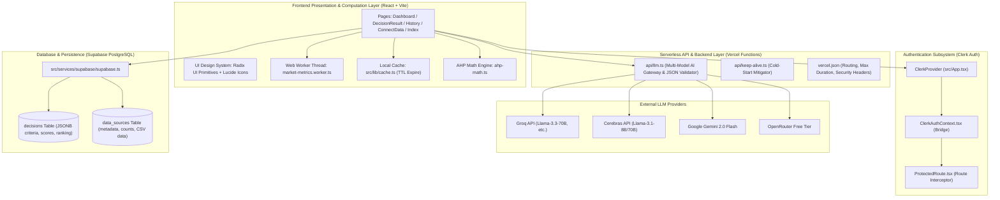

# KLAROS: Comprehensive Project Architecture & File Inventory Specification
### *Final Year Engineering Capstone Project Technical Reference*

---

## 📑 Table of Contents
1. [Executive Summary & Abstract](#1-executive-summary--abstract)
2. [High-Level System Architecture](#2-high-level-system-architecture)
3. [Frontend Layer Specification (`src/`)](#3-frontend-layer-specification)
   - [3.1 Application Bootstrap & Core Config](#31-application-bootstrap--core-config)
   - [3.2 Application Pages](#32-application-pages)
   - [3.3 Shell & Layout Components](#33-shell--layout-components)
   - [3.4 Feature Modules](#34-feature-modules)
   - [3.5 UI Design System & Component Primitives](#35-ui-design-system--component-primitives)
4. [Backend & Serverless API Layer (`api/`)](#4-backend--serverless-api-layer)
   - [4.1 Vercel Serverless Gateway & LLM Orchestrator](#41-vercel-serverless-gateway--llm-orchestrator)
   - [4.2 Health & Cold-Start Engine](#42-health--cold-start-engine)
   - [4.3 LLM Client Subsystem](#43-llm-client-subsystem)
5. [Database & Storage Layer (`services/supabase/` & `lib/`)](#5-database--storage-layer)
   - [5.1 Supabase PostgreSQL Database Schema (DDL)](#51-supabase-postgresql-database-schema-ddl)
   - [5.2 Data Access Layer & Store Modules](#52-data-access-layer--store-modules)
   - [5.3 Local Storage Offline Cache Architecture](#53-local-storage-offline-cache-architecture)
6. [Authentication & Authorization Layer (`Clerk Auth`)](#6-authentication--authorization-layer)
   - [6.1 Clerk Provider Configuration](#61-clerk-provider-configuration)
   - [6.2 Context Adapter & Route Guards](#62-context-adapter--route-guards)
7. [Mathematical Algorithms & Computational Engines](#7-mathematical-algorithms--computational-engines)
   - [7.1 Analytic Hierarchy Process (AHP) & MCDA Engine](#71-analytic-hierarchy-process-ahp--mcda-engine)
   - [7.2 Dedicated Web Worker KPI Engine](#72-dedicated-web-worker-kpi-engine)
8. [Complete Technology Stack Reference](#8-complete-technology-stack-reference)

---

## 1. Executive Summary & Abstract

**KLAROS** is an AI-powered Multi-Criteria Decision Analysis (MCDA) and Business Intelligence (BI) intelligence platform designed to ingest complex multi-table retail/supermarket datasets, compute financial and inventory key performance indicators off the main UI thread via Web Workers, and synthesize actionable strategic business recommendations using a resilient, multi-provider LLM pipeline backed by the **Analytic Hierarchy Process (AHP)** mathematical framework.

The application is architected with clear layer separation:
- **Client Presentation Layer**: Built with React 18, TypeScript, Vite, TailwindCSS, and Radix UI primitives.
- **Computation Subsystem**: Off-main-thread Web Workers executing $O(n)$ metrics aggregation and matrix transformations.
- **Backend & AI Gateway Layer**: Secure Vercel Serverless Edge Functions orchestrating Groq, Cerebras, Google Gemini, and OpenRouter in cascading fallbacks.
- **Persistence & Cloud Storage Layer**: Supabase PostgreSQL database storing relational dataset schemas, JSONB decision trees, and user-scoped decision records.
- **Identity & Session Management**: Clerk Authentication enforcing role boundaries and secure JWT propagation.

---

## 2. High-Level System Architecture



---

## 3. Frontend Layer Specification

### 3.1 Application Bootstrap & Core Config

| File Path | Primary Responsibility | Technical Details |
|---|---|---|
| `src/main.tsx` | DOM Root Initialization | Mounts the root React DOM tree with `React.StrictMode` onto `document.getElementById("root")`. |
| `src/App.tsx` | Master Routing & Context Provider Tree | Injects `ClerkProvider`, `AuthProvider`, `TooltipProvider`, `Toaster`, `Sonner`, and configures React Router v6 route hierarchy. |
| `src/index.css` | Global Design System & Variables | Defines HSL color channels for dark/light themes, typography tokens, glassmorphism filters, card elevation shadows, and animated gradients. |
| `index.html` | Application HTML Entry Point | HTML5 container with responsive viewport definitions, Google Fonts (`Inter`), meta tags, and root script injection. |
| `vite.config.ts` | Vite Bundler Configuration | Configures `@vitejs/plugin-react-swc`, path alias resolution (`@/*` $\rightarrow$ `./src/*`), and build chunking optimization. |

---

### 3.2 Application Pages

#### 1. `src/pages/Index.tsx` (`/`)
- **Type**: Public Landing Page.
- **Description**: Marketing showcase illustrating Klaros' MCDA capabilities, interactive demonstration cards, value propositions, and direct call-to-action buttons for registration/login.
- **Subcomponents**: `Hero.tsx`, `HowItWorks.tsx`, `CTA.tsx`, `LandingHeader.tsx`, `Footer.tsx`.

#### 2. `src/pages/Dashboard.tsx` (`/dashboard`)
- **Type**: Protected Core View.
- **Description**: Main operational dashboard. Displays overall analysis counters (Total, Completed, Running, BI-Linked), dataset switchers, recent decision cards, search filter inputs, and one-click "Auto-Analyze" triggers.
- **Key Logic**: Single-pass `stats` aggregation loop, dynamic search filtering, data source linking.

#### 3. `src/pages/DecisionResult.tsx` (`/decisions/:id/result`)
- **Type**: Protected Analytic Deep-Dive View.
- **Description**: Comprehensive decision intelligence report. Renders:
  - High-impact KPI summaries (Revenue, Units Sold, Low Stock SKUs, Net Profit).
  - Category sales performance bar/line charts and product performance grids via Recharts.
  - Multi-Criteria Decision Analysis options ranking with confidence scores and reasoning breakdown.
  - Interactive AI Decision Companion chat widget (`DecisionChatWidget.tsx`).

#### 4. `src/pages/History.tsx` (`/history`)
- **Type**: Protected Historical Audit Log.
- **Description**: Complete historical timeline of all analyses conducted by the user.
- **Features**: Supports 3 view modes:
  - **Timeline View**: Grouped by dataset source with expandable decision item cards.
  - **Feed View**: Compact chronological card feed.
  - **Metrics Table View**: Tabular comparative view of profit margin, low stock counts, and top product/category.
  - **Multi-Decision Comparison**: Checkbox selection matrix for side-by-side analysis comparison.

#### 5. `src/pages/ConnectData.tsx` (`/connect-data`)
- **Type**: Protected Data Ingestion Portal.
- **Description**: Connects synthetic supermarket datasets (5,000+ transactional records) or parses user-uploaded CSV files (`products.csv`, `sales.csv`, `stock.csv`, `investments.csv`).

#### 6. `src/pages/NotFound.tsx` (`*`)
- **Type**: Fallback View.
- **Description**: User-friendly 404 handler with redirection back to `/dashboard`.

---

### 3.3 Shell & Layout Components

| File Path | Component | Responsibility |
|---|---|---|
| `src/components/layout/DashboardSidebar.tsx` | `<DashboardSidebar />` | Persistent sidebar drawer with navigation items, Klaros brand logo, dataset status badge, and Clerk `<UserButton />`. |
| `src/components/layout/LandingHeader.tsx` | `<LandingHeader />` | Navigation bar for public landing page visitors with Login / Get Started buttons. |
| `src/components/layout/Header.tsx` | `<Header />` | Application header incorporating the animated `tubelight-navbar` effect. |
| `src/components/layout/Footer.tsx` | `<Footer />` | Responsive application footer with brand copyright and documentation links. |

---

### 3.4 Feature Modules

#### A. Decision & MCDA Engine (`src/features/decisions/`)
- `core/ahp-math.ts`: Mathematical implementation of the Analytic Hierarchy Process. Generates pairwise comparison matrices, computes principal eigenvectors, calculates consistency index ($CI = \frac{\lambda_{\max} - n}{n - 1}$), and evaluates the consistency ratio ($CR = \frac{CI}{RI}$).
- `core/analysis-schema.ts`: Zod schemas and TypeScript types enforcing RFC 8259 structured JSON validation for LLM MCDA outputs.
- `core/decision-workflow.ts`: State machine regulating decision status transitions (`draft` $\rightarrow$ `analyzing` $\rightarrow$ `done` $\rightarrow$ `archived`).
- `components/DecisionKpiCards.tsx`: Extracted 4-card metric overview displaying currency-formatted total revenue, units sold, stock alerts, and net profit.
- `components/DecisionChatWidget.tsx`: Floating AI companion modal with chat history memory, auto-scroll, and direct metric queries.
- `store/decision-store.ts`: Supabase database communication layer handling CRUD operations for user decisions with local cache synchronization.

#### B. Market & Business Intelligence Subsystem (`src/features/market/`)
- `utils/market-metrics.worker.ts`: Dedicated **Web Worker thread** that processes large CSV arrays off the main browser thread to calculate profit margins, category sales, inventory health, and top products.
- `utils/market-metrics-core.ts`: Pure functional algorithms powering KPI generation, date binning, Schwartzian sorting, and deduplication.
- `utils/market-metrics.ts`: Public API bridging UI components with the Web Worker, managing in-flight promise deduplication and offline caching.
- `utils/document-extractor.ts`: Local client-side CSV parsing utility reading file streams with PapaParse.
- `api/bi-api.ts`: Orchestrates dataset connections, synthetic data synthesis, and triggers the automated AI auto-analyze pipeline.
- `api/ai-analytics.ts`: Dispatches parallel AI requests generating executive summaries, opportunities, risk alerts, and forecasts.
- `components/MappingPreviewModal.tsx`: Column-mapping validation dialog before saving uploaded dataset schemas.

#### C. History & Dashboard Components
- `features/history/components/HistoryDecisionCard.tsx`: Unified decision card component shared across Timeline and Feed views in `History.tsx` with compare checkboxes and delete modals.
- `features/dashboard/components/DecisionCard.tsx`: Interactive card component displaying individual decision metrics, status pills, and dropdown actions.
- `features/dashboard/components/FilterSidebar.tsx`: Checkbox filter drawer for scoping decisions by status and dataset type.

---

### 3.5 UI Design System & Component Primitives

Located under `src/components/ui/` (TailwindCSS + Radix UI headless primitives):
- `alert-dialog.tsx`: Accessible confirmation modal dialogs (used for record deletion).
- `avatar.tsx`: User profile avatar renderer.
- `badge.tsx`: Category and status indicator badges.
- `button.tsx`: Variant-driven button component (default, outline, destructive, ghost, link).
- `card.tsx`: Surface elevation card container.
- `checkbox.tsx`: Form checkbox inputs.
- `dialog.tsx`: Modal dialog wrappers.
- `dropdown-menu.tsx`: Contextual action dropdowns.
- `input.tsx`: Text input fields.
- `label.tsx`: Form labels.
- `logo.tsx`: Vector SVG Klaros logo.
- `scroll-area.tsx`: Custom styled scrollbar container.
- `select.tsx`: Dropdown select inputs.
- `sonner.tsx` & `toaster.tsx` & `toast.tsx`: Toast notification dispatchers.
- `table.tsx`: Semantic HTML table components.
- `tabs.tsx`: Tabbed navigation interfaces.
- `tooltip.tsx`: Hover tooltips.
- `tubelight-navbar.tsx`: Animated glowing navigation bar.

---

## 4. Backend & Serverless API Layer

KLAROS adopts a **Serverless Function Architecture** deployed on Vercel to protect sensitive third-party API credentials, enforce rate limits, and provide failover redundancy.

```
api/
├── llm.ts           <- Multi-Model AI Gateway & Fallback Router
└── keep-alive.ts    <- Cold-Start Prevention & Health Check
```

### 4.1 Vercel Serverless Gateway & LLM Orchestrator (`api/llm.ts`)

- **Route**: `POST /api/llm`
- **Responsibilities**:
  1. **Credential Isolation**: Reads server-side environment variables (`GROQ_API_KEY`, `CEREBRAS_API_KEY`, `GEMINI_API_KEY`, `OPENROUTER_API_KEY`).
  2. **Cascading Multi-Provider Fallback**:
     $$\text{Groq (Primary)} \longrightarrow \text{Cerebras (Fallback 1)} \longrightarrow \text{Gemini (Fallback 2)} \longrightarrow \text{OpenRouter (Fallback 3)}$$
  3. **Structured JSON Output Enforcement**: Enforces RFC 8259 JSON format, strips `<think>` thinking tags from reasoning models (e.g., DeepSeek / Qwen), removes Markdown codeblocks (````json ... ````), and repairs unclosed braces.
  4. **Timeout & Backoff Handling**: Implements 15-second per-request timeouts with exponential backoff on HTTP 429 (Rate Limit) and HTTP 503 errors.

### 4.2 Health & Cold-Start Engine (`api/keep-alive.ts`)

- **Route**: `GET /api/keep-alive`
- **Responsibilities**: Periodic ping endpoint invoked by heartbeat schedulers to prevent Vercel Serverless cold-start latency during critical user evaluations.

### 4.3 Vercel Deployment Configuration (`vercel.json`)

```json
{
  "functions": {
    "api/llm.ts": {
      "maxDuration": 60,
      "memory": 1024
    },
    "api/keep-alive.ts": {
      "maxDuration": 10,
      "memory": 256
    }
  },
  "headers": [
    {
      "source": "/api/(.*)",
      "headers": [
        { "key": "Access-Control-Allow-Origin", "value": "*" },
        { "key": "X-Content-Type-Options", "value": "nosniff" },
        { "key": "X-Frame-Options", "value": "DENY" }
      ]
    }
  ],
  "rewrites": [
    { "source": "/api/(.*)", "destination": "/api/$1" },
    { "source": "/(.*)", "destination": "/index.html" }
  ]
}
```

### 4.4 LLM Client Subsystem (`src/services/llm/`)

| File Path | Role |
|---|---|
| `src/services/llm/llm-service.ts` | High-level facade dispatching domain requests (`generateMcdaAnalysis`, `generateAiInsightsFromMetrics`, `askQuestion`). |
| `src/services/llm/core/llm-proxy-client.ts` | Client HTTP transport invoking `/api/llm` with retry policies. |
| `src/services/llm/core/json-extractor.ts` | Regular-expression parser extracting clean JSON objects from noisy model completions. |
| `src/services/llm/core/backoff.ts` | Exponential backoff algorithm calculating jittered wait intervals. |
| `src/services/llm/core/fetch-with-timeout.ts` | `AbortController`-based network fetch wrapper. |
| `src/services/llm/domain/*.ts` | Specialized prompt templates (`mcda-analysis.ts`, `insights.ts`, `forecasts.ts`, `data-parser.ts`). |

---

## 5. Database & Storage Layer

### 5.1 Supabase PostgreSQL Database Schema (DDL)

```sql
-- Enable UUID extension
CREATE EXTENSION IF NOT EXISTS "uuid-ossp";

-- 1. DATA SOURCES TABLE
CREATE TABLE IF NOT EXISTS public.data_sources (
    id UUID PRIMARY KEY DEFAULT uuid_generate_v4(),
    user_id TEXT NOT NULL,
    name TEXT NOT NULL,
    type TEXT NOT NULL,
    status TEXT NOT NULL DEFAULT 'connected',
    is_synthetic BOOLEAN DEFAULT FALSE,
    counts JSONB,
    csv_data JSONB,
    last_synced_at TIMESTAMPTZ,
    created_at TIMESTAMPTZ DEFAULT NOW()
);

-- Indices for data_sources
CREATE INDEX IF NOT EXISTS idx_data_sources_user_id ON public.data_sources(user_id);
CREATE INDEX IF NOT EXISTS idx_data_sources_created_at ON public.data_sources(created_at DESC);

-- 2. DECISIONS TABLE
CREATE TABLE IF NOT EXISTS public.decisions (
    id UUID PRIMARY KEY DEFAULT uuid_generate_v4(),
    user_id TEXT NOT NULL,
    title TEXT NOT NULL,
    context TEXT,
    status VARCHAR(50) NOT NULL DEFAULT 'draft',
    data_source_id UUID REFERENCES public.data_sources(id) ON DELETE SET NULL,
    decision_type TEXT DEFAULT 'business_intelligence',
    options JSONB NOT NULL DEFAULT '[]'::jsonb,
    criteria JSONB NOT NULL DEFAULT '[]'::jsonb,
    constraints JSONB NOT NULL DEFAULT '[]'::jsonb,
    result_json JSONB,
    created_at TIMESTAMPTZ DEFAULT NOW(),
    updated_at TIMESTAMPTZ DEFAULT NOW()
);

-- Indices for decisions
CREATE INDEX IF NOT EXISTS idx_decisions_user_id ON public.decisions(user_id);
CREATE INDEX IF NOT EXISTS idx_decisions_status ON public.decisions(status);
CREATE INDEX IF NOT EXISTS idx_decisions_data_source_id ON public.decisions(data_source_id);
CREATE INDEX IF NOT EXISTS idx_decisions_created_at ON public.decisions(created_at DESC);
```

---

### 5.2 Data Access Layer & Store Modules

- `src/services/supabase/supabase.ts`: Instantiates `@supabase/supabase-js` client with environment variables (`VITE_SUPABASE_URL`, `VITE_SUPABASE_ANON_KEY`).
- `src/features/decisions/store/decision-store.ts`:
  - `getUserDecisions(userId)`: Queries `decisions` table sorted by `created_at DESC` with local storage caching.
  - `getDecision(id)`: Fetches a single decision record by primary key.
  - `updateDecisionStatus(id, status)`: Updates lifecycle status.
  - `deleteDecision(id)`: Permanently drops a decision record.
  - `duplicateDecision(id)`: Clones an existing analysis tree.
- `src/features/market/api/bi-api.ts`:
  - `getDataSources(userId)`: Reads user connected datasets.
  - `connectSyntheticData(userId, datasetId)`: Seeds synthetic supermarket dataset.
  - `uploadDataset(userId, files)`: Ingests client CSVs into Supabase.
  - `autoAnalyze(userId, dataSourceId)`: Triggers end-to-end MCDA pipeline.

---

### 5.3 Local Storage Offline Cache Architecture (`src/lib/cache.ts`)

Provides reliable browser caching with optional Time-To-Live (TTL) expiration:

```typescript
export function readCache<T>(key: string, ttlMs?: number): T | null {
  if (typeof window === 'undefined' || !window.localStorage) return null;
  try {
    const raw = window.localStorage.getItem(key);
    if (!raw) return null;
    const parsed = JSON.parse(raw);
    if (parsed && typeof parsed === 'object' && 'timestamp' in parsed && 'value' in parsed) {
      if (ttlMs && Date.now() - (parsed as { timestamp: number }).timestamp > ttlMs) {
        window.localStorage.removeItem(key);
        return null;
      }
      return (parsed as { value: T }).value;
    }
    return parsed as T;
  } catch {
    return null;
  }
}

export function writeCache<T>(key: string, value: T, withTimestamp = false): void {
  if (typeof window === 'undefined' || !window.localStorage) return;
  try {
    const payload = withTimestamp ? { timestamp: Date.now(), value } : value;
    window.localStorage.setItem(key, JSON.stringify(payload));
  } catch {
    // Gracefully handle quota/security errors
  }
}
```

---

## 6. Authentication & Authorization Layer

Authentication is handled via **Clerk Authentication**, offering enterprise-grade identity, JWT validation, and multi-factor session security.

```
src/features/auth/
├── components/
│   └── ProtectedRoute.tsx      <- Route Authentication Guard
├── contexts/
│   └── ClerkAuthContext.tsx    <- Unified Auth Adapter Bridge
```

### 6.1 Clerk Provider Configuration (`src/App.tsx`)

```tsx
<ClerkProvider
  publishableKey={CLERK_PUBLISHABLE_KEY}
  signInUrl="/login"
  signUpUrl="/signup"
  signInFallbackRedirectUrl="/dashboard"
  signUpFallbackRedirectUrl="/dashboard"
>
  <AuthProvider>
    <Routes>
      {/* Public */}
      <Route path="/" element={<Index />} />
      <Route path="/login/*" element={<SignIn routing="path" path="/login" />} />
      <Route path="/signup/*" element={<SignUp routing="path" path="/signup" />} />

      {/* Protected Routes */}
      <Route path="/dashboard" element={<ProtectedRoute><Dashboard /></ProtectedRoute>} />
      <Route path="/decisions/:id/result" element={<ProtectedRoute><DecisionResult /></ProtectedRoute>} />
      <Route path="/history" element={<ProtectedRoute><History /></ProtectedRoute>} />
      <Route path="/connect-data" element={<ProtectedRoute><ConnectData /></ProtectedRoute>} />
    </Routes>
  </AuthProvider>
</ClerkProvider>
```

### 6.2 Context Adapter & Route Guards

- `ClerkAuthContext.tsx`: Wraps Clerk's `useUser()` and `useAuth()` to export a standardized `useAuthContext()` hook with `user`, `isLoaded`, `isSignedIn`, `getToken()`, and `signOut()`.
- `ProtectedRoute.tsx`: Route interceptor component. Displays a full-screen loading skeleton while Clerk initializes; redirects unauthenticated visitors to `/login`.

---

## 7. Mathematical Algorithms & Computational Engines

### 7.1 Analytic Hierarchy Process (AHP) & MCDA Engine

Located in `src/features/decisions/core/ahp-math.ts`. Computes multi-criteria decision alternatives using Thomas L. Saaty's Analytic Hierarchy Process:

1. **Pairwise Comparison Matrix ($A$)**:
   $$A = \begin{bmatrix} 1 & a_{12} & \dots & a_{1n} \\ 1/a_{12} & 1 & \dots & a_{2n} \\ \vdots & \vdots & \ddots & \vdots \\ 1/a_{1n} & 1/a_{2n} & \dots & 1 \end{bmatrix}$$
2. **Normalized Principal Eigenvector (Priority Vector $w$)**:
   $$w_i = \frac{1}{n} \sum_{j=1}^n \frac{a_{ij}}{\sum_{k=1}^n a_{kj}}$$
3. **Maximum Eigenvalue ($\lambda_{\max}$)**:
   $$\lambda_{\max} = \frac{1}{n} \sum_{i=1}^n \frac{(A w)_i}{w_i}$$
4. **Consistency Index ($CI$) & Consistency Ratio ($CR$)**:
   $$CI = \frac{\lambda_{\max} - n}{n - 1}, \quad CR = \frac{CI}{RI}$$
   *Where $RI$ is the Random Consistency Index. The engine validates that $CR \le 0.10$ for mathematical consistency.*

---

### 7.2 Dedicated Web Worker KPI Engine

Located in `src/features/market/utils/market-metrics.worker.ts`.
- **Purpose**: Prevents UI freeze/jank when calculating aggregations over 5,000+ sales and stock records.
- **Workflow**:
  1. Main thread dispatches message `{ type: 'BUILD_METRICS', payload: dataset }`.
  2. Web worker computes total revenue, units, gross margin $\%$, category sums, and low-stock items in background.
  3. Worker posts structured `MarketMetrics` object back to main thread.

---

## 8. Complete Technology Stack Reference

| Category | Technologies / Libraries |
|---|---|
| **Core Frontend** | React 18.3, TypeScript 5.8, Vite 5.4 |
| **Styling & Animation** | Tailwind CSS 3.4, Tailwind Animate, Framer Motion 12.29 |
| **UI Components** | Radix UI Primitives, Lucide React Icons |
| **Data Visualization** | Recharts 2.15 (BarChart, LineChart, PieChart, ResponsiveContainer) |
| **Data Parsing** | PapaParse 5.4 (CSV Parser), XLSX 0.18 (Excel Parser) |
| **Mathematical Validation** | Zod 3.25, Date-fns 3.6 |
| **Authentication** | Clerk React SDK (`@clerk/react` 6.1) |
| **Database & Cloud Storage** | Supabase PostgreSQL (`@supabase/supabase-js` 2.105) |
| **Serverless & Edge Backend** | Vercel Serverless Functions (`@vercel/node` 5.10) |
| **AI LLM Inference** | Groq Cloud, Cerebras Cloud, Google Gemini API, OpenRouter |
| **Testing Suite** | Vitest 3.2, Testing Library, Playwright (E2E) |
| **Code Quality** | ESLint 9, TypeScript ESLint 8.38, Prettier |
