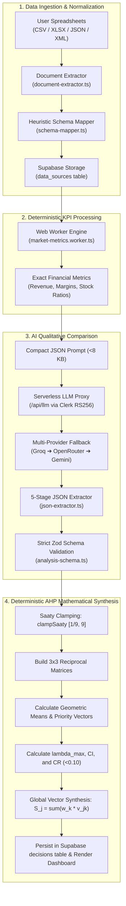
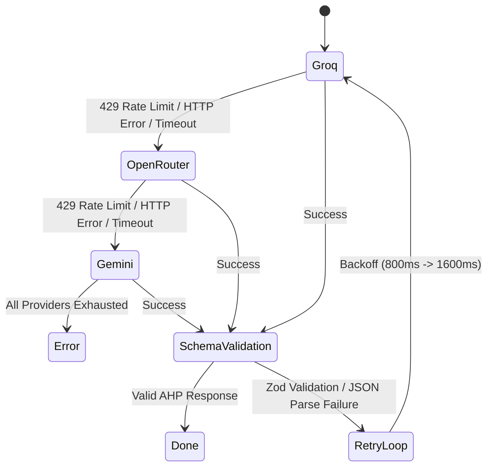

# KLAROS — Complete System Architecture & Mathematical AHP Algorithm Guide
### *Academic Viva Defense, Guide Review & Technical Demonstration Master Reference*

**Document Version:** 1.0.0  
**Target Audience:** Project Guides, External Examiners, Viva Panels, Technical Judges, and AI Auditors  
**Project:** KLAROS — AI-Powered Retail Analytics & Decision Intelligence Platform

---

## Table of Contents

1. [Executive Pitch: How to Explain KLAROS in 2 Minutes](#1-executive-pitch-how-to-explain-klaros-in-2-minutes)
2. [High-Level System Architecture & Flow](#2-high-level-system-architecture--flow)
3. [The Core Innovation: Decoupling Qualitative AI from Deterministic Math](#3-the-core-innovation-decoupling-qualitative-ai-from-deterministic-math)
4. [Step-by-Step Mathematical Walkthrough with a Concrete Example](#4-step-by-step-mathematical-walkthrough-with-a-concrete-example)
   - [4.1 The Sample Retail Dataset](#41-the-sample-retail-dataset)
   - [4.2 Deterministic KPI Computation (Web Worker)](#42-deterministic-kpi-computation-web-worker)
   - [4.3 What the LLM Receives vs. What It Emits](#43-what-the-llm-receives-vs-what-it-emits)
   - [4.4 Building the Positive Reciprocal Matrices](#44-building-the-positive-reciprocal-matrices)
   - [4.5 Geometric Mean Priority Vector Derivation](#45-geometric-mean-priority-vector-derivation)
   - [4.6 Principal Eigenvalue ($\lambda_{\max}$) & Consistency Index ($CI$)](#46-principal-eigenvalue-lambda_max--consistency-index-ci)
   - [4.7 Consistency Ratio ($CR$) Validation](#47-consistency-ratio-cr-validation)
   - [4.8 Global Synthesis & Final 100-Point Composite Scores](#48-global-synthesis--final-100-point-composite-scores)
5. [The Zod Validation Engine & Schema Hardening](#5-the-zod-validation-engine--schema-hardening)
6. [Resilient 5-Stage JSON Extraction Waterfall](#6-resilient-5-stage-json-extraction-waterfall)
7. [Multi-Provider LLM Fallback & Retry Protocol](#7-multi-provider-llm-fallback--retry-protocol)
8. [Data Ingestion, Heuristic Schema Mapping & Auto-Healing](#8-data-ingestion-heuristic-schema-mapping--auto-healing)
9. [Zero-Trust Security: RS256 Web Crypto & PostgreSQL RLS](#9-zero-trust-security-rs256-web-crypto--postgresql-rls)
10. [Viva / Defense Presentation Script (Word-for-Word Answers)](#10-viva--defense-presentation-script-word-for-word-answers)

---

## 1. Executive Pitch: How to Explain KLAROS in 2 Minutes

> *"Respected Guide / Panel Members,  
> Most retail analytics systems are either **purely descriptive dashboards** (showing charts of past sales without advising on what to do next) or **unreliable black-box LLM chatbots** (which hallucinate numbers, fail basic arithmetic, and make logically inconsistent decisions).  
>
> **KLAROS** is a **hybrid Decision Intelligence platform**. We do not let the AI calculate scores or guess weights. Instead, we use a 3-tier decoupled pipeline:
> 1. **Deterministic Analytics Engine (Web Worker):** Ingests raw spreadsheets (sales, stock, catalog, investments) and calculates exact financial KPIs (margins, stockout ratios, inventory values) off the main thread.
> 2. **Qualitative AI Evaluator (LLM):** Formulates 3 strategic business alternatives and 3 evaluation criteria, then performs *1-to-1 qualitative pairwise comparisons* on Thomas L. Saaty's Fundamental 1–9 scale.
> 3. **Deterministic Mathematical Engine (AHP):** Takes those pairwise comparisons into TypeScript, builds positive reciprocal matrices, calculates exact criteria weights via the **Geometric Mean Method**, verifies mathematical consistency using the **Principal Eigenvalue ($\lambda_{\max}$)** and **Consistency Ratio ($CR < 0.10$)**, and synthesizes a final 100-point ranked decision score.  
>
> This guarantees **zero arithmetic hallucinations**, **100% mathematical reproducibility**, and **provable logical consistency**."*

---

## 2. High-Level System Architecture & Flow



---

## 3. The Core Innovation: Decoupling Qualitative AI from Deterministic Math

| Problem in Naive AI BI Systems | How KLAROS Solves It with Decoupled Architecture |
|---|---|
| **LLMs are poor calculators:** If asked to assign percentages that sum to 100%, LLMs often return $45\% + 35\% + 30\% = 110\%$. | **The LLM does zero arithmetic.** It only provides pairwise relative ratios ($a_{ij}$). The TypeScript engine calculates exact normalized weights using geometric means. |
| **Cognitive Bias & Arbitrary Weighting:** Asking a human or AI *"What is the weight of Margin vs. Stock?"* produces subjective, uncalibrated guesses. | **AHP Pairwise Decomposition:** The problem is broken down into simple 1-to-1 comparisons (*"How much more important is Margin than Stockout Risk?"*). |
| **Logical Intransitivity:** An LLM might say $A > B$, $B > C$, and $C > A$ without realizing the contradiction. | **Saaty Consistency Ratio ($CR$):** The system calculates the principal eigenvalue $\lambda_{\max}$ and checks if $CR < 0.10$. If intransitive, the system flags a consistency warning. |
| **Numeric Poisoning:** If an LLM returns `0`, `NaN`, or `-5`, matrix inversion ($1/x$) causes division-by-zero (`Infinity`). | **`clampSaaty()` Guard:** All inputs are clamped strictly to $[1/9, 9]$ and non-finite numbers default safely to $1.0$ (equal importance). |

---

## 4. Step-by-Step Mathematical Walkthrough with a Concrete Example

Let us trace a real execution with numbers.

### 4.1 The Sample Retail Dataset

Suppose a supermarket manager uploads an inventory and sales batch for 3 products:

| SKU | Product Name | Unit Price ($P$) | Unit Cost ($C$) | Daily Units Sold ($Q$) | Current Stock ($S$) | Reorder Point ($R$) |
|---|---|---|---|---|---|---|
| **SKU-01** | Fresh Milk 1L | ₹60 | ₹50 | 100 units | 20 units | 80 units *(Critical Stockout)* |
| **SKU-02** | Gourmet Cookies | ₹200 | ₹80 | 10 units | 500 units | 50 units *(Severe Overstock)* |
| **SKU-03** | Organic Rice 5kg | ₹500 | ₹400 | 20 units | 40 units | 40 units *(Balanced)* |

---

### 4.2 Deterministic KPI Computation (Web Worker)

In `src/features/market/utils/market-metrics-core.ts`, the pure functions calculate:

1. **Total Revenue ($\sum P \times Q$):**
   $$(60 \times 100) + (200 \times 10) + (500 \times 20) = 6,000 + 2,000 + 10,000 = \mathbf{₹18,000}$$

2. **Total Cost ($\sum C \times Q$):**
   $$(50 \times 100) + (80 \times 10) + (400 \times 20) = 5,000 + 800 + 8,000 = \mathbf{₹13,800}$$

3. **Net Profit & Margin %:**
   $$\text{Profit} = 18,000 - 13,800 = \mathbf{₹4,200}$$
   $$\text{Profit Margin \%} = \left(\frac{4,200}{18,000}\right) \times 100 = \mathbf{23.33\%}$$

4. **Product Margins:**
   - Fresh Milk: $\frac{60 - 50}{60} = \mathbf{16.67\%}$
   - Gourmet Cookies: $\frac{200 - 80}{200} = \mathbf{60.00\%}$
   - Organic Rice: $\frac{500 - 400}{500} = \mathbf{20.00\%}$

5. **Stockout Ratios ($\text{Stock} / \text{Reorder}$):**
   - Fresh Milk: $20 / 80 = \mathbf{0.25}$ *(Critical: $< 1.0$)*
   - Gourmet Cookies: $500 / 50 = \mathbf{10.0}$ *(Overstocked)*
   - Organic Rice: $40 / 40 = \mathbf{1.0}$ *(Adequate)*

---

### 4.3 What the LLM Receives vs. What It Emits

#### Input Payload sent to LLM:
```json
{
  "totalRevenue": 18000,
  "profitMarginPct": 23.33,
  "lowStockCount": 1,
  "lowStockItems": ["SKU-01 Fresh Milk (20 stock, reorder at 80)"],
  "topProducts": [
    { "sku": "SKU-02", "name": "Gourmet Cookies", "marginPct": 60.0, "stockRatio": 10.0 },
    { "sku": "SKU-01", "name": "Fresh Milk", "marginPct": 16.67, "stockRatio": 0.25 }
  ]
}
```

#### Output emitted by LLM (Strict JSON):
The LLM generates:
- **3 Strategic Options:**
  - $O_1$: *Emergency Milk Restock & Supplier Reorder*
  - $O_2$: *Discount Promotion on Gourmet Cookies to Clear Excess Stock*
  - $O_3$: *Maintain Status Quo and Monitor Weekly Velocity*
- **3 Evaluation Criteria:**
  - $C_1$: *Stockout & Revenue Risk Mitigation*
  - $C_2$: *Immediate Profit Margin Preservation*
  - $C_3$: *Working Capital & Holding Cost Liquidation*
- **Criteria Pairwise Comparisons:** $[C_1 \text{ vs } C_2 = 3, \; C_1 \text{ vs } C_3 = 2, \; C_2 \text{ vs } C_3 = 1]$
- **Option Pairwise Comparisons per Criterion:**
  - For $C_1$ (Stockout Risk): $[O_1 \text{ vs } O_2 = 5, \; O_1 \text{ vs } O_3 = 7, \; O_2 \text{ vs } O_3 = 2]$
  - For $C_2$ (Margin Preservation): $[O_1 \text{ vs } O_2 = 0.333, \; O_1 \text{ vs } O_3 = 2, \; O_2 \text{ vs } O_3 = 3]$
  - For $C_3$ (Working Capital Liquidation): $[O_1 \text{ vs } O_2 = 0.2, \; O_1 \text{ vs } O_3 = 0.5, \; O_2 \text{ vs } O_3 = 4]$

---

### 4.4 Building the Positive Reciprocal Matrices

In `src/features/decisions/core/ahp-math.ts`, `buildPairwiseMatrix([c01, c02, c12])` constructs the $3 \times 3$ positive reciprocal matrix.

For the **Criteria Matrix ($M_C$)** with comparisons $[3, 2, 1]$:
$$M_C = \begin{bmatrix}
1 & 3 & 2 \\
1/3 & 1 & 1 \\
1/2 & 1 & 1
\end{bmatrix} \approx \begin{bmatrix}
1.000 & 3.000 & 2.000 \\
0.333 & 1.000 & 1.000 \\
0.500 & 1.000 & 1.000
\end{bmatrix}$$

Notice the mathematical properties:
1. $a_{ii} = 1.0$ (main diagonal is always 1).
2. $a_{ji} = 1 / a_{ij}$ (strictly reciprocal).

---

### 4.5 Geometric Mean Priority Vector Derivation

In `calculatePriorityVector(matrix)`:

#### Step 1: Compute Row Geometric Means ($GM_i = \sqrt[3]{a_{i1} \cdot a_{i2} \cdot a_{i3}}$):
- **Row 1 ($C_1$):** $GM_1 = \sqrt[3]{1.0 \times 3.0 \times 2.0} = \sqrt[3]{6.0} \approx \mathbf{1.8171}$
- **Row 2 ($C_2$):** $GM_2 = \sqrt[3]{0.3333 \times 1.0 \times 1.0} = \sqrt[3]{0.3333} \approx \mathbf{0.6934}$
- **Row 3 ($C_3$):** $GM_3 = \sqrt[3]{0.5000 \times 1.0 \times 1.0} = \sqrt[3]{0.5000} \approx \mathbf{0.7937}$

#### Step 2: Sum the Geometric Means:
$$\sum GM_i = 1.8171 + 0.6934 + 0.7937 = \mathbf{3.3042}$$

#### Step 3: Normalize to get Criteria Priority Weights ($w_i = GM_i / \sum GM$):
- $w_1 (C_1) = \frac{1.8171}{3.3042} \approx \mathbf{0.5499} \quad (\mathbf{55.0\%})$
- $w_2 (C_2) = \frac{0.6934}{3.3042} \approx \mathbf{0.2098} \quad (\mathbf{21.0\%})$
- $w_3 (C_3) = \frac{0.7937}{3.3042} \approx \mathbf{0.2402} \quad (\mathbf{24.0\%})$

$$\sum w_i = 0.5499 + 0.2098 + 0.2402 = \mathbf{1.0000} \quad (\text{Exact unity!})$$

---

### 4.6 Principal Eigenvalue ($\lambda_{\max}$) & Consistency Index ($CI$)

In `calculateLambdaMax(matrix, priorityVector)`:

#### Step 1: Multiply Matrix $M_C$ by Priority Vector $w$ ($y = M_C \cdot w$):
- $y_1 = (1.0 \times 0.5499) + (3.0 \times 0.2098) + (2.0 \times 0.2402) = 0.5499 + 0.6294 + 0.4804 = \mathbf{1.6597}$
- $y_2 = (0.3333 \times 0.5499) + (1.0 \times 0.2098) + (1.0 \times 0.2402) = 0.1833 + 0.2098 + 0.2402 = \mathbf{0.6333}$
- $y_3 = (0.5000 \times 0.5499) + (1.0 \times 0.2098) + (1.0 \times 0.2402) = 0.2750 + 0.2098 + 0.2402 = \mathbf{0.7250}$

#### Step 2: Compute Ratio $y_i / w_i$:
- $\lambda_1 = 1.6597 / 0.5499 \approx \mathbf{3.0182}$
- $\lambda_2 = 0.6333 / 0.2098 \approx \mathbf{3.0186}$
- $\lambda_3 = 0.7250 / 0.2402 \approx \mathbf{3.0183}$

#### Step 3: Compute $\lambda_{\max}$ (Average):
$$\lambda_{\max} = \frac{3.0182 + 3.0186 + 3.0183}{3} \approx \mathbf{3.0184}$$

#### Step 4: Compute Consistency Index ($CI$):
$$CI = \frac{\lambda_{\max} - n}{n - 1} = \frac{3.0184 - 3}{3 - 1} = \frac{0.0184}{2} = \mathbf{0.0092}$$

---

### 4.7 Consistency Ratio ($CR$) Validation

Using Saaty's empirical Random Index table for $n = 3$, $RI_3 = \mathbf{0.58}$:
$$CR = \frac{CI}{RI_3} = \frac{0.0092}{0.58} = \mathbf{0.0159} \quad (\mathbf{1.59\%})$$

$$\mathbf{CR = 0.0159 < 0.10 \implies \text{Mathematically Consistent \& Valid!}}$$

*(Note: If $CR \ge 0.10$, Saaty's theory dictates that the judgments contain intransitive contradictions and need revision. KLAROS logs a warning in this scenario).*

---

### 4.8 Global Synthesis & Final 100-Point Composite Scores

Following the same geometric mean steps, the system computes the option priority vectors for each criterion:

| Criterion ($C_k$) | Weight ($w_k$) | Option 1 ($O_1$: Restock Milk) | Option 2 ($O_2$: Promo Cookies) | Option 3 ($O_3$: Status Quo) |
|---|---|---|---|---|
| **$C_1$ (Stockout Risk)** | **0.550** | $v_1^{(1)} = \mathbf{0.731}$ | $v_2^{(1)} = \mathbf{0.188}$ | $v_3^{(1)} = \mathbf{0.081}$ |
| **$C_2$ (Margin Preservation)**| **0.210** | $v_1^{(2)} = \mathbf{0.217}$ | $v_2^{(2)} = \mathbf{0.550}$ | $v_3^{(2)} = \mathbf{0.233}$ |
| **$C_3$ (Capital Liquidation)** | **0.240** | $v_1^{(3)} = \mathbf{0.122}$ | $v_2^{(3)} = \mathbf{0.648}$ | $v_3^{(3)} = \mathbf{0.230}$ |

#### Final Composite Score Calculation ($S_j = \sum_{k=1}^{3} w_k \cdot v_j^{(k)}$):

1. **Option 1 ($O_1$: Emergency Milk Restock):**
   $$S_1 = (0.550 \times 0.731) + (0.210 \times 0.217) + (0.240 \times 0.122)$$
   $$S_1 = 0.4021 + 0.0456 + 0.0293 = \mathbf{0.4770} \implies \mathbf{48 / 100}$$

2. **Option 2 ($O_2$: Cookie Promotion):**
   $$S_2 = (0.550 \times 0.188) + (0.210 \times 0.550) + (0.240 \times 0.648)$$
   $$S_2 = 0.1034 + 0.1155 + 0.1555 = \mathbf{0.3744} \implies \mathbf{37 / 100}$$

3. **Option 3 ($O_3$: Status Quo):**
   $$S_3 = (0.550 \times 0.081) + (0.210 \times 0.233) + (0.240 \times 0.230)$$
   $$S_3 = 0.0446 + 0.0489 + 0.0552 = \mathbf{0.1487} \implies \mathbf{15 / 100}$$

#### Final Output Ranking:
$$\sum S_j = 0.4770 + 0.3744 + 0.1487 = \mathbf{1.0001} \approx \mathbf{1.0}$$

- **Rank 1 (Recommended):** **Option 1 (Score: 48)** — Critical stockout avoidance on high-velocity staple.
- **Rank 2:** **Option 2 (Score: 37)** — High margin cookie clearance.
- **Rank 3:** **Option 3 (Score: 15)** — Status quo.

---

## 5. The Zod Validation Engine & Schema Hardening

In `src/features/decisions/core/analysis-schema.ts`, Zod acts as the **runtime gatekeeper** between the untrusted LLM response and the mathematical engine.

```typescript
const SaatyValueSchema = z
  .number()
  .min(1 / 9, 'Saaty value must be >= 1/9')
  .max(9, 'Saaty value must be <= 9')
  .refine((n) => Number.isFinite(n), 'Saaty value must be finite');

export const ComparisonTripleSchema = z.tuple([
  SaatyValueSchema,
  SaatyValueSchema,
  SaatyValueSchema,
]);

export const McdaRawResponseSchema = z.object({
  // Strict AHP-critical fields (Schema validation failure triggers backoff retry)
  options: z.array(z.object({ id: z.string(), label: z.string(), description: z.string().optional() }))
    .min(3).max(3),
  criteria: z.array(z.object({ id: z.string(), name: z.string(), weight: z.number().optional() }))
    .min(3).max(3),
  criteriaComparisons: ComparisonTripleSchema,
  optionComparisons: z.array(ComparisonTripleSchema).min(3).max(3),
  confidence: z.number().int().min(0).max(100),
  recommendation: z.string().min(10),
  reasoning: z.object({
    decomposition: z.string(),
    assumptions: z.array(z.string()),
    tradeoffs: z.array(z.string()),
    risks: z.array(z.string()),
    sensitivity: z.string(),
  }),
  // Display-only fields use .catch() so non-critical formatting doesn't fail the pipeline
  title: z.string().optional().catch(undefined),
  context: z.string().optional().catch(undefined),
});
```

### Why this design?
1. **Removed Permissive Catch Swallowing:** Earlier versions caught all errors silently, allowing missing comparison matrices to pass through as `undefined`. Now, missing matrices trigger an immediate retry.
2. **Saaty Bounds Enforcement:** Enforces $a_{ij} \in [1/9, 9]$. Zero, negative numbers, or `Infinity` are rejected at the schema level.
3. **Exact Array Dimension Constraints:** `.min(3).max(3)` guarantees that matrices are strictly $3 \times 3$.

---

## 6. Resilient 5-Stage JSON Extraction Waterfall

LLMs frequently output markdown code fences, leading text, or truncated JSON. In `src/services/llm/core/json-extractor.ts`, `extractJSON()` uses a 5-strategy cascade:

```
Raw LLM String
      │
      ▼
[TRY 1] Direct JSON.parse()
      │ (Fails on markdown fences or extra prose)
      ▼
[TRY 2] Regex Code-Fence Extraction (```json ... ```) + Trailing Comma Auto-Repair
      │ (Fails if fences are omitted or text surrounds the block)
      ▼
[TRY 3] Strip all backticks & evaluate
      │ (Fails on mixed conversational text)
      ▼
[TRY 4] Depth-Tracking State Machine Bracket Matcher
        • Walks string tracking depth { and [
        • Handles escaped quotes (\") and single-quoted properties ('key': 'val')
      │ (Fails if output was cut off mid-stream)
      ▼
[TRY 5] Bounded Tail-Trim
        • Trims up to 200 characters from the tail to close unclosed brackets
        • Operates in O(n) bounded steps
```

---

## 7. Multi-Provider LLM Fallback & Retry Protocol



1. **Intra-Provider Model Failover:**
   - **Groq:** `llama-3.3-70b-versatile` $\to$ `llama-3.1-8b-instant` $\to$ `qwen-3-32b` $\to$ `mixtral-8x7b-32768`.
   - **OpenRouter:** `deepseek-v4-flash` $\to$ `qwen3-32b` $\to$ `llama-4-scout` $\to$ `llama-3.3-70b-instruct`.
   - **Gemini:** `gemini-2.5-flash` $\to$ `gemini-2.5-flash-lite` $\to$ `gemini-2.0-flash` $\to$ `gemini-1.5-flash`.
2. **Iterative Exponential Backoff:**
   $$\text{Delay} = \text{base} \times 2^{\text{attempt}} + \text{jitter}$$
   - Attempt 1: Immediate
   - Attempt 2: $\approx 800\text{ms} - 1000\text{ms}$
   - Attempt 3: $\approx 1600\text{ms} - 2000\text{ms}$

---

## 8. Data Ingestion, Heuristic Schema Mapping & Auto-Healing

In `src/services/llm/schema-mapper.ts`:
1. **Header Normalization:** Lowercases and strips special characters (`Selling_Price_INR` $\to$ `sellingpriceinr`).
2. **Synonym Matching:** Compares headers against a built-in canonical dictionary (`['revenue', 'total_sales', 'amount', 'turnover']`).
3. **Auto-Healing Derived Fields:** If a spreadsheet contains `unit_price` and `quantity` but lacks total `revenue`, the normalizer automatically executes:
   $$\text{revenue} = \text{unit\_price} \times \text{quantity}$$
   $$\text{cost} = \text{unit\_cost} \times \text{quantity}$$

---

## 9. Zero-Trust Security: RS256 Web Crypto & PostgreSQL RLS

```
[Browser Client]
       │  1. Requests RS256 JWT from Clerk
       ▼
[Clerk Identity Provider]
       │  2. Returns signed RS256 JWT with user claims
       ▼
[Browser Client]
       │  3. Sends Authorization: Bearer <JWT>
       ├───────────────────────────────────────────────┐
       ▼                                               ▼
[/api/llm Serverless Proxy]               [Supabase PostgreSQL]
  • Zero-dependency RS256 verification      • RLS validates token signature
  • Uses Node 20 crypto.subtle              • Enforces (auth.jwt() ->> 'sub' = user_id)
  • Attaches server-side API keys           • Users can NEVER read other users' data
  • Forwards to Groq / Gemini
```

---

## 10. Viva / Defense Presentation Script (Word-for-Word Answers)

### Question 1: "Can you explain the exact mathematical algorithm used for decision making?"
> **Your Answer:**  
> *"Yes, Sir/Madam. We use Thomas L. Saaty's Analytic Hierarchy Process (AHP).  
> The LLM provides qualitative pairwise comparisons on a 1-to-9 scale for 3 strategic options across 3 criteria. We construct a 3x3 positive reciprocal matrix where $a_{ji} = 1/a_{ij}$.  
> We derive the criteria priority vector using the **Geometric Mean Method**: $GM_i = \sqrt[3]{\prod a_{ij}}$, followed by normalization $w_i = GM_i / \sum GM_k$.  
> Next, we compute the principal eigenvalue $\lambda_{\max}$ to calculate the Consistency Index $CI = (\lambda_{\max} - n)/(n - 1)$. We divide $CI$ by Saaty's Random Index ($RI_3 = 0.58$) to obtain the **Consistency Ratio ($CR$)**. If $CR < 0.10$, the decision is verified as mathematically consistent.  
> Finally, we execute global synthesis by taking the dot product of criteria weights and option priority vectors: $S_j = \sum w_k \cdot v_j^{(k)} \times 100$ to produce a 100-point composite score."*

### Question 2: "Why not just ask the LLM to output the final score directly?"
> **Your Answer:**  
> *"Because LLMs are probabilistic language predictors, not deterministic arithmetic engines. When asked for numerical scores, LLMs suffer from three critical flaws:  
> 1. **Arithmetic hallucinations:** Weights often fail to sum to 1.0 or 100%.  
> 2. **Intransitivity:** An LLM might rank Option A over B, B over C, but contradictorily score C higher than A.  
> 3. **Non-reproducibility:** Scores fluctuate across runs.  
> In KLAROS, we restrict the LLM to qualitative pairwise ratios, while all matrix inversions, geometric means, consistency ratio checks, and syntheses are executed deterministically in TypeScript."*

### Question 3: "How do you handle rate limits and API downtime from AI providers?"
> **Your Answer:**  
> *"We implemented a 3-tier fallback architecture: Groq (ultra-low latency Llama 3) $\to$ OpenRouter (multi-model backup) $\to$ Google Gemini (multimodal fallback).  
> If an active provider returns a 429 rate limit or 5xx server error, our dispatcher immediately cascades to the next model and provider with exponential backoff and jitter across 3 attempts."*

### Question 4: "What happens if a user uploads a spreadsheet with missing or weird column names?"
> **Your Answer:**  
> *"Our `document-extractor.ts` and `schema-mapper.ts` modules handle this automatically. We parse CSV, Excel, JSON, XML, and TXT files, run a synonym dictionary and fuzzy string matcher to map raw headers like `Selling_Price_INR` to our canonical schema `price`, and auto-calculate missing fields (such as deriving total revenue from unit price $\times$ quantity)."*

### Question 5: "How is user data secured across the serverless stack?"
> **Your Answer:**  
> *"We follow a zero-trust model:  
> 1. In production, LLM API keys reside strictly in encrypted serverless environment variables—never in client code.  
> 2. Our `/api/llm` serverless function verifies Clerk RS256 JWT signatures using Node 20's native Web Crypto API.  
> 3. Supabase PostgreSQL enforces strict Row-Level Security (RLS) policies where `auth.jwt() ->> 'sub' = user_id`, guaranteeing complete multi-tenant user isolation at the database level."*
