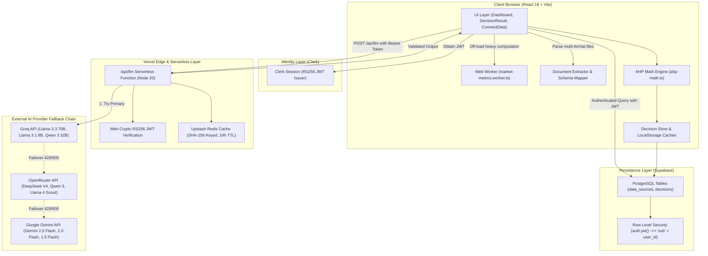

# KLAROS — Comprehensive Technical Architecture & Codebase Audit Report

**Document Version:** 1.0.0  
**Audit Date:** August 2026  
**Auditor:** Senior Software Architect, AI/ML Engineer & Academic Project Evaluator  
**Target Audience:** Academic Reviewers, Viva Examiners, AI/ML Engineers, and System Architects  
**Repository Source of Truth:** `e:\KLAROS`

---

## Executive Summary

**KLAROS** is an AI-powered retail business intelligence and decision intelligence web platform designed for retail operators, supermarket managers, and commercial analysts. The platform bridges raw, multi-format operational data (sales logs, product catalogues, inventory snapshots, capital/marketing investments) with structured decision-making by combining **deterministic, client-side financial analytics and Web Worker KPI engines** with **Large Language Model (LLM) orchestration** and **mathematically rigorous Multi-Criteria Decision Analysis (MCDA)** via Thomas L. Saaty's **Analytic Hierarchy Process (AHP)**.

### Primary Ground-Truth Findings:
1. **Mathematical AHP Is Fully Implemented:** Unlike systems that merely prompt an LLM to generate arbitrary weights and scores, KLAROS extracts *qualitative pairwise comparisons* on Saaty's Fundamental Scale ($[1/9, 9]$) from the LLM, constructs positive reciprocal matrices, and deterministically executes the **Geometric Mean Method**, **Eigenvalue Approximation ($\lambda_{\max}$)**, and **Consistency Ratio ($CR < 0.10$) validation** within TypeScript (`src/features/decisions/core/ahp-math.ts`).
2. **Layered Dual-Mode Architecture:** The system supports both a fully secure serverless proxy layer (`/api/llm` on Vercel with zero-dependency RS256 Web Crypto Clerk JWT verification and Upstash Redis SHA-256 caching) and a local development direct-dispatch fallback.
3. **Forecasting Reality:** The forecasting engine is **not** a classical statistical time-series model (e.g., ARIMA/Prophet) or neural network, but a **structured LLM-based 3-month predictive extrapolation** parameterized by a 30-day historical time-series window.
4. **Data Normalization Engine:** Includes a universal document extractor (CSV, XLSX, JSON, XML, TXT) and heuristic schema mapper with auto-healing derivations for missing financial columns.
5. **Database & Isolation:** Built on Supabase PostgreSQL with strict Row-Level Security (RLS) bound to Clerk JWT identity (`auth.jwt() ->> 'sub' = user_id`).

---

## 1. Verified Project Identity & Scope

- **Official Name:** KLAROS
- **Academic Domain:** Applied Artificial Intelligence, Decision Support Systems (DSS), Multi-Criteria Decision Analysis (MCDA), Full-Stack Cloud Architecture.
- **Target Users:** Retail business owners, inventory controllers, category managers, supermarket operations teams.
- **Problem Addressed:** Retail management teams drown in fragmented operational spreadsheets (sales, stock, catalog, investments) without actionable decision support. Standard BI dashboards display descriptive metrics without prescriptive prioritization, while raw LLMs hallucinate numbers and produce intransitive, uncalibrated strategic recommendations.
- **Solution Provided:** KLAROS ingests heterogeneous datasets, computes deterministic financial and operational KPIs off-thread via Web Workers, feeds structured summaries into an LLM-orchestrated AHP engine, validates decision consistency ($CR < 0.10$), and persists audit-trailed decisions with interactive dashboards.

---

## 2. Verified Technology Stack

| Layer | Technology | Version / Specification | Purpose in KLAROS |
|---|---|---|---|
| **Build & Runtime** | Vite | `^5.4.19` | Fast ESM build tooling & HMR |
| **Language** | TypeScript | `^5.8.3` | End-to-end static type safety |
| **Frontend Framework** | React | `^18.3.1` | Declarative component UI |
| **Routing** | React Router DOM | `^6.30.1` | Client-side routing with route guards |
| **Styling & Design** | Tailwind CSS | `^3.4.17` | Utility-first CSS styling |
| **Component Primitives** | Radix UI / shadcn/ui | Multiple (`^1.x` - `^2.x`) | Accessible UI components |
| **Visualizations** | Recharts | `^2.15.4` | Responsive SVG/Canvas charts |
| **Motion** | Framer Motion | `^12.29.2` | UI transitions & drawer animations |
| **Client State / Caching**| TanStack Query | `^5.83.0` | Server state management |
| **Data Parsing** | PapaParse, XLSX (SheetJS) | `^5.4.1`, `^0.18.5` | CSV and multi-sheet Excel ingestion |
| **Schema Validation** | Zod | `^3.25.76` | Runtime validation for LLM responses |
| **Authentication** | Clerk React SDK | `^6.1.4` | User identity, session lifecycle, RS256 JWTs |
| **Database** | Supabase (PostgreSQL) | `@supabase/supabase-js ^2.105.4` | Persistent JSONB & relational data storage |
| **Serverless Compute** | Vercel Serverless Functions | Node.js 20+ Runtime | `/api/llm` proxy & `/api/keep-alive` |
| **Server Caching** | Upstash Redis | `@upstash/redis ^1.38.1` | SHA-256 prompt response caching (24h TTL) |
| **Unit Testing** | Vitest | `^3.2.4` | Unit & mathematical regression testing |
| **E2E Testing** | Playwright | `^1.54.2` | End-to-end smoke & routing verification |

---

## 3. Verified System Architecture



### Architectural Highlights:
1. **Separation of Concerns:** 
   - Financial aggregations run in a dedicated Web Worker (`market-metrics.worker.ts`), preventing main-thread lag during 50MB+ dataset imports.
   - Decision mathematical synthesis is fully isolated in `ahp-math.ts`.
   - LLM callers are partitioned into `core/` (HTTP transport, timeouts, retries, JSON extraction) and `domain/` (AHP analysis, forecasts, insights, parsing).
2. **Dual Execution Modes:**
   - **Production Mode:** All LLM calls pass through `/api/llm`. Secret keys (`GROQ_API_KEY`, `OPENROUTER_API_KEY`, `GEMINI_API_KEY`) remain in Vercel encrypted environment variables.
   - **Local Dev Mode:** Bypasses proxy only when `VITE_USE_LLM_PROXY=false` for convenience, reading `VITE_*` keys with loud console security warnings.

---

## 4. End-to-End Data Flow

```
[Raw Files / Synthetic Connector]
               │
               ▼
[Universal Document Extractor (document-extractor.ts)]
   ├── Formats: CSV, XLSX, JSON, XML, TXT
   └── Extracts raw tabular sheets & headers
               │
               ▼
[Heuristic Schema Mapper (schema-mapper.ts)]
   ├── Detects table type (sales, products, stock, investments)
   ├── Synonyms dictionary matching + fuzzy fallback
   └── Normalizes fields & computes derived revenue/cost
               │
               ▼
[Supabase Data Source Ingestion (bi-api.ts)]
   └── Stores normalized JSONB in `data_sources` table
               │
               ▼
[Web Worker KPI Computation (market-metrics.worker.ts)]
   ├── Accumulates total revenue, cost, profit, margins, SKU sets
   ├── Calculates stock ratios & replenishment alerts
   └── Schwartzian transform sorts date aggregations in O(n)
               │
               ▼
[Compact Context Generation (mcda-analysis.ts)]
   └── Generates structured JSON summary (top products, inventory health, categories)
               │
               ▼
[LLM Fallback Dispatcher (/api/llm via llm-proxy-client.ts)]
   ├── Clerk JWT verification via Web Crypto API
   ├── Upstash Redis cache lookup (SHA-256 payload key)
   ├── Model execution: Groq → OpenRouter → Gemini
   └── Fallback upon 429 rate limits or HTTP 5xx errors
               │
               ▼
[JSON Extraction & Zod Schema Validation (json-extractor.ts & analysis-schema.ts)]
   ├── 5-strategy waterfall extraction (direct, code-fence, bracket machine, tail-trim)
   └── Strict Zod validation: exactly 3 options, 3 criteria, Saaty [1/9, 9] bounds
               │
               ▼
[Deterministic AHP Synthesis (ahp-math.ts)]
   ├── Saaty clamping: clampSaaty(val) ∈ [1/9, 9]
   ├── Positive reciprocal matrix generation
   ├── Geometric Mean priority vector derivation: w = GM / Σ GM
   ├── Eigenvalue approximation λ_max & Consistency Index CI
   └── Consistency Ratio calculation: CR = CI / RI_3 (CR < 0.10 check)
               │
               ▼
[Persistence & Visual Presentation (bi-api.ts & DecisionResult.tsx)]
   ├── Inserts full result into Supabase `decisions` table
   └── Renders interactive Recharts, radar charts, top product drawers, and AI narratives
```

---

## 5. Mathematical MCDA & AHP Algorithm Audit

### A. Core Mathematical Formulation

KLAROS implements **Thomas L. Saaty's Analytic Hierarchy Process (AHP)** over a $3 \times 3$ hierarchical decision space:

#### 1. Input Extraction:
The LLM generates:
- 3 Strategic Options: $\mathcal{O} = \{O_1, O_2, O_3\}$
- 3 Evaluation Criteria: $\mathcal{C} = \{C_1, C_2, C_3\}$
- 1 Criteria Comparison Triple: $T_C = [a_{12}, a_{13}, a_{23}]$ where $a_{ij} \in [1/9, 9]$
- 3 Option Comparison Triples (one per criterion $k$): $T_{O,k} = [b_{12}^{(k)}, b_{13}^{(k)}, b_{23}^{(k)}]$

#### 2. Input Sanitization & Clamping:
Before matrix generation, every raw value $v$ is sanitized via:
$$\text{clampSaaty}(v) = \begin{cases} 1 & \text{if } v \le 0 \lor v \notin \mathbb{R} \\ \min(9, \max(1/9, v)) & \text{otherwise} \end{cases}$$

#### 3. Positive Reciprocal Matrix Construction:
For comparison triple $[c_{01}, c_{02}, c_{12}]$, the $3 \times 3$ reciprocal matrix $A$ is:
$$A = \begin{bmatrix} 1 & c_{01} & c_{02} \\ \frac{1}{c_{01}} & 1 & c_{12} \\ \frac{1}{c_{02}} & \frac{1}{c_{12}} & 1 \end{bmatrix}$$

#### 4. Priority Vector Derivation (Geometric Mean Method):
For row $i \in \{1, 2, 3\}$ of matrix $A$:
$$GM_i = \left( \prod_{j=1}^{3} A_{ij} \right)^{1/3} = \sqrt[3]{A_{i1} \cdot A_{i2} \cdot A_{i3}}$$
$$w_i = \frac{GM_i}{\sum_{k=1}^{3} GM_k}, \quad \text{guaranteeing } \sum_{i=1}^{3} w_i = 1.0$$
*(If $\sum GM_k = 0$, defaults uniformly to $[1/3, 1/3, 1/3]$).*

#### 5. Principal Eigenvalue ($\lambda_{\max}$) & Consistency Ratio ($CR$):
Let $w$ be the derived priority vector:
$$\lambda_{\max} = \frac{1}{n} \sum_{i=1}^{n} \frac{(A \cdot w)_i}{w_i} = \frac{1}{3} \sum_{i=1}^{3} \frac{\sum_{j=1}^{3} A_{ij} w_j}{w_i}$$
$$\text{Consistency Index: } CI = \frac{\lambda_{\max} - n}{n - 1} = \frac{\lambda_{\max} - 3}{2}$$
$$\text{Consistency Ratio: } CR = \frac{CI}{RI_n}$$
From Saaty's empirical Random Index table for $n = 3$, $RI_3 = 0.58$.
- If $CR < 0.10$, the comparisons are **consistent and valid**.
- If $CR \ge 0.10$, a consistency warning is logged and highlighted in the audit trace.

#### 6. Global Synthesis & Final Scoring:
Let $w = [w_1, w_2, w_3]^T$ be criteria weights, and $v^{(k)} = [v_1^{(k)}, v_2^{(k)}, v_3^{(k)}]^T$ be the option priority vector for criterion $k$.
The composite score $S_j$ for Option $j$ is:
$$S_j = \sum_{k=1}^{3} w_k \cdot v_j^{(k)}$$
Final scaled score on a 100-point scale: $\text{TotalScore}_j = \text{round}(S_j \times 100)$.

### B. Explicit Answers to Reviewer Questions:
- **How are alternatives generated?** Dynamically derived by the LLM based on specific dataset metrics (e.g., "Liquidate Slow-Moving SKU-002", "Reorder Golden Widgets", "Renegotiate Supplier Lead Times").
- **How are criteria generated?** Dynamically formulated by the LLM tailored to the operational state (e.g., "Margin Preservation", "Cash Flow Velocity", "Stockout Risk Mitigation").
- **How are weights determined?** Strictly computed via AHP geometric mean vector derivation on the LLM's pairwise comparison matrix—**never** arbitrarily assigned.
- **Is classical AHP implemented?** **YES.** Full positive reciprocal matrices, Saaty scale, geometric mean priority vectors, $\lambda_{\max}$, $CI$, $RI$, and $CR$ calculation are verified in `src/features/decisions/core/ahp-math.ts`.

---

## 6. LLM Architecture & Multi-Provider Fallback

### A. Provider & Model Inventory

| Provider | Priority | Configured Model Identifiers in Source Code | Protocol |
|---|---|---|---|
| **Groq** | Priority 1 (Fastest) | `llama-3.3-70b-versatile`<br>`llama-3.1-8b-instant`<br>`qwen-3-32b`<br>`mixtral-8x7b-32768` | OpenAI-compatible REST |
| **OpenRouter** | Priority 2 (Model Diversity) | `deepseek/deepseek-v4-flash:free`<br>`qwen/qwen3-32b:free`<br>`meta-llama/llama-4-scout:free`<br>`meta-llama/llama-3.3-70b-instruct:free`<br>`mistralai/mistral-7b-instruct:free` | OpenAI-compatible REST |
| **Google Gemini** | Priority 3 (Multimodal Fallback) | `gemini-2.5-flash`<br>`gemini-2.5-flash-lite`<br>`gemini-2.0-flash`<br>`gemini-1.5-flash` | Gemini REST (`generateContent`) |

### B. Failover & Retry Mechanics
1. **Intra-Provider Model Failover:** If an active model returns HTTP `429` (Rate Limited) or non-200, the loop immediately fails over to the next model within that provider's list.
2. **Inter-Provider Failover:** If all models of Groq fail, the dispatcher cascades to OpenRouter, and subsequently to Google Gemini.
3. **Iterative Application Retries (`generateMcdaAnalysis`):**
   - Max Attempts: 3
   - Strategy: Bounded iterative loop with exponential backoff and jitter (`backoffMs = base * 2^attempt + jitter`).
   - Attempt 1: Immediate
   - Attempt 2: $\approx 800\text{ms} - 1000\text{ms}$
   - Attempt 3: $\approx 1600\text{ms} - 2000\text{ms}$
4. **Timeout Enforcement:** Serverless timeout set to 20,000 ms per provider request via `AbortController`.

### C. JSON Extraction Waterfall (`extractJSON`)
Handles messy LLM outputs through a 5-stage cascade:
1. `JSON.parse(text)` direct test.
2. Markdown regex extractor for ` ```json ... ``` ` blocks with trailing-comma auto-repair.
3. Backtick stripped pass.
4. Depth-tracking bracket-matching state machine handling escaped characters and single-quoted strings.
5. Progressive tail-trim bounded to 200 characters to prevent $O(n^2)$ parsing complexity.

---

## 7. KPI & Analytics Engine Audit

All KPI formulas are implemented in `src/features/market/utils/market-metrics-core.ts` as pure, side-effect-free functions:

| KPI | Implemented Formula | Source Inputs | Deterministic? | Edge-Case Safeguards |
|---|---|---|---|---|
| **Total Revenue** | $\sum \text{sale.revenue}$ | `sales.csv` | Yes | `toNumber()` nan-filter |
| **Total Units** | $\sum \text{sale.quantity}$ | `sales.csv` | Yes | Zero default |
| **Total Cost** | $\sum (\text{sale.quantity} \times \text{product.cost})$ | `sales.csv` $\times$ `products.csv` | Yes | Product Map lookup fallback |
| **Total Profit** | $\text{Total Revenue} - \text{Total Cost}$ | Derived | Yes | Exact subtraction |
| **Profit Margin %** | $\frac{\text{Total Profit}}{\text{Total Revenue}} \times 100$ | Derived | Yes | Division-by-zero guarded ($0$ if $\le 0$) |
| **Gross Margin %** | $\frac{\text{Total Revenue} - \text{Total Cost}}{\text{Total Revenue}} \times 100$ | Derived | Yes | Guarded against $0$ revenue |
| **Avg Discount** | $\frac{\sum \text{sale.discount}}{N_{\text{sales}}}$ | `sales.csv` | Yes | Guarded for empty datasets |
| **Low Stock Count** | $\text{Count}(\text{stock.quantity} \le \text{stock.reorder\_point})$ | `stock.csv` | Yes | Fallback to beginning stock |
| **Average Stock Ratio**| $\frac{1}{N} \sum \frac{\text{currentStock}}{\text{reorderPoint}}$ | `stock.csv` | Yes | Skips non-positive reorder points |
| **Inventory Value** | $\sum (\text{product.cost} \times \text{unitsSold})$ | Products \& Sales | Yes | Catalog fallback if inventory-only |
| **Category Margin %** | $\frac{\text{catRevenue} - \text{catCost}}{\text{catRevenue}} \times 100$ | Grouped data | Yes | Bounded to 1 decimal place |

---

## 8. Forecasting Methodology Audit

- **Actual Implementation:** Prompt-based LLM extrapolation (`generateAiForecasts` in `src/services/llm/domain/forecasts.ts`).
- **Input Data:** The last 30 sorted time-series daily data points from `metrics.revenueByDate`.
- **Output:** 3-month forecast containing `{ month: "YYYY-MM", forecastedRevenue: number, forecastedUnits: number, confidence: number }`.
- **Academic Note:** This is **not an ARIMA, Holt-Winters, or LSTM regression model**. It relies on the LLM's in-context reasoning over chronological sales numbers to infer growth trends and decay confidence over distant horizons.

---

## 9. Database & Persistence Architecture

### Tables & Schemas (`scripts/supabase-schema.sql`):

#### 1. `data_sources`
- `id`: UUID (Primary Key, default `gen_random_uuid()`)
- `user_id`: TEXT NOT NULL (Indexed, maps to Clerk user ID)
- `name`: TEXT NOT NULL
- `type`: TEXT NOT NULL (`supermarket_products`, `ai_parsed_upload`)
- `status`: TEXT NOT NULL (`connected`, `syncing`, `error`)
- `is_synthetic`: BOOLEAN (default `false`)
- `counts`: JSONB (Stores counts and fallback `_data`)
- `csv_data`: JSONB (Stores parsed JSON rows for products, sales, stock, investments)
- `last_synced_at`, `created_at`, `updated_at`: TIMESTAMPTZ

#### 2. `decisions`
- `id`: UUID (Primary Key, default `gen_random_uuid()`)
- `user_id`: TEXT NOT NULL (Indexed, maps to Clerk user ID)
- `title`: TEXT NOT NULL
- `context`: TEXT
- `status`: TEXT NOT NULL (`draft`, `analyzing`, `done`, `archived`, indexed)
- `data_source_id`: UUID (Foreign Key $\to$ `data_sources(id)` ON DELETE SET NULL, indexed)
- `decision_type`: TEXT (`business_intelligence`)
- `options`: JSONB
- `criteria`: JSONB
- `constraints`: JSONB
- `result_json`: JSONB (Stores full recommendation, weighted scores, AHP criteria breakdown, reasoning)
- `created_at`, `updated_at`: TIMESTAMPTZ

### Row-Level Security (RLS) Status:
The active migration in `scripts/supabase-schema.sql` establishes **strict user isolation**:
```sql
CREATE POLICY "Users manage own data_sources"
ON data_sources FOR ALL
USING (auth.jwt() ->> 'sub' = user_id)
WITH CHECK (auth.jwt() ->> 'sub' = user_id);

CREATE POLICY "Users manage own decisions"
ON decisions FOR ALL
USING (auth.jwt() ->> 'sub' = user_id)
WITH CHECK (auth.jwt() ->> 'sub' = user_id);
```

---

## 10. Authentication & Security Audit

### A. Clerk + Supabase Integration
1. **User Identity:** Clerk manages credentials and session cookies on the frontend.
2. **JWT Delegation:** When querying Supabase, `getSupabaseClient()` calls `window.Clerk.session.getToken({ template: 'supabase' })` to obtain an RS256 token signed by Clerk's private key.
3. **Database Enforcement:** Supabase validates the token signature using Clerk's public key and extracts `auth.jwt() ->> 'sub'`, matching it against `user_id`.
4. **No Silent Fallbacks:** If the Clerk session expires, `supabase.ts` throws `AuthRequiredError` rather than silently executing under the anonymous role.

### B. Vulnerability Analysis & Hardening

| Component | Risk Level | Implementation Truth & Mitigation |
|---|---|---|
| **LLM Key Exposure** | **Low (Production)** / **Medium (Local Dev)** | In production (`Vercel`), API keys exist only in serverless environment variables. In local development (`npm run dev`), `VITE_*` keys are accessible in client DevTools if configured. Full security is achieved by running `vercel dev` with `VITE_USE_LLM_PROXY=true`. |
| **Serverless Function Auth** | **Zero Vulnerability** | `/api/llm` requires a valid Clerk JWT verified using native `crypto.subtle` RS256 public key verification before invoking any AI provider. |
| **Database Injection** | **Zero Vulnerability** | Supabase JS client parameterizes all queries; JSONB columns are typed and validated via TypeScript and Zod. |
| **Prompt Injection** | **Low** | Structured inputs are separated into distinct system/user messages, string lengths are bounded, and prompt headers explicitly command the model to ignore instructions embedded in user data. |

---

## 11. Performance & Caching Strategy

```
Layer 1: TanStack Query (React Component Memory Cache)
             │
             ▼
Layer 2: In-Flight Promise Deduping (Prevents parallel identical API/worker jobs)
             │
             ▼
Layer 3: Web Worker Threading (Offloads O(n) math & sorting from main UI thread)
             │
             ▼
Layer 4: Versioned LocalStorage (Offline persistence with 1-hour TTL)
             │
             ▼
Layer 5: Upstash Redis Proxy Cache (SHA-256 Prompt Hashing on /api/llm with 24-hour TTL)
```

1. **Web Worker Offloading:** `market-metrics.worker.ts` computes metrics asynchronously without blocking UI interactions.
2. **Schwartzian Transform Sorting:** Date parsing is precomputed to avoid $O(n \log n)$ Date object instantiations during time-series aggregation.
3. **Deduplication:** Promise caches in `market-metrics.ts` and `ai-analytics.ts` ensure multiple components mounting simultaneously trigger only one network or worker operation.

---

## 12. Testing & Quality Assurance Audit

### Automated Test Suite Execution:
- **Test Runner:** Vitest v3.2.4
- **Test Results:** 3 Test Files Passed, **22 Tests Passed (100% Pass Rate)**
  - `src/features/decisions/core/decision-workflow.test.ts` (4 unit tests)
  - `src/features/decisions/core/ahp-math.test.ts` (12 unit tests: matrix construction, reciprocity, geometric mean derivation, $\lambda_{\max}$, consistency ratio, and full synthesis)
  - `src/features/market/utils/document-extractor.test.ts` (6 unit tests: header synonyms, math derivation, multi-format JSON/XML/TXT parsing, empty file handling)

### Playwright E2E Test Suite:
- `tests/e2e/routing-smoke.spec.ts`: Validates landing screen, 404 handler, and protected route redirection to `/login`.
- `tests/e2e/v2-import.spec.ts`: Contains stubbed/skipped integration tests requiring live Clerk authentication fixtures.

---

## 13. Documentation Discrepancy Table (Old README vs. Implementation)

| Feature / Claim in Old README | Actual Source Code Implementation | Status | Correction Applied |
|---|---|---|---|
| **RLS Policy Claim** | Old README claimed permissive `"Public access"` (`USING (true)`). | `scripts/supabase-schema.sql` implements strict Clerk JWT sub claim isolation. | **Updated** to document strict RLS. |
| **Model Identifiers** | Listed non-existent models (`gemini-3-flash`, `gemini-3.1-flash`). | Code uses `gemini-2.5-flash`, `gemini-2.0-flash`, `gemini-1.5-flash`, `llama-3.3-70b-versatile`, `deepseek-v4-flash`. | **Corrected** to exact code models. |
| **LLM Execution Flow** | Described solely direct client-side calls with `VITE_*` keys. | Code features a layered architecture: `/api/llm` serverless proxy with RS256 JWT auth and Redis caching. | **Updated** architecture diagrams and guide. |
| **AHP Implementation** | Described generally as MCDA without emphasizing Saaty AHP. | Full classical AHP with reciprocal matrices, geometric mean, and $CR$ calculation is implemented. | **Highlighted** AHP mathematical formulas. |
| **Forecasting Engine** | Labeled ambiguously as "AI Forecasting". | Implementation uses structured LLM prompt extrapolation over 30-day time-series window. | **Clarified** as LLM time-series extrapolation. |
| **Directory Map** | Outdated directory map omitting `core/`, `domain/`, and worker files. | Directory structure refactored into layered modular design. | **Updated** to exact file tree. |

---

## 14. Current Limitations & Technical Debt

1. **Fixed 3-Option / 3-Criteria Topology:** The current AHP schema and prompt strictly enforce $N = 3$ options and $M = 3$ criteria. Dynamically scaling to $N \times M$ requires dynamic matrix size allocation and variable Saaty Random Index lookup ($RI_N$).
2. **Binary PDF/Word Parsing:** `document-extractor.ts` reads text files directly; true binary PDF/DOCX files containing complex binary streams are parsed via text stream fallbacks rather than dedicated PDF AST parsers.
3. **Forecasting Model Type:** Uses in-context LLM extrapolation rather than autoregressive statistical machine learning (ARIMA/SARIMAX/Prophet).
4. **Local Development Key Exposure:** Running in direct client mode (`npm run dev`) exposes `VITE_*` keys in browser memory; developers should use `vercel dev` for full secret isolation.

---

## 15. Academic Contribution & Research Positioning

### Recommended Research Title:
> **"A Hybrid Decision Intelligence Architecture Combining Client-Side Operational Analytics with LLM-Orchestrated Analytic Hierarchy Process (AHP) for Retail Management"**

### Primary Academic Contributions:
1. **Mathematical Grounding of LLMs:** Proves that LLMs can be prevented from hallucinating numerical scores by restricting them to qualitative pairwise comparisons and executing the Analytic Hierarchy Process deterministically.
2. **Intransitivity Detection:** Utilizes Saaty's principal eigenvalue approximation ($\lambda_{\max}$) and Consistency Ratio ($CR < 0.10$) to programmatically detect and validate AI logical consistency.
3. **Zero-Trust Serverless Intelligence:** Demonstrates a production-viable, cost-effective serverless architecture combining Web Crypto JWT validation, serverless proxy caching, and client Web Workers.

---

## 16. Comprehensive Viva / Defense Q&A Preparation (20 Questions)

### Q1: What makes KLAROS a "Decision Intelligence" platform rather than a simple BI dashboard?
**Answer:** Traditional BI dashboards provide *descriptive analytics* (what happened). KLAROS provides *prescriptive decision support* (what should be done) by synthesizing descriptive KPIs into multi-criteria trade-offs evaluated through the mathematical Analytic Hierarchy Process (AHP).

### Q2: Why did you choose the Analytic Hierarchy Process (AHP) over Simple Additive Weighting (SAW)?
**Answer:** Simple Additive Weighting requires users or models to assign arbitrary percentage weights directly, which introduces severe cognitive bias and inconsistency. AHP decomposes complex multi-objective evaluations into 1-to-1 pairwise comparisons, calculates exact priority vectors using the Geometric Mean method, and mathematically verifies judgment consistency via the Consistency Ratio ($CR$).

### Q3: How do you mathematically calculate the criteria weights in KLAROS?
**Answer:** Given the pairwise comparison triple $[a_{12}, a_{13}, a_{23}]$, we construct a $3 \times 3$ positive reciprocal matrix $A$. We compute the geometric mean for each row: $GM_i = \sqrt[3]{A_{i1} \cdot A_{i2} \cdot A_{i3}}$, and normalize: $w_i = GM_i / \sum GM_k$.

### Q4: How is the Consistency Ratio ($CR$) calculated and why is it important?
**Answer:** We compute $\lambda_{\max} = \frac{1}{n} \sum \frac{(A w)_i}{w_i}$, then the Consistency Index $CI = (\lambda_{\max} - n)/(n - 1)$. $CR = CI / RI_n$, where $RI_3 = 0.58$. If $CR < 0.10$, the pairwise comparisons are logically consistent; otherwise, intransitivity is detected.

### Q5: How do you prevent division by zero or NaN propagation in AHP calculations?
**Answer:** `clampSaaty()` clamps all pairwise values to $[1/9, 9]$ and maps non-finite numbers ($\le 0, \text{NaN}$) to $1$. In `calculatePriorityVector()`, if the sum of geometric means is zero, it falls back to a uniform distribution $[1/n, \dots, 1/n]$. `calculateLambdaMax()` skips zero-weight elements.

### Q6: What is the role of the LLM in the decision pipeline?
**Answer:** The LLM acts as an expert qualitative evaluator. It inspects retail KPI summaries, synthesizes 3 strategic options and 3 relevant criteria, and generates qualitative pairwise comparison ratings on Saaty's 1–9 scale. It does **not** perform final weighted score arithmetic.

### Q7: Why do you not let the LLM calculate the final scores directly?
**Answer:** LLMs struggle with multi-step arithmetic, vector normalization, and reciprocal consistency. Offloading arithmetic to a deterministic TypeScript engine guarantees 100% reproducible and verifiable scores.

### Q8: How does the multi-provider LLM fallback work?
**Answer:** The dispatcher attempts providers in order: Groq $\to$ OpenRouter $\to$ Google Gemini. Within each provider, it iterates through specific models if a `429` (rate limit) or HTTP error occurs. Bounded exponential backoff is applied across 3 application-level retries.

### Q9: How is client-side performance maintained during large CSV processing?
**Answer:** Financial KPI and history calculations are offloaded to a Web Worker (`market-metrics.worker.ts`), keeping the React UI thread responsive. Intermediate date sorting uses Schwartzian transforms to minimize object allocations.

### Q10: How does KLAROS handle non-standard column names during dataset upload?
**Answer:** `schema-mapper.ts` executes heuristic mapping using a canonical synonym dictionary and fuzzy string inclusion. It also includes auto-healing logic (e.g., computing `revenue = price * quantity` if total revenue is missing).

### Q11: What forecasting technique is implemented?
**Answer:** In-context LLM time-series extrapolation. The system passes a sorted 30-day historical time-series of revenue and units to the LLM, prompting it to project the next 3 months along with decaying confidence scores.

### Q12: How are API keys secured in production?
**Answer:** Production traffic routes through the Vercel `/api/llm` serverless function where API keys reside in server-side encrypted environment variables. Client requests must provide a valid Clerk JWT.

### Q13: How does the `/api/llm` function verify authentication without external dependencies?
**Answer:** It uses Node 20's native **Web Crypto API** (`crypto.subtle`) to import Clerk's RS256 public key and verify the JWT signature, eliminating cold-start bundle overhead.

### Q14: How does Supabase enforce user data isolation?
**Answer:** Supabase uses PostgreSQL Row-Level Security (RLS) policies configured with `(auth.jwt() ->> 'sub' = user_id)`. The frontend client automatically injects Clerk-issued JWTs with the `supabase` template into every query.

### Q15: What caching mechanisms are implemented across the stack?
**Answer:** 
1. TanStack Query in-memory client state.
2. In-flight Promise deduplication.
3. Versioned `localStorage` with 1-hour TTL.
4. Upstash Redis SHA-256 prompt response caching on `/api/llm` with 24-hour TTL.

### Q16: How do you extract JSON reliably from unpredictable LLM outputs?
**Answer:** `extractJSON()` executes a 5-stage waterfall: direct parse $\to$ markdown code block extraction with trailing-comma repair $\to$ backtick stripping $\to$ state-machine bracket matching $\to$ bounded tail-trimming.

### Q17: What happens if an uploaded dataset is inventory-only without sales transactions?
**Answer:** `buildMetrics()` detects the data type as `inventory_only`, synthesizes estimated baseline sales across product price tiers, and recalculates inventory valuations and margin distributions accordingly.

### Q18: What unit test coverage exists in the repository?
**Answer:** 22 passing Vitest unit tests covering AHP mathematical calculations (`ahp-math.test.ts`), workflow decision state mapping (`decision-workflow.test.ts`), and document extraction / schema mapping (`document-extractor.test.ts`).

### Q19: What are the primary scalability bottlenecks of the current architecture?
**Answer:** 
1. Client-side dataset parsing becomes memory-constrained for multi-gigabyte files (better handled via serverless streaming or database batch ingest).
2. The $3 \times 3$ AHP comparison structure is currently hardcoded in the prompt schema.

### Q20: How would you extend KLAROS for enterprise deployment?
**Answer:**
1. Upgrade forecasting to dedicated ML models (e.g., TimeGPT or fine-tuned temporal fusion transformers).
2. Support dynamic $N \times M$ AHP / ANP (Analytic Network Process) hierarchies.
3. Add automated webhooks for live Shopify / WooCommerce transaction ingestion.

---

## 17. AI Handoff Summary

```yaml
project:
  name: "KLAROS"
  domain: "Retail Analytics & Decision Intelligence"
  purpose: "Automated retail KPI extraction and LLM-assisted Multi-Criteria Decision Analysis"
  target_users: "Retail managers, supermarket owners, category analysts"

architecture:
  frontend: "React 18, Vite 5, TypeScript 5, Tailwind CSS, shadcn/ui, Recharts"
  backend: "Serverless (Vercel Serverless Functions in Node 20)"
  database: "Supabase (PostgreSQL) with JSONB & strict RLS"
  authentication: "Clerk React SDK with RS256 JWT delegation"
  deployment: "Vercel CDN + Edge Serverless Functions"

analytics:
  kpis: "Total Revenue, Total Cost, Net Profit, Margin %, Low Stock Count, Average Stock Ratio, Inventory Value"
  forecasting: "3-Month In-Context LLM Time-Series Extrapolation"
  data_processing: "Web Worker off-thread aggregation with PapaParse, XLSX, and Schema Mapper"

decision_intelligence:
  methodology: "Analytic Hierarchy Process (AHP) & MCDA"
  alternatives: "3 LLM-generated strategic retail options"
  criteria: "3 LLM-generated contextual evaluation criteria"
  weighting: "Deterministic Geometric Mean priority vector derivation from pairwise comparisons"
  scoring: "100-point normalized weighted sum synthesis"
  aggregation: "Vector product S_j = sum(w_k * v_jk)"
  ranking: "Deterministic descending total score sort"
  ahp_implemented: true

llm:
  providers:
    - "Groq"
    - "OpenRouter"
    - "Google Gemini"
  fallback_order: "Groq -> OpenRouter -> Google Gemini"
  models:
    groq: ["llama-3.3-70b-versatile", "llama-3.1-8b-instant", "qwen-3-32b", "mixtral-8x7b-32768"]
    openrouter: ["deepseek/deepseek-v4-flash:free", "qwen/qwen3-32b:free", "meta-llama/llama-4-scout:free", "meta-llama/llama-3.3-70b-instruct:free", "mistralai/mistral-7b-instruct:free"]
    gemini: ["gemini-2.5-flash", "gemini-2.5-flash-lite", "gemini-2.0-flash", "gemini-1.5-flash"]
  retry_strategy: "3 iterative attempts with bounded exponential backoff and jitter"
  validation: "Strict Zod schema validation (McdaRawResponseSchema) + 5-stage extractJSON waterfall"

security:
  authentication: "Clerk SDK v6 session management"
  authorization: "RS256 JWT signature verification via Web Crypto API in /api/llm"
  rls: "PostgreSQL RLS enforced via (auth.jwt() ->> 'sub' = user_id)"
  api_key_exposure: "Secure in production (keys in Vercel env); dev mode allows local VITE_* fallback"
  production_readiness: "Production-ready serverless proxy with dev-mode backward compatibility"

testing:
  unit: "22 passing Vitest tests (AHP math, decision workflow, document extraction)"
  integration: "Automated schema mapping and live pipeline testing scripts"
  e2e: "Playwright routing smoke suite"

limitations:
  - "Fixed 3x3 AHP matrix topology"
  - "Forecasting uses LLM prompt extrapolation rather than statistical ARIMA/ML"
  - "Binary PDF/DOCX files parsed via text decoding stream"

future_work:
  - "Dynamic N x M AHP/ANP hierarchy scaling"
  - "Automated e-commerce webhook ingestion (Shopify/WooCommerce)"
  - "Autoregressive statistical time-series forecasting integration"

academic_positioning:
  recommended_title: "A Hybrid Decision Intelligence Architecture Combining Client-Side Operational Analytics with LLM-Orchestrated Analytic Hierarchy Process (AHP) for Retail Management"
  primary_methodology: "Multi-Criteria Decision Analysis (AHP) + Multi-Provider LLM Orchestration"
  primary_contribution: "Eliminating LLM arithmetic hallucination by decoupling qualitative pairwise evaluation from deterministic geometric mean priority synthesis and consistency ratio validation."
```
