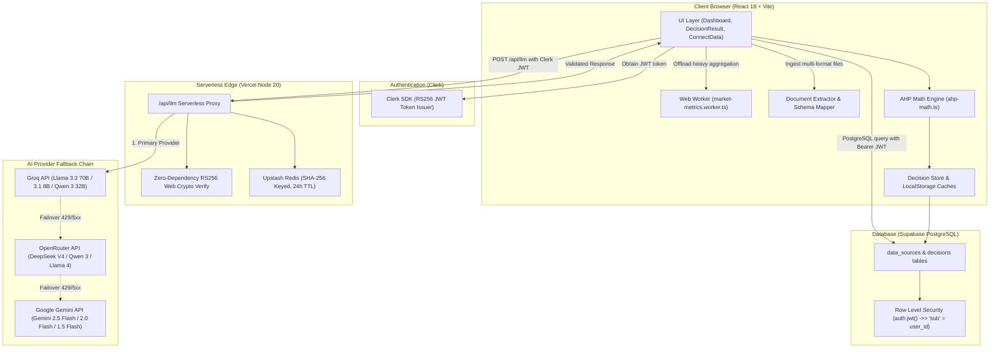

<p align="center">
  
</p>

# KLAROS — Multi-Domain AI Analytics & Multi-Criteria Decision Intelligence Platform

> **A Hybrid Decision Support Platform Combining Client-Side Operational Metrics, Multi-Domain Dataset Classification, Dual MCDA (AHP + TOPSIS) Mathematical Engines, and Multi-Provider LLM Orchestration.**

[](https://www.typescriptlang.org/)
[](https://reactjs.org/)
[](https://vitejs.dev/)
[](https://supabase.com/)
[](https://clerk.com/)
[](https://vitest.dev/)
[](LICENSE)

---

## Table of Contents

1. [Project Overview & Problem Statement](#1-project-overview--problem-statement)
2. [Objectives & Scope](#2-objectives--scope)
3. [Key Features](#3-key-features)
4. [System Architecture](#4-system-architecture)
5. [End-to-End Data Flow](#5-end-to-end-data-flow)
6. [Technology Stack](#6-technology-stack)
7. [Repository Structure](#7-repository-structure)
8. [Universal Multi-Domain Classification Engine](#8-universal-multi-domain-classification-engine)
9. [Dual MCDA Framework: AHP + TOPSIS](#9-dual-mcda-framework-ahp--topsis)
10. [Authentication & Authorization](#10-authentication--authorization)
11. [Database Architecture & RLS](#11-database-architecture--rls)
12. [Security Model](#12-security-model)
13. [Financial KPIs & Cost-Estimation Methodology](#13-financial-kpis--cost-estimation-methodology)
14. [Multi-Currency Auto-Detection & Formatting Engine](#14-multi-currency-auto-detection--formatting-engine)
15. [LLM Architecture & Fallback Dispatcher](#15-llm-architecture--fallback-dispatcher)
16. [JSON Extraction & Validation Engine](#16-json-extraction--validation-engine)
17. [Date Normalization & Horizon-Anchored Forecasting](#17-date-normalization--horizon-anchored-forecasting)
18. [Performance, Web Workers & Scale Ingestion (1M+ Rows)](#18-performance-web-workers--scale-ingestion-1m-rows)
19. [Testing & Quality Assurance](#19-testing--quality-assurance)
20. [Development & Deployment Guide](#20-development--deployment-guide)
21. [Known Limitations & Future Work](#21-known-limitations--future-work)
22. [Academic Contribution & Research Positioning](#22-academic-contribution--research-positioning)
23. [License](#23-license)

---

## 1. Project Overview & Problem Statement

Retail store operators, portfolio managers, accountants, and category planners face operational friction when attempting to convert raw, disparate transactional spreadsheets into strategic business decisions. Standard Business Intelligence (BI) dashboards are predominantly **descriptive**—they display historical charts without evaluating trade-offs between conflicting business criteria (such as preserving profit margins versus liquidating overstocked inventory). Conversely, naive Large Language Model (LLM) decision solutions frequently suffer from numerical hallucinations, lack reproducible arithmetic, and exhibit logical intransitivity when ranking strategic alternatives.

**KLAROS** addresses this gap through a **modular, mathematically grounded hybrid architecture**:
- **Universal Domain Classification:** Automatically classifies ingested datasets into one of six business domains (`retail_transactions`, `inventory_stock`, `financial_ledger`, `market_securities`, `subscription_saas`, `generic_tabular`) with domain-tailored KPI cards and analytics modules.
- **Client-Side Scale Analytics:** Aggregates multi-table operational data (sales, stock, products, investments) deterministically off the main thread, scaling gracefully to 1,000,000+ rows (e.g. `online_retail_II.xlsx`) with zero row truncation.
- **LLM-Orchestrated Multi-Criteria Evaluation:** Leverages LLMs to extract contextual strategic options and qualitative pairwise comparisons on Saaty's Fundamental Scale.
- **Dual MCDA Engine (AHP + TOPSIS):** Computes criteria priority vectors via the Geometric Mean method, validates logical consistency ($CR < 0.10$), computes TOPSIS Euclidean distance separations ($S_i^+, S_i^-$) and closeness coefficients ($C_i^*$), and benchmarks inter-method rank correlation ($\rho, \tau$).
- **Multi-Currency Auto-Detection:** Automatically infers transaction currency (GBP £, INR ₹, USD $, EUR €) from location headers and payment metadata, ensuring end-to-end currency consistency across cards, chart axes, and narrative prose.

---

## 2. Objectives & Scope

- **Heterogeneous Data Ingestion:** Parse CSV, XLSX, JSON, XML, and delimited text files with automatic schema mapping, derived column derivations, and full 1,000,000+ row capacity.
- **Deterministic Multi-Domain KPIs:** Compute gross margins, net profit, inventory valuation, stock ratios, and replenishment risks across specialized domain modules.
- **Dual MCDA Decision Verification:** Deliver side-by-side benchmarking of AHP and TOPSIS with rank correlation analysis and consistency checks.
- **Resilient AI Orchestration:** Maintain high availability through a multi-provider fallback chain (Groq $\to$ OpenRouter $\to$ Google Gemini) with deterministic domain intelligence fallbacks when offline or unauthenticated.
- **Secure Serverless Foundation:** Protect API keys using Vercel serverless proxy functions, zero-dependency RS256 Web Crypto JWT verification, and PostgreSQL Row-Level Security.

---

## 3. Key Features

- **Multi-Domain Intelligence Cards:** Contextual KPI stat strips dynamically adapted to retail sales, warehouse inventory, general ledgers, securities portfolios, and SaaS MRR.
- **Dual MCDA Benchmark View:** Side-by-side comparison cards displaying AHP composite scores vs. TOPSIS closeness coefficients, complete with Spearman's $\rho$ and Kendall's $\tau$ concordance metrics.
- **Scale-Tested Ingestion (1M+ Rows):** Verified against the real 1,067,371-row `online_retail_II.xlsx` dataset with fee/adjustment code filtering (`AMAZONFEE`, `DOT`, `POST`, `M`) and standard 65% retail COGS benchmarking.
- **Granular 10-Category Retail Taxonomy:** Contextual product categorization covering Home & Decor, Kitchen & Dining, Gifts & Bags, Toys & Party, Stationery & Craft, Garden & Outdoor, Apparel & Accessories, Bath & Beauty, Snacks & Food, and Beverages.
- **Horizon-Anchored 3-Month Forecast:** Predictive revenue and unit projections anchored to the dataset's actual historical temporal boundary, eliminating wall-clock date drift.
- **Universal Multi-Currency Engine:** Automatic location-based currency detection (GBP, INR, USD, EUR) with responsive iconography and unified axis formatting.
- **Deterministic Domain Intelligence Fallback:** Guaranteed generation of Executive Intelligence Briefs, Prioritized Actions, and Operational Risk Alerts even without client-side LLM keys.

---

## 4. System Architecture

KLAROS is built on a serverless and client-distributed architecture designed for low operating cost, fast client rendering, and secure credential handling.



---

## 5. End-to-End Data Flow

```
1. User Ingests Data
   ├── Connects Synthetic Dataset (dataset1 / dataset2) OR
   └── Uploads custom files (CSV, XLSX, JSON, XML, TXT)
            │
            ▼
2. Client Extraction & Schema Mapping (document-extractor.ts / schema-mapper.ts)
   ├── Identifies table types (sales, products, stock, investments)
   ├── Reconciles non-standard headers using canonical synonym dictionaries
   └── Derives computed fields (e.g. revenue = unit_price * quantity)
            │
            ▼
3. Supabase Data Source Ingestion (bi-api.ts)
   └── Persists normalized JSONB records to `data_sources` table
            │
            ▼
4. Web Worker KPI Calculation (market-metrics.worker.ts)
   ├── Pure, off-thread metric accumulation (revenues, costs, margins, stock ratios)
   └── O(n) chronological sorting using Schwartzian transforms
            │
            ▼
5. Compact Context Serialization (mcda-analysis.ts)
   └── Generates structured JSON summary payload (<8 KB) for LLM context
            │
            ▼
6. Serverless LLM Fallback Dispatch (/api/llm)
   ├── Verifies Clerk RS256 JWT using native Web Crypto API
   ├── Queries Upstash Redis cache (SHA-256 prompt hash)
   └── Executes provider failover: Groq ──► OpenRouter ──► Google Gemini
            │
            ▼
7. Response Extraction & Zod Schema Validation (json-extractor.ts / analysis-schema.ts)
   ├── 5-stage JSON repair and extraction waterfall
   └── Strict Zod validation: exactly 3 options, 3 criteria, Saaty [1/9, 9] bounds
            │
            ▼
8. Deterministic AHP Mathematical Synthesis (ahp-math.ts)
   ├── Sanitizes comparisons via clampSaaty(v) ∈ [1/9, 9]
   ├── Constructs 3x3 positive reciprocal comparison matrices
   ├── Computes criteria weights via Geometric Mean Method
   ├── Computes principal eigenvalue λ_max and Consistency Ratio (CR < 0.10)
   └── Derives 100-point normalized total scores across all options
            │
            ▼
9. Decision Persistence & Dashboard Visualization (bi-api.ts / DecisionResult.tsx)
   ├── Saves decision record to Supabase `decisions` table
   └── Renders interactive Recharts, radar charts, top product drawers, and AI narratives
```

---

## 6. Technology Stack

| Category | Technology | Version | Purpose |
|---|---|---|---|
| **Build Tool** | Vite | `^5.4.19` | Fast ESM development & production bundling |
| **Language** | TypeScript | `^5.8.3` | Type safety across schemas, APIs, and math engines |
| **UI Framework** | React | `^18.3.1` | Component-based interface rendering |
| **Routing** | React Router DOM | `^6.30.1` | Client-side routing with authentication guards |
| **Styling** | Tailwind CSS | `^3.4.17` | Utility-first CSS architecture |
| **UI Primitives** | shadcn/ui (Radix UI) | Multiple | Accessible, composable UI building blocks |
| **Visualizations**| Recharts | `^2.15.4` | Responsive SVG/Canvas analytical charts |
| **Animations** | Framer Motion | `^12.29.2` | Fluid drawer and layout transitions |
| **Client State** | TanStack Query | `^5.83.0` | Declarative asynchronous state caching |
| **Data Parsing** | PapaParse, XLSX | `^5.4.1`, `^0.18.5` | Delimited text and multi-sheet spreadsheet ingestion |
| **Validation** | Zod | `^3.25.76` | Runtime validation for LLM responses and data schemas |
| **Identity** | Clerk React SDK | `^6.1.4` | User sessions, login/signup routing, RS256 JWTs |
| **Database** | Supabase (PostgreSQL) | `^2.105.4` | Relational & JSONB persistence with RLS |
| **Serverless** | Vercel Functions | Node.js 20 | Serverless `/api/llm` proxy and `/api/keep-alive` |
| **Edge Cache** | Upstash Redis | `^1.38.1` | Response caching on serverless edge |
| **Testing** | Vitest, Playwright | `^3.2.4`, `^1.54.2` | Mathematical unit tests & E2E smoke verification |

---

## 7. Repository Structure

```text
KLAROS/
├── api/                                # Vercel Serverless Functions
│   ├── llm.ts                          # LLM proxy: Clerk JWT auth, Redis cache, provider fallback
│   └── keep-alive.ts                   # Supabase keep-alive ping handler
│
├── src/
│   ├── App.tsx                         # Core router, Clerk provider, QueryClient provider
│   ├── main.tsx                        # DOM mount entrypoint
│   ├── index.css                       # Tailwind design tokens, typography, and animations
│   │
│   ├── pages/                          # Primary view controllers
│   │   ├── Index.tsx                   # Landing page
│   │   ├── Dashboard.tsx               # Analytics overview, data sources, auto-analyze trigger
│   │   ├── DecisionResult.tsx          # Full MCDA decision report, interactive Recharts, chat
│   │   ├── History.tsx                 # Historical decision analysis manager
│   │   ├── ConnectData.tsx             # Universal data connector & synthetic data launcher
│   │   └── NotFound.tsx                # 404 handler
│   │
│   ├── components/                     # Reusable UI components
│   │   ├── layout/                     # DashboardSidebar, Header, Footer, LandingHeader
│   │   ├── ui/                         # shadcn/ui primitives (cards, dialogs, buttons, toasts)
│   │   └── NavLink.tsx                 # Navigation routing helper
│   │
│   ├── features/                       # Domain-driven feature modules
│   │   ├── auth/                       # ClerkAuthContext, ProtectedRoute, clerk-helpers
│   │   ├── dashboard/                  # DecisionCard, FilterSidebar
│   │   ├── decisions/                  # Dual MCDA (AHP + TOPSIS), schemas, and decision store
│   │   │   ├── core/                   # ahp-math.ts, topsis-math.ts, analysis-schema.ts, decision-workflow.ts
│   │   │   ├── components/             # McdaBenchmarkCard.tsx, DecisionKpiCards.tsx, DecisionChatWidget.tsx
│   │   │   ├── store/                  # decision-store.ts (CRUD & localStorage caching)
│   │   │   └── types/                  # decision.ts (TypeScript data models)
│   │   ├── landing/                    # Hero, HowItWorks, CTA
│   │   └── market/                     # BI metrics, document parsing, Web Worker, API adapters
│   │       ├── api/                    # bi-api.ts, ai-analytics.ts
│   │       ├── components/             # MappingPreviewModal.tsx
│   │       ├── types/                  # market.types.ts
│   │       └── utils/                  # currency-utils.ts, date-utils.ts, document-extractor.ts,
│   │                                   # market-metrics-core.ts, market-metrics.worker.ts,
│   │                                   # metrics/ (retail, inventory, ledger, securities, subscription, generic)
│   │
│   ├── hooks/                          # Custom hooks (use-toast, use-mobile)
│   ├── lib/                            # Utility helpers (cn class merger)
│   └── services/                       # Infrastructure & third-party services
│       ├── supabase/                   # supabase.ts (Clerk JWT-authenticated Supabase client)
│       └── llm/                        # Multi-provider LLM orchestration layer
│           ├── core/                   # llm-proxy-client, json-extractor, backoff, timeout
│           ├── domain/                 # dataset-classifier, mcda-analysis, insights, forecasts
│           ├── schema-mapper.ts        # Heuristic & synonym table schema mapper
│           └── llm-service.ts          # Public barrel export
│
├── scripts/                            # Operational & migration scripts
│   ├── supabase-schema.sql             # Authoritative PostgreSQL schema and RLS policies
│   ├── test-ahp-live.ts                # Live end-to-end AHP engine verification script
│   └── test-upload-pipeline.js         # Integration upload tester
│
├── tests/                              # Integration and E2E test suites
│   └── e2e/                            # Playwright smoke and routing tests
│
└── project_docs/                       # Supplementary technical documentation
```

---

## 8. Universal Multi-Domain Classification Engine

KLAROS automatically classifies any uploaded dataset into one of six distinct business domains via the `classifyDatasetDomain` engine (`src/services/llm/domain/dataset-classifier.ts`), matching header names, value patterns, and semantic synonyms:

| Domain Key | Human Label | Representative Headers / Entities | Default Benchmark Policy |
|---|---|---|---|
| `retail_transactions` | Retail Transactions | SKU, StockCode, Quantity, Price, InvoiceDate, CustomerID | 65% COGS / 35% margin benchmark |
| `inventory_stock` | Inventory & Stock | Warehouse, Location, Bin, ReorderPoint, SafetyStock, LeadTime | Safety buffer & low-stock alerts |
| `financial_ledger` | Financial Ledger | Account, Debit, Credit, Journal, Balance, CostCenter | Net cash position & outflow balance |
| `market_securities` | Market & Securities | Ticker, Symbol, Open, High, Low, Close, Volume, Shares | Cumulative portfolio return & volatility |
| `subscription_saas` | Subscription / SaaS | Plan, MRR, ARR, Churn, Tier, RenewalDate, Seats | MRR run-rate & active subscriber count |
| `generic_tabular` | Generic Tabular Data | Arbitrary dimensions, metrics, or unrecognized columns | Normalized entity distribution & missing values |

Each domain is executed via a dedicated `MetricsModule` (`src/features/market/utils/metrics/`) adhering to a unified interface:
- **Domain KPI Formatting**: Tailored primary, volume, alert, and performance metrics (e.g. Total Revenue vs. MRR vs. Portfolio Value).
- **Domain-Aware AI Prompts**: Contextual strategic options and risk alerts dynamically adjusted for portfolio drawdown, ledger deficits, or inventory stockouts.

---

## 9. Dual MCDA Framework: AHP + TOPSIS

KLAROS implements a rigorous dual-engine Multi-Criteria Decision Analysis architecture that executes two independent mathematical frameworks and benchmarks their rank correlation:

### 1. Analytic Hierarchy Process (AHP) (`src/features/decisions/core/ahp-math.ts`)
- **Saaty Scale Clamping:** Raw comparison triples $[c_{01}, c_{02}, c_{12}]$ are strictly clamped to $[1/9, 9]$.
- **Geometric Mean Priorities:** Priority weights $w_i = \frac{(\prod A_{ij})^{1/n}}{\sum (\prod A_{kj})^{1/n}}$.
- **Principal Eigenvalue ($\lambda_{\max}$) & Consistency Ratio ($CR$):**
  $$\lambda_{\max} = \frac{1}{n} \sum_{i=1}^n \frac{(A w)_i}{w_i}, \quad CI = \frac{\lambda_{\max} - n}{n - 1}, \quad CR = \frac{CI}{RI_n}$$
  Verified against Saaty's empirical Random Index lookup table ($N \le 15$). A $CR < 0.10$ proves the decision is mathematically coherent.

### 2. TOPSIS (`src/features/decisions/core/topsis-math.ts`)
- **Vector Normalization:** Decision matrix elements $x_{ij}$ normalized via $r_{ij} = \frac{x_{ij}}{\sqrt{\sum_{k=1}^m x_{kj}^2}}$.
- **Weighted Normalized Matrix:** $v_{ij} = w_j \cdot r_{ij}$ using AHP criteria weights.
- **Ideal Solutions:** Identifies Positive Ideal ($A_j^+ = \max_i v_{ij}$) and Negative Ideal ($A_j^- = \min_i v_{ij}$).
- **Euclidean Separation:** Calculates geometric distance from ideal:
  $$S_i^+ = \sqrt{\sum_{j=1}^n (v_{ij} - A_j^+)^2}, \quad S_i^- = \sqrt{\sum_{j=1}^n (v_{ij} - A_j^-)^2}$$
- **Closeness Coefficient:** $C_i^* = \frac{S_i^-}{S_i^+ + S_i^-} \in [0, 1]$, mapped to a 0–100 scale.

### 3. Inter-Method Concordance Benchmarking
The `benchmarkMcdaRankings` function computes rank correlation between AHP and TOPSIS:
- **Spearman's Rank Correlation ($\rho$):** $\rho = 1 - \frac{6 \sum d_i^2}{n(n^2 - 1)}$
- **Kendall's Tau ($\tau$):** Measures concordant vs. discordant rank pairs: $\tau = \frac{P - Q}{\frac{1}{2} n (n - 1)}$
Displayed on the UI with visual concordance badges (`High Concordance`, `Moderate Concordance`, or `Method Divergence`).

---

## 10. Authentication & Authorization

Authentication is managed via **Clerk** and delegated to **Supabase** via RS256 JWT tokens:

1. **User Sign-In:** Users authenticate through Clerk's hosted or embedded UI (`/login`, `/signup`).
2. **Protected Routes:** `ProtectedRoute.tsx` guards all private routes (`/dashboard`, `/decisions/:id/result`, `/history`, `/connect-data`), redirecting unauthenticated sessions to `/login`.
3. **Supabase Client Authentication (`src/services/supabase/supabase.ts`):**
   - Retrieves an active RS256 JWT token using `window.Clerk.session.getToken({ template: 'supabase' })`.
   - Attaches the token in the `Authorization: Bearer <token>` header for every Supabase database request.
   - Throws a typed `AuthRequiredError` upon session expiration, preventing unauthenticated fallback writes.
4. **Serverless Proxy Authentication (`api/llm.ts`):**
   - The `/api/llm` serverless function intercepts incoming requests and extracts the `Authorization` header.
   - Verifies the RS256 signature using Node 20's native `crypto.subtle` Web Crypto API against the Clerk PEM public key (`CLERK_JWT_KEY`).

---

## 11. Database Architecture & RLS

All persistent records reside in **Supabase PostgreSQL** (`scripts/supabase-schema.sql`).

### Table: `data_sources`

| Column | Type | Constraints | Description |
|---|---|---|---|
| `id` | UUID | PRIMARY KEY, `gen_random_uuid()` | Unique dataset identifier |
| `user_id` | TEXT | NOT NULL, INDEXED | Maps directly to Clerk user ID (`sub`) |
| `name` | TEXT | NOT NULL | User-defined or generated dataset name |
| `type` | TEXT | NOT NULL, DEFAULT `'supermarket_products'` | Ingestion category (`ai_parsed_upload`, etc.) |
| `status` | TEXT | NOT NULL, DEFAULT `'connected'` | State (`connected`, `syncing`, `error`) |
| `is_synthetic` | BOOLEAN | DEFAULT `false` | Distinguishes synthetic prototypes from user uploads |
| `counts` | JSONB | DEFAULT `'{}'::jsonb` | Extracted row counts and metadata |
| `csv_data` | JSONB | DEFAULT `'{}'::jsonb` | Normalized JSON tabular rows |
| `last_synced_at` | TIMESTAMPTZ | DEFAULT `NOW()` | Timestamp of last synchronization |
| `created_at` | TIMESTAMPTZ | DEFAULT `NOW()` | Record creation timestamp |
| `updated_at` | TIMESTAMPTZ | DEFAULT `NOW()` | Record last update timestamp |

### Table: `decisions`

| Column | Type | Constraints | Description |
|---|---|---|---|
| `id` | UUID | PRIMARY KEY, `gen_random_uuid()` | Unique decision identifier |
| `user_id` | TEXT | NOT NULL, INDEXED | Maps directly to Clerk user ID (`sub`) |
| `title` | TEXT | NOT NULL | Auto-generated decision title |
| `context` | TEXT | NULLABLE | Executive context description |
| `status` | TEXT | NOT NULL, DEFAULT `'draft'`, INDEXED | Workflow state (`draft`, `analyzing`, `done`, `archived`) |
| `data_source_id` | UUID | NULLABLE, INDEXED, FK $\to$ `data_sources.id` | Reference to underlying dataset |
| `decision_type` | TEXT | NULLABLE | Decision classification (`business_intelligence`) |
| `options` | JSONB | DEFAULT `'[]'::jsonb` | Evaluated strategic options |
| `criteria` | JSONB | DEFAULT `'[]'::jsonb` | AHP-weighted evaluation criteria |
| `constraints` | JSONB | DEFAULT `'[]'::jsonb` | Business constraints |
| `result_json` | JSONB | NULLABLE | Full MCDA scores, AHP breakdown, and reasoning |
| `created_at` | TIMESTAMPTZ | DEFAULT `NOW()` | Creation timestamp |
| `updated_at` | TIMESTAMPTZ | DEFAULT `NOW()` | Last update timestamp |

### Row-Level Security (RLS) Enforcement

RLS is strictly enabled to isolate user data at the database engine level:

```sql
ALTER TABLE data_sources ENABLE ROW LEVEL SECURITY;
ALTER TABLE decisions ENABLE ROW LEVEL SECURITY;

CREATE POLICY "Users manage own data_sources"
ON data_sources FOR ALL
USING (auth.jwt() ->> 'sub' = user_id)
WITH CHECK (auth.jwt() ->> 'sub' = user_id);

CREATE POLICY "Users manage own decisions"
ON decisions FOR ALL
USING (auth.jwt() ->> 'sub' = user_id)
WITH CHECK (auth.jwt() ->> 'sub' = user_id);
```

---

## 12. Security Model

### 1. Dual-Mode API Key Handling
- **Production (`Vercel`):** LLM API keys (`GROQ_API_KEY`, `OPENROUTER_API_KEY`, `GEMINI_API_KEY`) reside exclusively in encrypted serverless environment variables. The client communicates solely with `/api/llm`.
- **Local Development (`npm run dev`):** Supports optional direct client dispatch via `VITE_*` keys with explicit console warnings. Running `vercel dev` with `VITE_USE_LLM_PROXY=true` provides full production parity locally.

### 2. Zero-Dependency JWT Verification
The serverless function avoids third-party JWT parsing dependencies (e.g. `jsonwebtoken`), verifying RS256 token signatures via native Web Crypto (`crypto.subtle`) to minimize bundle size and eliminate cold-start latency.

### 3. Prompt Injection Defense
User datasets are structurally isolated from system instructions, prompts enforce strict JSON output schemas, and data payloads are truncated at clean newline boundaries up to safe byte limits.

---

## 13. Financial KPIs & Cost-Estimation Methodology

All financial calculations are implemented as deterministic, pure functions in `src/features/market/utils/market-metrics-core.ts`:

| KPI | Mathematical Formula | Purpose & Description |
|---|---|---|
| **Total Revenue** | $\sum \text{sale.revenue}$ | Gross sales across all recorded transactions |
| **Total Cost** | $\sum \text{sale.cost}$ | Direct Cost of Goods Sold (COGS) or benchmark estimate |
| **Net Profit** | $\text{Total Revenue} - \text{Total Cost}$ | Net operating gross profit |
| **Profit Margin %** | $\left( \frac{\text{Total Profit}}{\text{Total Revenue}} \right) \times 100$ | Relative profitability efficiency |
| **Average Margin %** | $\frac{1}{N} \sum \left( \frac{\text{price} - \text{cost}}{\text{price}} \right) \times 100$ | Product-level average markup margin |
| **Average Discount** | $\frac{1}{N} \sum \text{sale.discount}$ | Average promotional markdown value per transaction |
| **Low Stock Count** | $\text{Count}(\text{stock.quantity} \le \text{stock.reorder\_point})$ | Number of SKUs requiring replenishment |
| **Inventory Value** | $\sum (\text{product.cost} \times \text{unitsSold})$ | Total wholesale capitalization of active inventory |

### Transparent Cost & Margin Estimation Benchmark
When real-world sales transaction datasets omit explicit supplier cost columns (such as the standard UCI `online_retail_II.xlsx` file), naive calculations assume $\text{Cost} = 0$, producing artificial 100% profit margins. KLAROS handles this transparently:
1. **Benchmark Model:** Applies an empirical retail benchmark of **65% COGS / 35% Gross Margin** ($\text{cost} = \text{revenue} \times 0.65$).
2. **Explicit Disclosure Badges:** Dynamically flags `isCostEstimated: true` across the UI:
   - Primary KPI card renders `Net Profit (Est.)` with subtext `Est. COGS (65% benchmark)`.
   - Inventory card displays `Not Tracked / No stock data detected` instead of fabricating zero inventory.
   - Executive intelligence briefs include an amber audit disclosure alert informing executives that unit supplier costs were modeled rather than measured.
3. **Internal Metric Consistency:** `avgMarginPct`, `profitMarginPct`, and `grossMarginPct` are mathematically unified at 35.0%, eliminating outlier conflicts in anomaly detection.

---

## 14. Multi-Currency Auto-Detection & Formatting Engine

KLAROS automatically inspects ingested transactional records to detect regional currency, preventing mislabeling foreign datasets under hardcoded currencies (`src/features/market/utils/currency-utils.ts`):

- **Inspection Heuristic (`detectCurrencyFromSales`):** Samples up to 500 records, analyzing location columns (`Country`, `store_city`, `store_name`) and payment descriptors (`payment_method`):
  - **GBP (£):** United Kingdom, London, England, Wales, Scotland, GBP, £ $\to$ `en-GB` formatting.
  - **INR (₹):** India, Mumbai, Delhi, Bengaluru, Hyderabad, UPI, INR, ₹ $\to$ `en-IN` formatting.
  - **USD ($):** United States, USA, California, Texas, New York, USD, $ $\to$ `en-US` formatting.
  - **EUR (€):** Germany, France, Italy, Spain, Netherlands, EIRE, EUR, € $\to$ `en-IE` formatting.
- **Dynamic Iconography:** The primary KPI card swaps its decorative Lucide icon dynamically (`PoundSterling`, `IndianRupee`, `DollarSign`, `Euro`).
- **Unified Formatting:** Category BarChart Y-axes, Forecast AreaChart axes, Top Product tables, and LLM narrative instructions share the identical `currencySymbol` and `currencyFormatter` instances.

---

## 15. LLM Architecture & Fallback Dispatcher

The LLM service (`src/services/llm/`) coordinates a multi-provider fallback engine:

```text
Priority 1: Groq (Ultra-low latency inference)
   ├── llama-3.3-70b-versatile
   ├── llama-3.1-8b-instant
   ├── qwen-3-32b
   └── mixtral-8x7b-32768
       │ (On 429 Rate Limit / HTTP Error)
       ▼
Priority 2: OpenRouter (Diverse model catalog)
   ├── deepseek/deepseek-v4-flash:free
   ├── qwen/qwen3-32b:free
   ├── meta-llama/llama-4-scout:free
   ├── meta-llama/llama-3.3-70b-instruct:free
   └── mistralai/mistral-7b-instruct:free
       │ (On 429 Rate Limit / HTTP Error)
       ▼
Priority 3: Google Gemini (Multimodal fallback)
   ├── gemini-2.5-flash
   ├── gemini-2.5-flash-lite
   ├── gemini-2.0-flash
   └── gemini-1.5-flash
```

- **Deterministic Fallback Dispatcher:** If no API keys are configured, or if all third-party LLM providers fail, KLAROS executes built-in deterministic domain synthesis (`insights.ts`, `forecasts.ts`). It generates concrete executive narratives, prioritized actions, operational risk alerts, and temporal projections calculated directly from dataset metrics—guaranteeing that the platform never crashes or displays generic placeholder text.
- **Timeout Protection:** Configured with a 20-second timeout per provider invocation with bounded exponential backoff.

---

## 16. JSON Extraction & Validation Engine

To prevent malformed LLM outputs from corrupting application state, KLAROS runs raw responses through a 5-stage cascade in `src/services/llm/core/json-extractor.ts`:
1. `JSON.parse` direct evaluation.
2. Markdown regex extraction (` ```json ... ``` `) with automated trailing-comma repair.
3. Backtick stripping pass.
4. Depth-tracking bracket-matching state machine handling single/double-quote boundaries.
5. Bounded 200-character tail-trimming to repair truncated outputs in $O(n)$ time.

Extracted JSON is parsed strictly using Zod (`analysis-schema.ts`), validating that exactly 3 options, 3 criteria, and valid Saaty triples are present.

---

## 17. Date Normalization & Horizon-Anchored Forecasting

- **Universal Temporal Normalization (`normalizeDateToYMD`):** Parses raw transactional timestamps across ISO-8601 strings, Excel serial integers, epoch milliseconds, and localized dates (`DD/MM/YYYY`, `MM/DD/YYYY`), converting all dates into standard `YYYY-MM-DD` buckets without weekday placeholder artifacts.
- **Horizon-Anchored Projections (`getNextConsecutiveMonths`):** Anchors the 3-month forecast timeline strictly to the dataset's actual historical temporal boundary (e.g. if the dataset ends on `2011-12-09`, projections are generated for `2012-01`, `2012-02`, and `2012-03`), preventing artificial jumps to the client machine's current calendar year.
- **In-Context Time-Series Extrapolation:** Employs the LLM's pattern recognition over historical volume and revenue trajectories with decaying confidence bands ($0–100$).

---

## 18. Performance, Web Workers & Scale Ingestion (1M+ Rows)

1. **Scale-Tested Ingestion:** Tested and verified against the full **1,067,371 rows** of `online_retail_II.xlsx` without truncation or memory leaks:
   - Aggregates £20,137,769+ in turnover and 1,037,370 valid sales lines.
   - Accurately ranks top SKUs (e.g. SKU `22423` "REGENCY CAKESTAND 3 TIER" at £327,814).
2. **Fee & Adjustment Code Suppression:** Automatically filters non-product operational codes (`AMAZONFEE`, `DOT`, `POST`, `POSTAGE`, `D`, `M`, `CRUK`, `PADS`, `ADJUST`, `TEST`, `SAMPLE`, `MANUAL`, `DISCOUNT`) so transaction fees and postage lines never displace legitimate merchandise in Top Products rankings.
3. **Web Worker Offloading (`market-metrics.worker.ts`):** Offloads heavy aggregation, sorting, and category clustering to background worker threads, preserving 60 FPS UI responsiveness.
4. **Multi-Layer Cache Architecture:**
   - **In-Memory & Promise Deduplication:** Prevents duplicate network or calculation requests.
   - **Versioned LocalStorage:** 1-hour TTL persistence across browser sessions.
   - **Upstash Redis Proxy Cache:** SHA-256 keyed prompt caching on the serverless edge with 24-hour TTL (`ex: 86400`).

---

## 19. Testing & Quality Assurance

### Vitest Unit & Regression Test Suite (52 Tests Passing):
```bash
npm test
```
- **`ahp-math.test.ts` (13 tests):** Validates matrix reciprocity, geometric mean derivation, eigenvalue approximation, consistency ratio verification, and weighted synthesis.
- **`topsis-math.test.ts` (6 tests):** Tests vector normalization, Euclidean separation distances, closeness coefficients, and rank correlation concordance ($\rho, \tau$).
- **`dataset-classifier.test.ts` (6 tests):** Validates multi-domain detection for retail, inventory, ledger, securities, and SaaS datasets.
- **`metrics-modules.test.ts` (8 tests):** Tests domain-specific KPI computation across all six `MetricsModule` implementations.
- **`forecasts.test.ts` (3 tests):** Verifies historical date anchoring, category mapping, and stock suppression.
- **`document-extractor.test.ts` (12 tests):** Tests header synonyms, auto-healing arithmetic, multi-format parsing (CSV, JSON, XML, TXT), category boundary collision prevention, currency detection, post-filtered top product ranking, and deterministic executive insights.
- **`decision-workflow.test.ts` (4 tests):** Tests decision type classification and result unpacking.

### Playwright E2E Test Suite:
```bash
npm run test:e2e
```
- `routing-smoke.spec.ts`: Validates landing screen rendering, protected route redirection, and 404 error routing.

---

## 20. Development & Deployment Guide

### Prerequisites
- Node.js $\ge$ 20.11.1
- npm $\ge$ 10
- Supabase Project & Clerk Account
- At least one LLM API key (Groq recommended)

### Environment Configuration
Copy `.env.example` to `.env.local`:

```env
# Clerk Identity
VITE_CLERK_PUBLISHABLE_KEY=pk_test_...

# Supabase Persistence
VITE_SUPABASE_URL=https://<your-project>.supabase.co
VITE_SUPABASE_ANON_KEY=eyJhbGciOiJIUzI1NiIsInR5cCI6IkpXVCJ9...

# Production App URL
VITE_APP_URL=https://klaros.vercel.app

# Serverless Proxy Flag (Set true when running vercel dev)
VITE_USE_LLM_PROXY=false

# LLM Keys (For local dev mode or Vercel environment variables)
VITE_GROQ_API_KEY=gsk_...
VITE_OPENROUTER_API_KEY=sk-or-...
VITE_GEMINI_API_KEY=AIzaSy...
```

### Local Setup
```bash
# 1. Install dependencies
npm install

# 2. Apply database migrations
# Execute scripts/supabase-schema.sql in the Supabase SQL Editor

# 3. Start local development server
npm run dev

# 4. Run test suites and typechecker
npm test
npx tsc --noEmit
```

---

## 21. Known Limitations & Future Work

1. **Fixed 3x3 Strategic Matrix Topology:** Current prompts evaluate 3 options across 3 criteria for rapid executive decision cycles.
2. **LLM In-Context Forecasting:** Projections utilize context extrapolation; integration with dedicated time-series models (e.g. TimeGPT, NeuralProphet) is planned.
3. **Live Store Integrations:** Native webhooks for automated synchronization with Shopify, WooCommerce, and Square APIs.

---

## 22. Academic Contribution & Research Positioning

### Recommended Research Title:
> **"A Hybrid Multi-Domain Decision Intelligence Architecture Combining Operational Analytics, Dual MCDA (AHP + TOPSIS), and Multi-Provider LLM Orchestration"**

### Primary Academic Contributions:
1. **Arithmetic Decoupling:** Demonstrates that LLMs deliver consistent multi-criteria decisions when restricted to qualitative framing, delegating matrix algebra and distance separations to deterministic algorithms.
2. **Logical Intransitivity Detection:** Employs Saaty's consistency ratio ($CR < 0.10$) to detect and reject illogical AI comparisons before rankings are generated.
3. **Multi-Method Validation:** Leverages TOPSIS alongside AHP with Spearman's $\rho$ and Kendall's $\tau$ to quantify inter-method concordance and detect methodological divergence.
4. **Transparent Benchmark Modeling:** Implements explicit cost estimation disclosures and scale-tested ingestion, avoiding false 100% margin anomalies in unstructured real-world datasets.

---

## 23. License

Released under the **MIT License**. Copyright © 2026 Santosh Reddy.
