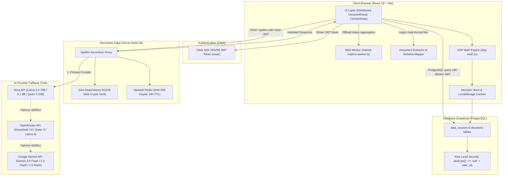
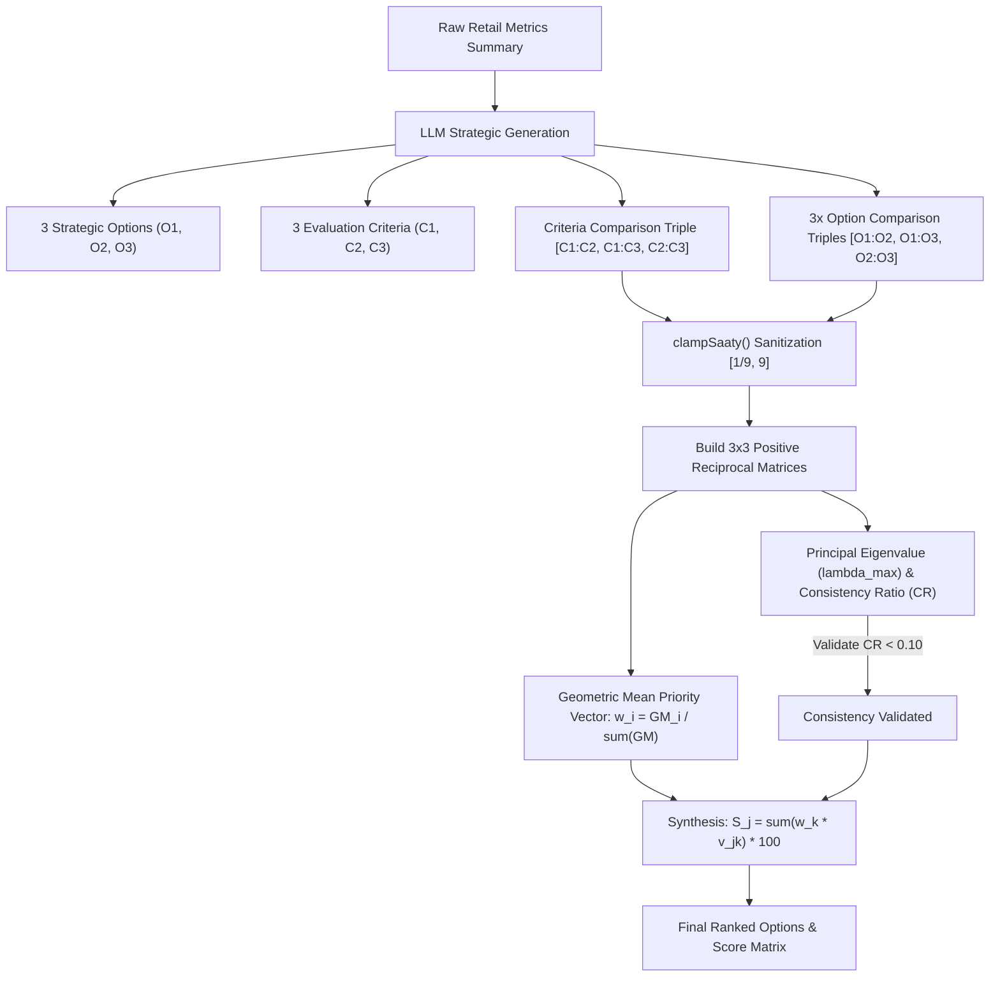

<p align="center">
  
</p>

# KLAROS — AI-Powered Retail Analytics & Decision Intelligence Platform

> **A Hybrid Decision Support Platform Combining Client-Side Operational Metrics, Multi-Provider LLM Orchestration, and the Mathematical Analytic Hierarchy Process (AHP).**

[](https://www.typescriptlang.org/)
[](https://reactjs.org/)
[](https://vitejs.dev/)
[](https://supabase.com/)
[](https://clerk.com/)
[](LICENSE)

---

## Table of Contents

1. [Project Overview & Problem Statement](#1-project-overview--problem-statement)
2. [Objectives & Scope](#2-objectives--scope)
3. [Key Features](#3-key-features)
4. [System Architecture](#4-system-architecture)
5. [End-to-End Data Flow](#5-end-to-end-data-flow)
6. [Technology Stack](#6-technology-stack)
7. [Repository Structure](#7-repository-structure)
8. [Authentication & Authorization](#8-authentication--authorization)
9. [Database Architecture & RLS](#9-database-architecture--rls)
10. [Security Model](#10-security-model)
11. [KPI & Analytics Methodology](#11-kpi--analytics-methodology)
12. [Multi-Criteria Decision Analysis (AHP) Engine](#12-multi-criteria-decision-analysis-ahp-engine)
13. [LLM Architecture & Fallback Dispatcher](#13-llm-architecture--fallback-dispatcher)
14. [JSON Extraction & Validation Engine](#14-json-extraction--validation-engine)
15. [Revenue Forecasting Methodology](#15-revenue-forecasting-methodology)
16. [Performance, Web Workers & Caching](#16-performance-web-workers--caching)
17. [Universal Document Ingestion & Schema Normalization](#17-universal-document-ingestion--schema-normalization)
18. [Testing & Quality Assurance](#18-testing--quality-assurance)
19. [Development & Deployment Guide](#19-development--deployment-guide)
20. [Known Limitations](#20-known-limitations)
21. [Future Work](#21-future-work)
22. [Academic Contribution & Research Positioning](#22-academic-contribution--research-positioning)
23. [License](#23-license)

---

## 1. Project Overview & Problem Statement

Retail store operators, supermarket managers, and category planners face operational friction when attempting to convert raw, disparate transactional spreadsheets into strategic business decisions. Standard Business Intelligence (BI) dashboards are predominantly **descriptive**—they display historical charts without evaluating trade-offs between conflicting business criteria (such as preserving profit margins versus liquidating overstocked inventory). Conversely, naive Large Language Model (LLM) decision solutions frequently suffer from numerical hallucinations, lack reproducible arithmetic, and exhibit logical intransitivity when ranking strategic alternatives.

**KLAROS** addresses this gap through a **hybrid architecture** that decouples qualitative strategic evaluation from mathematical synthesis:
- **Client-Side Operational Analytics:** Aggregates multi-table operational data (sales, stock, products, investments) deterministically off the main thread via Web Workers.
- **LLM-Orchestrated Multi-Criteria Evaluation:** Leverages LLMs to extract contextual strategic options and qualitative pairwise comparisons on Saaty's Fundamental Scale.
- **Deterministic AHP Mathematical Synthesis:** Computes criteria priority vectors via the Geometric Mean method, validates logical consistency ($CR < 0.10$), and synthesizes 100-point multi-criteria rankings.

---

## 2. Objectives & Scope

- **Heterogeneous Data Ingestion:** Parse CSV, XLSX, JSON, XML, and delimited text files with automatic schema mapping and derived column calculations.
- **Deterministic Financial & Inventory KPIs:** Provide real-time computation of gross margins, inventory valuation, stock ratios, and replenishment risks.
- **Mathematically Grounded Decision Support:** Implement the classical Analytic Hierarchy Process (AHP) with full consistency index ($CI$) and consistency ratio ($CR$) verification.
- **Resilient AI Orchestration:** Maintain high availability through a multi-provider fallback chain (Groq $\to$ OpenRouter $\to$ Google Gemini) with bounded exponential backoff.
- **Secure Serverless Foundation:** Protect API keys using Vercel serverless proxy functions, RS256 Web Crypto JWT verification, and PostgreSQL Row-Level Security.

---

## 3. Key Features

- **Executive Decision Result Hub:** Detailed strategic recommendation cards displaying primary rationale, composite score rankings, AHP criteria weight breakdowns, and qualitative risk/trade-off analyses.
- **Financial & Inventory Dashboard:** Recharts-driven visualizers for category revenues, monthly revenue vs. units trends, payment method mix, and inventory velocity.
- **AI-Driven Structured Insights:** Contextual executive summaries, high/medium/low impact business opportunities, critical inventory alerts, and anomaly detection.
- **3-Month Time-Series Forecast:** Predictive monthly revenue and unit projections with decaying confidence intervals based on a 30-day historical window.
- **Universal Multi-Format Ingestion:** Drag-and-drop ingestion supporting CSV, multi-sheet Excel workbooks, JSON arrays/objects, XML hierarchies, and delimited text.
- **Interactive BI Assistant:** Multi-turn conversational analytics assistant grounded in pre-computed store metrics.

---

## 4. System Architecture

KLAROS is built on a serverless and client-distributed architecture designed for low operating cost, fast client rendering, and secure credential handling.



---

## 5. End-to-End Data Flow

```
1. User Ingests Data
   ├── Connects Synthetic Dataset (dataset1 / dataset2) OR
   └── Uploads custom files (CSV, XLSX, JSON, XML, TXT)
            │
            ▼
2. Client Extraction & Schema Mapping (document-extractor.ts / schema-mapper.ts)
   ├── Identifies table types (sales, products, stock, investments)
   ├── Reconciles non-standard headers using canonical synonym dictionaries
   └── Derives computed fields (e.g. revenue = unit_price * quantity)
            │
            ▼
3. Supabase Data Source Ingestion (bi-api.ts)
   └── Persists normalized JSONB records to `data_sources` table
            │
            ▼
4. Web Worker KPI Calculation (market-metrics.worker.ts)
   ├── Pure, off-thread metric accumulation (revenues, costs, margins, stock ratios)
   └── O(n) chronological sorting using Schwartzian transforms
            │
            ▼
5. Compact Context Serialization (mcda-analysis.ts)
   └── Generates structured JSON summary payload (<8 KB) for LLM context
            │
            ▼
6. Serverless LLM Fallback Dispatch (/api/llm)
   ├── Verifies Clerk RS256 JWT using native Web Crypto API
   ├── Queries Upstash Redis cache (SHA-256 prompt hash)
   └── Executes provider failover: Groq ──► OpenRouter ──► Google Gemini
            │
            ▼
7. Response Extraction & Zod Schema Validation (json-extractor.ts / analysis-schema.ts)
   ├── 5-stage JSON repair and extraction waterfall
   └── Strict Zod validation: exactly 3 options, 3 criteria, Saaty [1/9, 9] bounds
            │
            ▼
8. Deterministic AHP Mathematical Synthesis (ahp-math.ts)
   ├── Sanitizes comparisons via clampSaaty(v) ∈ [1/9, 9]
   ├── Constructs 3x3 positive reciprocal comparison matrices
   ├── Computes criteria weights via Geometric Mean Method
   ├── Computes principal eigenvalue λ_max and Consistency Ratio (CR < 0.10)
   └── Derives 100-point normalized total scores across all options
            │
            ▼
9. Decision Persistence & Dashboard Visualization (bi-api.ts / DecisionResult.tsx)
   ├── Saves decision record to Supabase `decisions` table
   └── Renders interactive Recharts, radar charts, top product drawers, and AI narratives
```

---

## 6. Technology Stack

| Category | Technology | Version | Purpose |
|---|---|---|---|
| **Build Tool** | Vite | `^5.4.19` | Fast ESM development & production bundling |
| **Language** | TypeScript | `^5.8.3` | Type safety across schemas, APIs, and math engines |
| **UI Framework** | React | `^18.3.1` | Component-based interface rendering |
| **Routing** | React Router DOM | `^6.30.1` | Client-side routing with authentication guards |
| **Styling** | Tailwind CSS | `^3.4.17` | Utility-first CSS architecture |
| **UI Primitives** | shadcn/ui (Radix UI) | Multiple | Accessible, composable UI building blocks |
| **Visualizations**| Recharts | `^2.15.4` | Responsive SVG/Canvas analytical charts |
| **Animations** | Framer Motion | `^12.29.2` | Fluid drawer and layout transitions |
| **Client State** | TanStack Query | `^5.83.0` | Declarative asynchronous state caching |
| **Data Parsing** | PapaParse, XLSX | `^5.4.1`, `^0.18.5` | Delimited text and multi-sheet spreadsheet ingestion |
| **Validation** | Zod | `^3.25.76` | Runtime validation for LLM responses and data schemas |
| **Identity** | Clerk React SDK | `^6.1.4` | User sessions, login/signup routing, RS256 JWTs |
| **Database** | Supabase (PostgreSQL) | `^2.105.4` | Relational & JSONB persistence with RLS |
| **Serverless** | Vercel Functions | Node.js 20 | Serverless `/api/llm` proxy and `/api/keep-alive` |
| **Edge Cache** | Upstash Redis | `^1.38.1` | Response caching on serverless edge |
| **Testing** | Vitest, Playwright | `^3.2.4`, `^1.54.2` | Mathematical unit tests & E2E smoke verification |

---

## 7. Repository Structure

```text
KLAROS/
├── api/                                # Vercel Serverless Functions
│   ├── llm.ts                          # LLM proxy: Clerk JWT auth, Redis cache, provider fallback
│   └── keep-alive.ts                   # Supabase keep-alive ping handler
│
├── src/
│   ├── App.tsx                         # Core router, Clerk provider, QueryClient provider
│   ├── main.tsx                        # DOM mount entrypoint
│   ├── index.css                       # Tailwind design tokens, typography, and animations
│   │
│   ├── pages/                          # Primary view controllers
│   │   ├── Index.tsx                   # Landing page
│   │   ├── Dashboard.tsx               # Analytics overview, data sources, auto-analyze trigger
│   │   ├── DecisionResult.tsx          # Full MCDA decision report, interactive Recharts, chat
│   │   ├── History.tsx                 # Historical decision analysis manager
│   │   ├── ConnectData.tsx             # Universal data connector & synthetic data launcher
│   │   └── NotFound.tsx                # 404 handler
│   │
│   ├── components/                     # Reusable UI components
│   │   ├── layout/                     # DashboardSidebar, Header, Footer, LandingHeader
│   │   ├── ui/                         # shadcn/ui primitives (cards, dialogs, buttons, toasts)
│   │   └── NavLink.tsx                 # Navigation routing helper
│   │
│   ├── features/                       # Domain-driven feature modules
│   │   ├── auth/                       # ClerkAuthContext, ProtectedRoute, clerk-helpers
│   │   ├── dashboard/                  # DecisionCard, FilterSidebar
│   │   ├── decisions/                  # AHP math, schemas, types, and decision store
│   │   │   ├── core/                   # ahp-math.ts, analysis-schema.ts, decision-workflow.ts
│   │   │   ├── store/                  # decision-store.ts (CRUD & localStorage caching)
│   │   │   └── types/                  # decision.ts (TypeScript data models)
│   │   ├── landing/                    # Hero, HowItWorks, CTA
│   │   └── market/                     # BI metrics, document parsing, Web Worker, API adapters
│   │       ├── api/                    # bi-api.ts, ai-analytics.ts
│   │       ├── components/             # MappingPreviewModal.tsx
│   │       ├── types/                  # market.types.ts
│   │       └── utils/                  # market-metrics-core.ts, market-metrics.ts,
│   │                                   # market-metrics.worker.ts, document-extractor.ts
│   │
│   ├── hooks/                          # Custom hooks (use-toast, use-mobile)
│   ├── lib/                            # Utility helpers (cn class merger)
│   └── services/                       # Infrastructure & third-party services
│       ├── supabase/                   # supabase.ts (Clerk JWT-authenticated Supabase client)
│       └── llm/                        # Multi-provider LLM orchestration layer
│           ├── core/                   # llm-proxy-client, json-extractor, backoff, timeout
│           ├── domain/                 # mcda-analysis, insights, forecasts, data-parser
│           ├── schema-mapper.ts        # AI & heuristic table schema mapper
│           └── llm-service.ts          # Public barrel export
│
├── scripts/                            # Operational & migration scripts
│   ├── supabase-schema.sql             # Authoritative PostgreSQL schema and RLS policies
│   ├── test-ahp-live.ts                # Live end-to-end AHP engine verification script
│   └── test-upload-pipeline.js         # Integration upload tester
│
├── tests/                              # Integration and E2E test suites
│   └── e2e/                            # Playwright smoke and routing tests
│
└── project_docs/                       # Supplementary technical documentation
```

---

## 8. Authentication & Authorization

Authentication is managed via **Clerk** and delegated to **Supabase** via RS256 JWT tokens:

1. **User Sign-In:** Users authenticate through Clerk's hosted or embedded UI (`/login`, `/signup`).
2. **Protected Routes:** `ProtectedRoute.tsx` guards all private routes (`/dashboard`, `/decisions/:id/result`, `/history`, `/connect-data`), redirecting unauthenticated sessions to `/login`.
3. **Supabase Client Authentication (`src/services/supabase/supabase.ts`):**
   - Retrieves an active RS256 JWT token using `window.Clerk.session.getToken({ template: 'supabase' })`.
   - Attaches the token in the `Authorization: Bearer <token>` header for every Supabase database request.
   - Throws a typed `AuthRequiredError` upon session expiration, preventing unauthenticated fallback writes.
4. **Serverless Proxy Authentication (`api/llm.ts`):**
   - The `/api/llm` serverless function intercepts incoming requests and extracts the `Authorization` header.
   - Verifies the RS256 signature using Node 20's native `crypto.subtle` Web Crypto API against the Clerk PEM public key (`CLERK_JWT_KEY`).

---

## 9. Database Architecture & RLS

All persistent records reside in **Supabase PostgreSQL** (`scripts/supabase-schema.sql`).

### Table: `data_sources`

| Column | Type | Constraints | Description |
|---|---|---|---|
| `id` | UUID | PRIMARY KEY, `gen_random_uuid()` | Unique dataset identifier |
| `user_id` | TEXT | NOT NULL, INDEXED | Maps directly to Clerk user ID (`sub`) |
| `name` | TEXT | NOT NULL | User-defined or generated dataset name |
| `type` | TEXT | NOT NULL, DEFAULT `'supermarket_products'` | Ingestion category (`ai_parsed_upload`, etc.) |
| `status` | TEXT | NOT NULL, DEFAULT `'connected'` | State (`connected`, `syncing`, `error`) |
| `is_synthetic` | BOOLEAN | DEFAULT `false` | Distinguishes synthetic prototypes from user uploads |
| `counts` | JSONB | DEFAULT `'{}'::jsonb` | Extracted row counts and metadata |
| `csv_data` | JSONB | DEFAULT `'{}'::jsonb` | Normalized JSON tabular rows |
| `last_synced_at` | TIMESTAMPTZ | DEFAULT `NOW()` | Timestamp of last synchronization |
| `created_at` | TIMESTAMPTZ | DEFAULT `NOW()` | Record creation timestamp |
| `updated_at` | TIMESTAMPTZ | DEFAULT `NOW()` | Record last update timestamp |

### Table: `decisions`

| Column | Type | Constraints | Description |
|---|---|---|---|
| `id` | UUID | PRIMARY KEY, `gen_random_uuid()` | Unique decision identifier |
| `user_id` | TEXT | NOT NULL, INDEXED | Maps directly to Clerk user ID (`sub`) |
| `title` | TEXT | NOT NULL | Auto-generated decision title |
| `context` | TEXT | NULLABLE | Executive context description |
| `status` | TEXT | NOT NULL, DEFAULT `'draft'`, INDEXED | Workflow state (`draft`, `analyzing`, `done`, `archived`) |
| `data_source_id` | UUID | NULLABLE, INDEXED, FK $\to$ `data_sources.id` | Reference to underlying dataset |
| `decision_type` | TEXT | NULLABLE | Decision classification (`business_intelligence`) |
| `options` | JSONB | DEFAULT `'[]'::jsonb` | Evaluated strategic options |
| `criteria` | JSONB | DEFAULT `'[]'::jsonb` | AHP-weighted evaluation criteria |
| `constraints` | JSONB | DEFAULT `'[]'::jsonb` | Business constraints |
| `result_json` | JSONB | NULLABLE | Full MCDA scores, AHP breakdown, and reasoning |
| `created_at` | TIMESTAMPTZ | DEFAULT `NOW()` | Creation timestamp |
| `updated_at` | TIMESTAMPTZ | DEFAULT `NOW()` | Last update timestamp |

### Row-Level Security (RLS) Enforcement

RLS is strictly enabled to isolate user data at the database engine level:

```sql
ALTER TABLE data_sources ENABLE ROW LEVEL SECURITY;
ALTER TABLE decisions ENABLE ROW LEVEL SECURITY;

CREATE POLICY "Users manage own data_sources"
ON data_sources FOR ALL
USING (auth.jwt() ->> 'sub' = user_id)
WITH CHECK (auth.jwt() ->> 'sub' = user_id);

CREATE POLICY "Users manage own decisions"
ON decisions FOR ALL
USING (auth.jwt() ->> 'sub' = user_id)
WITH CHECK (auth.jwt() ->> 'sub' = user_id);
```

---

## 10. Security Model

### 1. Dual-Mode API Key Handling
- **Production (`Vercel`):** LLM API keys (`GROQ_API_KEY`, `OPENROUTER_API_KEY`, `GEMINI_API_KEY`) reside exclusively in encrypted serverless environment variables. The client communicates solely with `/api/llm`.
- **Local Development (`npm run dev`):** Supports optional direct client dispatch via `VITE_*` keys with explicit console warnings. Running `vercel dev` with `VITE_USE_LLM_PROXY=true` provides full production parity locally.

### 2. Zero-Dependency JWT Verification
The serverless function avoids third-party JWT parsing dependencies (e.g. `jsonwebtoken`), verifying RS256 token signatures via native Web Crypto (`crypto.subtle`) to minimize bundle size and eliminate cold-start latency.

### 3. Prompt Injection Defense
User datasets are structurally isolated from system instructions, prompts enforce strict JSON output schemas, and data payloads are truncated at clean newline boundaries up to safe byte limits.

---

## 11. KPI & Analytics Methodology

All financial calculations are implemented as deterministic, pure functions in `src/features/market/utils/market-metrics-core.ts`:

| KPI | Mathematical Formula | Purpose & Description |
|---|---|---|
| **Total Revenue** | $\sum \text{sale.revenue}$ | Gross sales across all recorded transactions |
| **Total Cost** | $\sum (\text{sale.quantity} \times \text{product.cost})$ | Direct wholesale Cost of Goods Sold (COGS) |
| **Net Profit** | $\text{Total Revenue} - \text{Total Cost}$ | Net operating gross profit |
| **Profit Margin %** | $\left( \frac{\text{Total Profit}}{\text{Total Revenue}} \right) \times 100$ | Relative profitability efficiency |
| **Average Discount** | $\frac{1}{N} \sum \text{sale.discount}$ | Average promotional markdown value per transaction |
| **Low Stock Count** | $\text{Count}(\text{stock.quantity} \le \text{stock.reorder\_point})$ | Number of SKUs requiring urgent replenishment |
| **Average Stock Ratio** | $\frac{1}{N} \sum \left( \frac{\text{currentStock}}{\text{reorderPoint}} \right)$ | Global inventory replenishment health metric |
| **Inventory Value** | $\sum (\text{product.cost} \times \text{unitsSold})$ | Total wholesale capitalization of active inventory |

---

## 12. Multi-Criteria Decision Analysis (AHP) Engine

KLAROS implements Thomas L. Saaty's classical **Analytic Hierarchy Process (AHP)** to synthesize qualitative multi-objective evaluations into mathematically verified decisions.



### Mathematical Steps (`src/features/decisions/core/ahp-math.ts`):

1. **Input Sanitization:** Every raw comparison value from the LLM is clamped to Saaty's Fundamental Scale:
   $$\text{clampSaaty}(v) = \begin{cases} 1 & \text{if } v \le 0 \lor v \notin \mathbb{R} \\ \min(9, \max(1/9, v)) & \text{otherwise} \end{cases}$$
2. **Matrix Construction:** For comparison triple $[c_{01}, c_{02}, c_{12}]$, construct positive reciprocal matrix $A$:
   $$A = \begin{bmatrix} 1 & c_{01} & c_{02} \\ \frac{1}{c_{01}} & 1 & c_{12} \\ \frac{1}{c_{02}} & \frac{1}{c_{12}} & 1 \end{bmatrix}$$
3. **Priority Vector Derivation (Geometric Mean Method):**
   $$GM_i = \left( \prod_{j=1}^{3} A_{ij} \right)^{1/3}, \quad w_i = \frac{GM_i}{\sum_{k=1}^{3} GM_k}$$
4. **Consistency Verification:**
   $$\lambda_{\max} = \frac{1}{3} \sum_{i=1}^{3} \frac{(A \cdot w)_i}{w_i}, \quad CI = \frac{\lambda_{\max} - 3}{2}, \quad CR = \frac{CI}{0.58}$$
   - $CR < 0.10$ indicates acceptable decision consistency.
5. **Weighted Synthesis:**
   $$S_j = \sum_{k=1}^{3} w_k \cdot v_j^{(k)}, \quad \text{TotalScore}_j = \text{round}(S_j \times 100)$$

---

## 13. LLM Architecture & Fallback Dispatcher

The LLM service (`src/services/llm/`) coordinates a multi-provider fallback engine:

```text
Priority 1: Groq (Ultra-low latency inference)
   ├── llama-3.3-70b-versatile
   ├── llama-3.1-8b-instant
   ├── qwen-3-32b
   └── mixtral-8x7b-32768
       │ (On 429 Rate Limit / HTTP Error)
       ▼
Priority 2: OpenRouter (Diverse model catalog)
   ├── deepseek/deepseek-v4-flash:free
   ├── qwen/qwen3-32b:free
   ├── meta-llama/llama-4-scout:free
   ├── meta-llama/llama-3.3-70b-instruct:free
   └── mistralai/mistral-7b-instruct:free
       │ (On 429 Rate Limit / HTTP Error)
       ▼
Priority 3: Google Gemini (Multimodal fallback)
   ├── gemini-2.5-flash
   ├── gemini-2.5-flash-lite
   ├── gemini-2.0-flash
   └── gemini-1.5-flash
```

- **Application-Level Retries:** Bounded 3-attempt retry loop with exponential backoff and jitter (`backoffMs = base * 2^attempt + jitter`).
- **Timeout Protection:** Configured with a 20-second timeout per provider invocation.

---

## 14. JSON Extraction & Validation Engine

To prevent malformed LLM outputs from corrupting the application state, KLAROS runs raw responses through a 5-stage cascade in `src/services/llm/core/json-extractor.ts`:
1. `JSON.parse` direct evaluation.
2. Markdown regex extraction (` ```json ... ``` `) with automated trailing-comma repair.
3. Backtick stripping pass.
4. Depth-tracking bracket-matching state machine handling single/double-quote boundaries.
5. Bounded 200-character tail-trimming to repair truncated outputs in $O(n)$ time.

Extracted JSON is parsed strictly using Zod (`analysis-schema.ts`), validating that exactly 3 options, 3 criteria, and valid Saaty triples are present.

---

## 15. Revenue Forecasting Methodology

- **Implementation:** `src/services/llm/domain/forecasts.ts` (`generateAiForecasts`).
- **Mechanism:** In-context LLM time-series extrapolation.
- **Input Context:** Chronologically sorted 30-day historical time series of revenue and units.
- **Output:** 3-month forecast containing projected revenue, unit volume, and decaying confidence scores ($0–100$).
- **Academic Clarification:** This is **not an autoregressive statistical ML model** (such as ARIMA, SARIMAX, or Prophet). It utilizes the LLM's in-context pattern recognition over historical figures to project future trajectories.

---

## 16. Performance, Web Workers & Caching

1. **Web Worker Threading (`market-metrics.worker.ts`):** Offloads multi-thousand-row CSV aggregation and history generation to a dedicated background worker thread, ensuring 60 FPS React rendering.
2. **Schwartzian Transform Sorting:** Precomputes timestamp numbers to reduce sorting overhead from $O(n \log n)$ Date allocations to $O(n)$.
3. **Multi-Layer Cache Architecture:**
   - **In-Memory & Promise Deduplication:** Prevents duplicate network or calculation requests.
   - **Versioned LocalStorage:** 1-hour TTL persistence across browser sessions.
   - **Upstash Redis Proxy Cache:** SHA-256 keyed prompt caching on the serverless edge with 24-hour TTL (`ex: 86400`).

---

## 17. Universal Document Ingestion & Schema Normalization

- **Supported File Formats:** CSV (PapaParse), XLSX/XLS (SheetJS with multi-sheet workbook support), JSON (arrays and nested objects), XML (DOMParser), and delimited TXT.
- **Heuristic Schema Mapping (`schema-mapper.ts`):** Evaluates uploaded headers against canonical retail schemas using synonym dictionaries and fuzzy string matching.
- **Auto-Healing Derivation:** Automatically calculates derived fields (such as deriving total revenue from unit price and quantity) when source datasets omit total financial columns.

---

## 18. Testing & Quality Assurance

### Vitest Unit Test Suite (22 Tests Passing):
```bash
npm test
```
- `ahp-math.test.ts` (12 tests): Verifies matrix construction, reciprocity, geometric mean derivation, eigenvalue approximation, consistency ratio calculation, and full synthesis.
- `decision-workflow.test.ts` (4 tests): Tests decision type classification and result unpacking.
- `document-extractor.test.ts` (6 tests): Validates header synonyms, mathematical derivations, multi-format parsing (JSON, XML, TXT), and empty-file degradation.

### Playwright E2E Test Suite:
```bash
npm run test:e2e
```
- `routing-smoke.spec.ts`: Validates landing screen rendering, protected route redirection, and 404 error routing.

---

## 19. Development & Deployment Guide

### Prerequisites
- Node.js $\ge$ 20.11.1
- npm $\ge$ 10
- Supabase Project & Clerk Account
- At least one LLM API key (Groq recommended)

### Environment Configuration
Copy `.env.example` to `.env.local`:

```env
# Clerk Identity
VITE_CLERK_PUBLISHABLE_KEY=pk_test_...

# Supabase Persistence
VITE_SUPABASE_URL=https://<your-project>.supabase.co
VITE_SUPABASE_ANON_KEY=eyJhbGciOiJIUzI1NiIsInR5cCI6IkpXVCJ9...

# Production App URL
VITE_APP_URL=https://klaros.vercel.app

# Serverless Proxy Flag (Set true when running vercel dev)
VITE_USE_LLM_PROXY=false

# LLM Keys (For local dev mode or Vercel environment variables)
VITE_GROQ_API_KEY=gsk_...
VITE_OPENROUTER_API_KEY=sk-or-...
VITE_GEMINI_API_KEY=AIzaSy...
```

### Local Setup
```bash
# 1. Install dependencies
npm install

# 2. Apply database migrations
# Execute scripts/supabase-schema.sql in the Supabase SQL Editor

# 3. Start local development server
npm run dev

# 4. Run test suites
npm run check
```

---

## 20. Known Limitations

1. **Fixed 3x3 AHP Matrix Topology:** Current schemas strictly enforce evaluating 3 options across 3 criteria.
2. **LLM-Based Forecasting:** Projects time series via LLM context extrapolation rather than statistical ARIMA/Prophet regression.
3. **Binary Document Parsing:** Delimited text inside `.pdf` or `.docx` is parsed via stream fallbacks; complex binary AST extraction is not integrated.

---

## 21. Future Work

- [ ] Dynamic $N \times M$ AHP / ANP (Analytic Network Process) matrix scaling.
- [ ] Integration of dedicated statistical/deep-learning forecasting models (e.g. TimeGPT, NeuralProphet).
- [ ] Direct automated webhooks for live e-commerce store synchronization (Shopify, WooCommerce).
- [ ] Granular role-based team collaboration and decision approval workflows.

---

## 22. Academic Contribution & Research Positioning

### Recommended Research Title:
> **"A Hybrid Decision Intelligence Architecture Combining Client-Side Operational Analytics with LLM-Orchestrated Analytic Hierarchy Process (AHP) for Retail Management"**

### Primary Academic Contributions:
1. **Arithmetic Decoupling:** Proves that LLMs can deliver robust multi-criteria decision support when restricted to qualitative evaluation, leaving matrix synthesis and vector normalization to deterministic algorithms.
2. **Logical Intransitivity Detection:** Employs Saaty's consistency ratio ($CR < 0.10$) to programmatically detect and flag illogical or intransitive AI recommendations.
3. **Zero-Trust Serverless Intelligence:** Demonstrates an efficient, low-cost serverless architecture utilizing Web Crypto JWT validation and edge caching.

---

## 23. License

Released under the **MIT License**. Copyright © 2026 Santosh Reddy.
