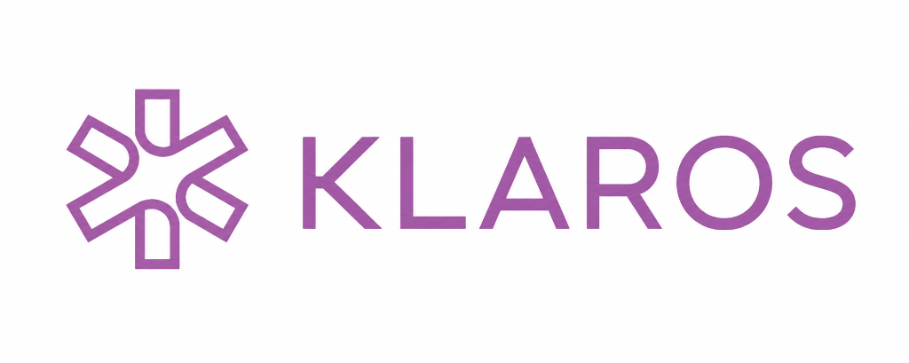
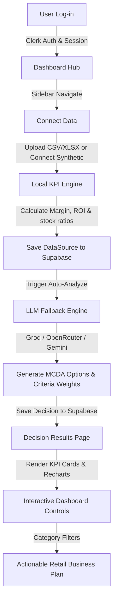

<p align="center">
  
</p>

# KLAROS — Retail Analytics & Decision Intelligence Platform

> AI-powered Business Intelligence for retail teams. Upload your datasets, run MCDA-based analysis with a multi-provider LLM fallback engine (Groq → OpenRouter → Gemini), and get actionable KPI insights — all in a fully serverless, premium SaaS interface.

---

## Table of Contents

1. [Overview & Flow of Work](#overview--flow-of-work)
2. [Key Features](#key-features)
3. [Tech Stack & Architecture](#tech-stack--architecture)
4. [Database & Authentication](#database--authentication)
5. [AI/LLM Engine & Decision Logic](#aillm-engine--decision-logic)
6. [Data Schema & KPI Engine](#data-schema--kpi-engine)
7. [Development & Deployment Guide](#development--deployment-guide)
8. [Caching & Performance Strategy](#caching--performance-strategy)
9. [Security, Troubleshooting & Roadmap](#security-troubleshooting--roadmap)
10. [License](#license)

---

## Overview & Flow of Work

**KLAROS** is a full-stack, serverless retail analytics platform. It bridges raw spreadsheet transaction logs and strategic executive planning by combining client-side financial/inventory calculations with LLM-driven Multi-Criteria Decision Analysis (MCDA). The backend is fully serverless — Supabase (PostgreSQL) for persistence, browser-to-API LLM calls with automatic provider fallback.

### Analytical Pipeline



### Data Connection & Sync
Users connect a **Synthetic Supermarket Dataset** (preloaded prototype for testing) or drag-and-drop custom retail spreadsheets (`products`, `sales`, `stock`, `investments`). Data is parsed client-side via `PapaParse` / `XLSX` and saved to Supabase `data_sources` with record counts and metadata.

### Local Financial & Inventory KPI Engine
Raw sales numbers are aggregated client-side — revenue, cost, margin %, low-stock thresholds — into structured JSON inputs for the LLM.

### Multi-Provider LLM MCDA Engine
The client dispatches compiled metrics to the **Unified LLM Dispatcher** which tries providers in priority order:
1. **Groq** (fastest inference, free tier)
2. **OpenRouter** (best model variety, many free models)
3. **Google Gemini** (multimodal, quota-limited fallback)

The LLM runs an MCDA algorithm to generate **3 distinct strategic options** with weighted criteria scoring grids. The result is stored as a `decision` record in Supabase.

### Interactive Analysis
The results page displays the report dashboard with category filter pills and AI revenue forecasts.

---

## Key Features

- **Left-Aligned Dashboard Sidebar**: Standard navigation drawer (`DashboardSidebar`) with consistent layout transitions.
- **Vibrant KPI Cards**: Financial cards with Indian Rupee formatting (`₹1,96,687`), clean typography, and color-coded states.
- **Report Analytics Card**: Recharts bar visualizer with custom category colors (Beverages: blue, Groceries: green, Bakery: orange, Dairy: red, Produce: purple, Snacks: cyan).
- **Top Products Side Panel**: Searchable panel with SKU prefix auto-categorization, visual category badges, and icon emojis.
- **AI Actionable Insights Grid**: Executive narratives, impact-badged opportunities, risk alerts, and anomaly detectors.
- **AI Revenue Forecast**: 3-month extrapolated line chart plotted side-by-side with historical sales.
- **Multi-Provider LLM Fallback**: Automatic failover across Groq, OpenRouter, and Gemini for high availability.

---

## Tech Stack & Architecture

| Layer | Component | Technology | Purpose |
|---|---|---|---|
| **Frontend** | Build Tool | **Vite 5** | Ultra-fast HMR and bundling |
| | Core | **React 18 + TypeScript 5** | Type-safe UI rendering |
| | Router | **React Router DOM v6** | Client-side routing |
| | Styles | **Tailwind CSS v3 + shadcn/ui** | Design system with utility tokens |
| | Charts | **Recharts 2** | SVG/Canvas visualizations |
| | Animation | **Framer Motion 12** | Micro-interactions and sidebars |
| | State Manager | **TanStack Query v5** | Server state caching |
| **Auth** | Identity | **Clerk SDK v6** | Registration, sessions, and JWTs |
| **Database** | Database | **Supabase (PostgreSQL)** | Persistent storage, RLS policies |
| **AI** | LLM Dispatcher | **Groq → OpenRouter → Gemini** | Multi-provider fallback engine |
| | Data Parsers | **PapaParse + XLSX** | CSV and Excel processing |

### Corrected Codebase Module Map

```
src/
├── App.tsx                        # Core router, Clerk wrapper, TanStack Query
├── main.tsx                       # Client entrypoint
├── index.css                      # Tailwind base + Poppins font
│
├── pages/
│   ├── Index.tsx                  # Marketing landing screen
│   ├── Dashboard.tsx              # Analytics launcher, dataset manager, decision cards
│   ├── DecisionResult.tsx         # Results dashboard, charts, AI alerts, chatbot
│   ├── History.tsx                # Analysis manager with filters and compare
│   ├── ConnectData.tsx            # Data upload manager (CSV/Excel) + synthetic connector
│   └── NotFound.tsx               # Catch-all 404 route
│
├── components/
│   ├── layout/
│   │   ├── DashboardSidebar.tsx   # Core sidebar navigation
│   │   ├── Header.tsx             # Top navigation header
│   │   ├── Footer.tsx             # Site footer
│   │   └── LandingHeader.tsx      # Landing page header
│   ├── NavLink.tsx                # Active link wrapper
│   └── ui/                        # 50 shadcn/ui primitives (Radix-based)
│
├── features/
│   ├── auth/
│   │   ├── components/
│   │   │   └── ProtectedRoute.tsx # Auth guard wrapper
│   │   ├── contexts/
│   │   │   └── ClerkAuthContext.tsx
│   │   └── utils/
│   │       └── clerk-helpers.ts
│   ├── dashboard/
│   │   └── components/
│   │       ├── DecisionCard.tsx   # Decision summary card
│   │       └── FilterSidebar.tsx  # Dashboard filter controls
│   ├── decisions/
│   │   ├── store/
│   │   │   └── decision-store.ts  # Caching and decision CRUD
│   │   ├── core/
│   │   │   ├── analysis-schema.ts # Zod schemas for MCDA structures
│   │   │   ├── decision-workflow.ts
│   │   │   └── decision-workflow.test.ts
│   │   └── types/
│   │       └── decision.ts
│   ├── landing/
│   │   └── components/
│   │       ├── Hero.tsx
│   │       ├── HowItWorks.tsx
│   │       └── CTA.tsx
│   └── market/
│       ├── api/
│       │   ├── bi-api.ts          # Supabase data source sync + delete
│       │   └── ai-analytics.ts    # AI forecasting + narrative summaries
│       ├── types/
│       │   └── market.types.ts
│       └── utils/
│           └── market-metrics.ts  # Raw transaction → financial metrics
│
├── hooks/
│   ├── use-mobile.tsx             # Mobile detection hook
│   └── use-toast.ts               # Toast notification hook
│
├── services/
│   ├── supabase/
│   │   └── supabase.ts            # Clerk JWT-authenticated Supabase client
│   └── llm/
│       └── llm-service.ts         # Multi-provider LLM dispatcher + MCDA parsing
│
└── test/
    └── setup.ts                   # Vitest test setup
```

---

## Database & Authentication

All tables reside in Supabase. The migration script is at [`scripts/supabase-schema.sql`](scripts/supabase-schema.sql).

### Table: `data_sources`

| Column | Type | Notes |
|---|---|---|
| `id` | UUID PK | Default: `gen_random_uuid()` |
| `user_id` | TEXT NOT NULL | Maps to Clerk `user.id` |
| `name` | TEXT NOT NULL | User-given source name |
| `type` | TEXT NOT NULL | e.g. `csv`, `supermarket_products` |
| `status` | TEXT NOT NULL | `connected`, `syncing`, `error` |
| `is_synthetic` | BOOLEAN | Default `false` |
| `counts` | JSONB | Record counts: `{ products, sales, stock, investments }` |
| `csv_data` | JSONB | Raw parsed CSV data, default `'{}'::jsonb` |
| `last_synced_at` | TIMESTAMPTZ | |
| `created_at` | TIMESTAMPTZ | Default `NOW()` |
| `updated_at` | TIMESTAMPTZ | Default `NOW()` |

### Table: `decisions`

| Column | Type | Notes |
|---|---|---|
| `id` | UUID PK | Default: `gen_random_uuid()` |
| `user_id` | TEXT NOT NULL | Maps to Clerk `user.id` |
| `title` | TEXT NOT NULL | AI-generated header |
| `context` | TEXT | Brief summary narrative |
| `status` | TEXT | `draft`, `analyzing`, `done`, `archived` |
| `data_source_id` | UUID FK | References `data_sources.id` ON DELETE SET NULL |
| `decision_type` | TEXT | |
| `options` | JSONB | Default `'[]'::jsonb` |
| `criteria` | JSONB | Default `'[]'::jsonb` |
| `constraints` | JSONB | Default `'[]'::jsonb` |
| `result_json` | JSONB | Scores array, weights, full AI analysis |
| `created_at` | TIMESTAMPTZ | Default `NOW()` |
| `updated_at` | TIMESTAMPTZ | Default `NOW()` |

Indexes: `idx_decisions_user_id`, `idx_decisions_status`, `idx_decisions_data_source_id`, `idx_data_sources_user_id`.

### Row-Level Security (RLS)

The migration script enables RLS on both tables but **installs permissive "Public access" policies** (`USING (true)`) for MVP/local development:

```sql
ALTER TABLE data_sources ENABLE ROW LEVEL SECURITY;
ALTER TABLE decisions   ENABLE ROW LEVEL SECURITY;

CREATE POLICY "Public access" ON data_sources FOR ALL USING (true);
CREATE POLICY "Public access" ON decisions   FOR ALL USING (true);
```

> **Why permissive policies?** The `user_id` column is set at the application layer (via Clerk session), so row-level filtering is effectively enforced by the app. This avoids the common `42501` permission-denied error during local testing with anon keys.

#### Upgrading to Production-Grade RLS

Before production deployment, replace the permissive policies with Clerk JWT-based isolation:

```sql
-- For both data_sources and decisions:
DROP POLICY IF EXISTS "Public access" ON decisions;
CREATE POLICY "User isolation" ON decisions
  FOR ALL
  TO authenticated
  USING (auth.uid()::text = user_id);
```

This requires a **Clerk JWT template** named `supabase` that injects `user_id` into the token claims. Configure it in Clerk Dashboard → **JWT Templates** → **New Template** → *Supabase*.

### Token Sharing Flow

1. User logs in via Clerk.
2. The Supabase client builder (`supabase.ts`) catches active Clerk sessions.
3. Before each query, it calls `Clerk.session.getToken({ template: 'supabase' })`.
4. It sets the JWT in the `Authorization` header.
5. Supabase decodes the user ID from the JWT and validates against RLS policies.

---

## AI/LLM Engine & Decision Logic

All AI logic lives in [`src/services/llm/llm-service.ts`](src/services/llm/llm-service.ts). It implements a **Unified Multi-Provider Fallback Dispatcher**.

### Provider Priority Chain

```
1. Groq (fastest)
   └─ Models: llama-3.3-70b-versatile, llama-3.1-8b-instant, qwen-3-32b, mixtral-8x7b-32768
2. OpenRouter (best variety)
   └─ Models: deepseek/deepseek-v4-flash:free, qwen/qwen3-32b:free,
              meta-llama/llama-4-scout:free, meta-llama/llama-3.3-70b-instruct:free,
              mistralai/mistral-7b-instruct:free, openrouter/auto:free, and more
3. Google Gemini (multimodal fallback)
   └─ Models: gemini-2.5-flash, gemini-2.5-flash-lite, gemini-3-flash,
              gemini-3.1-flash, gemini-3.1-flash-lite, gemini-2.0-flash, gemini-1.5-flash
```

Each provider iterates through its model list on `429` (quota exhausted) or failure. Only one provider key is required; the dispatcher skips unconfigured providers.

### Available AI Functions

| Function | Purpose |
|---|---|
| `generateMcdaAnalysis` | Full MCDA with Zod validation and auto-retry (up to 3 attempts) |
| `generateInsights` | Executive summary bullet points |
| `generateAiInsightsFromMetrics` | Structured insights: opportunities, risk alerts, anomalies |
| `generateAiNarrative` | Single-paragraph executive narrative |
| `generateAiForecasts` | 3-month revenue and unit forecast |
| `askQuestion` | Conversational Q&A with chat history |
| `parseDatasetWithAI` | Universal data parser (any format → normalized structure) |

### MCDA Output Schema (Zod-validated)

The LLM returns JSON matching this structure (defined in [`src/features/decisions/core/analysis-schema.ts`](src/features/decisions/core/analysis-schema.ts)):

```ts
interface McdaRawResponse {
  title: string;            // AI-generated analysis title
  context?: string;          // Short summary of the retail situation
  options: {                 // 3 strategic options
    id: string;              // "o1", "o2", "o3"
    label: string;
    description?: string;
  }[];
  criteria: {                // 3 weighted criteria
    id: string;              // "c1", "c2", "c3"
    name: string;
    weight: number;          // Sums to 1.0
  }[];
  recommendation?: string;   // Explanatory recommendation
  confidence?: number;       // 0-100, AI certainty in recommendation
  reasoning?: {              // Transparent reasoning trace
    decomposition: string;
    assumptions: string[];
    tradeoffs: string[];
    risks: string[];
    sensitivity: string;
  };
  scores: {                  // Scoring matrix
    optionId: string;
    [criterionId: string]: number | string;
    total: number;
  }[];
}
```

### JSON Extractor

A robust `extractJSON` function handles the full range of LLM output quirks: markdown code fences, trailing commas, partial bracket matching, and progressive shrinking — ensuring the raw LLM output is reliably parsed.

---

## Data Schema & KPI Engine

### Client-Side KPI Calculations

Aggregated in [`src/features/market/utils/market-metrics.ts`](src/features/market/utils/market-metrics.ts):

| Metric | Formula | Purpose |
|---|---|---|
| **Total Revenue** | $\sum \text{Sales Revenue}$ | Total invoice intake |
| **Total Cost** | $\sum (\text{Qty} \times \text{Cost Price})$ | Wholesale inventory costs |
| **Net Profit** | $\text{Revenue} - \text{Cost}$ | Bottom-line earnings |
| **Profit Margin %** | $(\text{Profit} / \text{Revenue}) \times 100$ | Margin efficiency |
| **Avg Discount %** | $\text{Mean}(\text{Discount Rate})$ | Price markdown impact |
| **Low Stock SKUs** | $\text{Count}(\text{Stock} \le \text{Threshold})$ | Replenishment warnings |

### Expected CSV Upload Schemas

When connecting custom datasets, the application expects four files:

**1. `products.csv`** (Catalog)
`sku`, `name`, `category`, `subcategory`, `brand`, `price`, `cost`, `supplier`

**2. `sales.csv`** (Transactions)
`sku`, `date`, `quantity`, `revenue`, `discount`, `payment_method`, `store_city`

**3. `stock.csv`** (Warehouse)
`sku`, `date`, `quantity`, `beginning_stock`, `units_sold`, `reorder_point`, `supplier_lead_time`

**4. `investments.csv`** (Marketing & Capital)
`date`, `amount`, `category`, `description`, `expected_roi`, `actual_roi`

---

## Development & Deployment Guide

### Prerequisites

- Node.js $\ge$ 20.11.1
- npm $\ge$ 10
- A free-tier Supabase database
- A free-tier Clerk application
- At least one LLM API key (Groq recommended for fastest performance)

### Environment Variables

Copy [`.env.example`](.env.example) to `.env.local`:

```env
# Clerk Authentication
VITE_CLERK_PUBLISHABLE_KEY=pk_test_...
VITE_CLERK_SIGN_IN_URL=/login
VITE_CLERK_SIGN_UP_URL=/signup
VITE_CLERK_AFTER_SIGN_IN_URL=/dashboard
VITE_CLERK_AFTER_SIGN_UP_URL=/dashboard

# Supabase
VITE_SUPABASE_URL=https://<your-project>.supabase.co
VITE_SUPABASE_ANON_KEY=eyJhbGciOiJIUzI1NiIsInR5cCI6IkpXVCJ9...

# Production URL (optional)
VITE_APP_URL=https://klaros-analytics.vercel.app

# LLM API Keys — at least one required
# Groq (Recommended — fastest): https://console.groq.com/keys
VITE_GROQ_API_KEY=gsk_...

# OpenRouter (variety of free models): https://openrouter.ai/keys
VITE_OPENROUTER_API_KEY=sk-or-...

# Google Gemini (multimodal fallback): https://ai.google.dev
VITE_GEMINI_API_KEY=AIzaSy...
```

### Quickstart

```bash
git clone https://github.com/Santosh-Reddy1310/KLAROS.git
cd KLAROS
npm install
cp .env.example .env.local   # Fill in credentials
# Paste scripts/supabase-schema.sql in Supabase SQL Editor and run
npm run dev                   # → http://localhost:8080
```

### Scripts

| Command | Purpose |
|---|---|
| `npm run dev` | Start Vite dev server on port 8080 |
| `npm run build` | Production build to `dist/` |
| `npm run preview` | Preview production build locally |
| `npm run lint` | ESLint check |
| `npm run test` | Vitest unit tests |
| `npm run test:e2e` | Playwright headless E2E tests |
| `npm run test:e2e:headed` | Playwright with browser UI |
| `npm run test:e2e:debug` | Playwright debug mode |

### Deployment (Vercel)

1. Connect GitHub repo to Vercel.
2. Framework: **Vite**.
3. Build Command: `npm run build`
4. Output Directory: `dist`
5. Add all environment variables in Vercel settings.
6. Deploy. Vercel applies redirects from [`vercel.json`](vercel.json) for React Router client-side routing.

---

## Caching & Performance Strategy

To minimize API bills and maximize page load speed, KLAROS uses a client-side `localStorage` cache with versioned keys:

| Cache Key | Location | Notes |
|---|---|---|
| `klaros:data-sources:v3` | `bi-api.ts` | Invalidates on connect/edit/delete |
| `klaros:market-metrics:v1:` | `market-metrics.ts` | TTL: 1 hour, in-memory dedup |
| `klaros:market-history:v1:` | `market-metrics.ts` | TTL: 1 hour, in-memory dedup |
| `klaros:ai-analytics:v1:` | `ai-analytics.ts` | Bucketed by hour, TTL: 1 hour, in-memory promise dedup |
| `klaros:decisions:v3:` | `decision-store.ts` | Invalidates on new analysis or source deletion |

All caches are version-prefixed for easy invalidation during deployments.

---

## Security, Troubleshooting & Roadmap

### Security Checklist

- [ ] Rotate Supabase anon key if accidentally committed.
- [ ] Upgrade RLS policies from "Public access" to Clerk JWT-based isolation before production (see [RLS upgrade guide](#upgrading-to-production-grade-rls)).
- [ ] Configure strict domain origins in Clerk console.
- [ ] Keep `.env.local` in `.gitignore`.
- [ ] Validate all LLM API keys are stored only in environment variables or browser-local Settings UI.

### Troubleshooting

| Symptom | Fix |
|---|---|
| `42501` Permission Denied | Run the migration script to create RLS policies. For MVP, the "Public access" policy allows anon keys. |
| Empty charts / "No data connected" | Click **Connect Synthetic Data** on the Connect Data page. |
| API Key Missing warnings | Set at least one of `VITE_GROQ_API_KEY`, `VITE_OPENROUTER_API_KEY`, or `VITE_GEMINI_API_KEY` in `.env.local`. Alternatively, paste a key in the Settings panel (bottom-left sidebar) — it is stored in browser cache only. |
| AI returns "All providers failed" | Verify your API key has quota remaining. Groq free tier has rate limits; wait and retry. |

### Roadmap

- [ ] CSV export button on the History grid
- [ ] Dataset-level delta change tracking over time
- [ ] Real-time webhooks for live Supabase synchronization
- [ ] Custom ML prediction models for stock replenishment forecasting
- [ ] Multi-user role-based access (admin, analyst, viewer)
- [ ] Scheduled automated analysis runs (cron-based)
- [ ] Excel (.xlsx) native import with multi-sheet support

---

## License

MIT © 2026 Santosh Reddy
