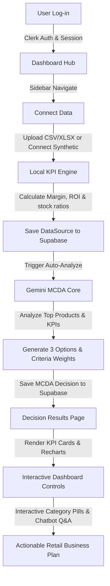

<p align="center">
  
</p>

# KLAROS — Retail Analytics & Decision Intelligence Platform

> AI-powered Business Intelligence for retail teams. Upload your datasets, run MCDA-based analysis with Google Gemini, chat with your data via a custom AI Companion, and get actionable KPI insights — all in a fully serverless, premium SaaS interface.

---

## Table of Contents

1. [Overview](#overview)
2. [Flow of Work](#flow-of-work)
3. [Key Features](#key-features)
4. [Tech Stack](#tech-stack)
5. [Core Integrations](#core-integrations)
6. [Codebase Architecture & Module Map](#codebase-architecture--module-map)
7. [Database Schema](#database-schema)
8. [Supabase Setup](#supabase-setup)
9. [Authentication — Clerk + Supabase RLS](#authentication--clerk--supabase-rls)
10. [AI / LLM Engine & MCDA Schema](#ai--llm-engine--mcda-schema)
11. [Market Metrics & KPI Definitions](#market-metrics--kpi-definitions)
12. [Dataset Upload Schema](#dataset-upload-schema)
13. [Environment Variables](#environment-variables)
14. [Scripts & Local Development](#scripts--local-development)
15. [Testing](#testing)
16. [Deployment](#deployment)
17. [Caching Strategy](#caching-strategy)
18. [Troubleshooting](#troubleshooting)
19. [Security Checklist](#security-checklist)
20. [Roadmap](#roadmap)
21. [License](#license)

---

## Overview

**KLAROS** is a state-of-the-art, full-stack, serverless retail analytics platform. It bridges the gap between raw spreadsheet transaction logs and strategic executive planning. By combining client-side financial/inventory calculations with LLM-driven Multi-Criteria Decision Analysis (MCDA), KLAROS guides store managers and retail planners to make data-backed, optimal business decisions.

The entire backend is **fully serverless** — eliminating database pooling overhead and expensive server hosting. All database transactions are handled via **Supabase (PostgreSQL)** secured by Clerk session JWTs, and all AI analytical queries are handled browser-to-API with **Google Gemini 2.5 Flash**, keeping the platform fast, responsive, and private.

---

## Flow of Work

KLAROS follows a systematic analytical pipeline from raw transaction upload to interactive AI companion queries:



### 1. Data Connection & Sync
- Users connect a **Synthetic Supermarket Dataset** (preloaded prototype for testing) or drag-and-drop their custom retail spreadsheet logs (`products`, `sales`, `stock`, and `investments`).
- Data is parsed client-side using `PapaParse` / `XLSX` and saved to Supabase `data_sources` with transaction record counts and metadata.

### 2. Local Financial & Inventory KPI Engine
- Before reaching the LLM, raw sales numbers are aggregated.
- Revenue, cost, margin %, low-stock thresholds, and dates are compiled into structured JSON inputs.

### 3. Google Gemini MCDA Engine
- The client dispatches compiled metrics to the Gemini API (`gemini-2.5-flash`).
- Gemini runs an MCDA algorithm to generate **3 distinct strategic options** with weighted criteria scoring grids (e.g. profit impact, supply chain risk, capital efficiency).
- The result is stored as a `decision` record in Supabase.

### 4. Interactive Analysis & Chatbot Q&A
- The results page displays the report dashboard.
- Users can filter and explore metrics by category using interactive pills to dynamically update sales and margin summaries.
- A floating **Klaros AI Companion** (chatbot) is loaded on the page to answer conversational questions about category sales, top products, and inventory.

---

## Key Features

- **Left-Aligned Dashboard Sidebar**: Standard navigation drawer (`DashboardSidebar`) providing consistent layout transitions across the platform.
- **Vibrant KPI Cards**: Detailed financial cards styled with clean text weights and color states, showing Indian Rupee standard currency formatting (`₹1,96,687` instead of USD).
- **Report Analytics Card**: A Recharts bar visualizer using custom category colors (Beverages: blue, Groceries: green, Bakery: orange, Dairy: red, Produce: purple, Snacks: cyan).
- **Top Products Side Panel**: Searchable panel using SKU prefix auto-categorization to assign visual category badges and icon emojis.
- **AI Actionable Insights Grid**: Executive narratives, impact-badged opportunities, risk alerts, and anomaly detectors compiled dynamically by Gemini.
- **AI Revenue Forecast**: A 3-month extrapolated line chart visualizer plotted side-by-side with historical sales.
- **Klaros AI Companion**: Floating chatbot assistant that provides conversational Q&A over the active dataset metrics.

---

## Tech Stack

| Layer | Component | Selected Technology | Purpose |
|---|---|---|---|
| **Frontend** | Build Tool | **Vite 5** | Ultra-fast HMR and building |
| | Core | **React 18 + TypeScript 5** | Type-safe UI rendering |
| | Router | **React Router DOM v6** | Client-side routing and path params |
| | Styles | **Tailwind CSS v3 + shadcn/ui** | Design system with utility tokens |
| | Charts | **Recharts 2** | Responsive SVG/Canvas visualizations |
| | Animation | **Framer Motion 12** | Micro-interactions and sidebars |
| | State Manager | **TanStack Query v5** | Server state caching and invalidation |
| **Auth** | Identity | **Clerk SDK v6** | Secure registration, sessions, and JWTs |
| **Database** | Database | **Supabase (PostgreSQL)** | Persistent storage with custom policies |
| **AI** | Model | **Google Gemini 2.5 Flash** | Multi-Criteria Decision Analysis (MCDA) |
| | Data Parsers | **PapaParse + XLSX** | Large CSV and Excel sheet processing |

---

## Core Integrations

### 1. Clerk Identity
Clerk handles user registration, authentication (email/password + OAuth), and session management. It acts as the gatekeeper, generating session JWTs that Supabase uses to isolate user data.

### 2. Supabase PostgreSQL
Supabase hosts the relational data. Client queries utilize row-level security (RLS) policies to verify that a user can only read, write, or delete records matching their unique Clerk `user_id`.

### 3. Google Gemini REST API
Direct browser-to-AI communication. The application formats a detailed prompt context enclosing calculated retail metrics, and posts directly to Gemini's API endpoint, avoiding intermediate proxy servers.

---

## Codebase Architecture & Module Map

```
src/
├── App.tsx                        # Core router, Clerk wrapper, and TanStack Query setup
├── main.tsx                       # Client entrypoint
├── index.css                      # Tailwind base, design variables, and Poppins font body binding
│
├── pages/
│   ├── Index.tsx                  # Marketing / Landing landing screen
│   ├── Dashboard.tsx              # Analytics launcher, dataset manager, and decision cards list
│   ├── DecisionResult.tsx         # Redesigned Results dashboard, charts, AI alerts, and Chatbot
│   ├── History.tsx                # Analysis manager with filter controls and side-by-side compare
│   └── ConnectData.tsx            # Data upload manager (CSV/Excel files) and synthetic connector
│
├── components/
│   ├── auth/                      # Routing auth guards
│   ├── layout/
│   │   └── DashboardSidebar.tsx   # Core sidebar navigation
│   └── ui/                        # Radix primitives styled via shadcn/ui
│
├── features/
│   ├── auth/                      # Auth wrappers and Clerk context providers
│   ├── decisions/
│   │   ├── store/
│   │   │   └── decision-store.ts  # Caching and fetched decisions management
│   │   └── core/
│   │       └── analysis-schema.ts # Zod schemas for MCDA structures
│   └── market/
│       ├── api/
│       │   ├── bi-api.ts          # Supabase data source sync operations and delete handlers
│       │   └── ai-analytics.ts    # AI forecasting and narrative summary dispatches
│       └── utils/
│           └── market-metrics.ts  # Aggregates raw transactions into financial metrics
│
├── services/
│   ├── supabase/
│   │   └── supabase.ts            # Clerk JWT-authenticated Supabase client instances
│   └── llm/
│       └── llm-service.ts         # Generates insights, converses with data, and parses MCDA JSON
```

---

## Database Schema

All database tables reside inside Supabase. The migration script is located in [`supabase-schema.sql`](scripts/supabase-schema.sql).

### Table: `data_sources`
Tracks files connected or uploaded by users.
- `id` (UUID, Primary Key, Default: `uuid_generate_v4()`)
- `user_id` (TEXT, Not Null) - Maps to Clerk's `user.id`.
- `name` (TEXT, Not Null) - Given source name.
- `type` (TEXT, Not Null) - e.g. `csv`, `supermarket_products`.
- `status` (TEXT, Not Null) - `connected`, `syncing`, `error`.
- `is_synthetic` (BOOLEAN, Default: `false`) - True for prototype datasets.
- `counts` (JSONB) - Holds parsed line counts: `{ products, sales, stock, investments }`.
- `last_synced_at` (TIMESTAMPTZ)
- `created_at` (TIMESTAMPTZ)

### Table: `decisions`
Stores calculated MCDA reports and recommendations.
- `id` (UUID, Primary Key)
- `user_id` (TEXT, Not Null) - Maps to Clerk's `user.id`.
- `title` (TEXT, Not Null) - AI generated header.
- `context` (TEXT) - Brief summary narrative.
- `status` (TEXT) - `draft`, `analyzing`, `done`, `archived`.
- `data_source_id` (UUID, Foreign Key) - References `data_sources.id`.
- `decision_type` (TEXT)
- `options` (JSONB) - List of option titles and descriptions.
- `criteria` (JSONB) - MCDA weighting checklist.
- `constraints` (JSONB) - Optional rules constraint array.
- `result_json` (JSONB) - Scores array, final weights, and detailed AI analysis.
- `created_at` (TIMESTAMPTZ)
- `updated_at` (TIMESTAMPTZ)

---

## Supabase Setup

1. Create a project at [supabase.com](https://supabase.com).
2. Go to **SQL Editor**, click **New Query**, and paste the full script from [`supabase-schema.sql`](scripts/supabase-schema.sql). Click **Run**.
3. Go to **Project Settings → API** and copy the **Project URL** and **Anon Public Key**.
4. Save them in `.env.local` as `VITE_SUPABASE_URL` and `VITE_SUPABASE_ANON_KEY`.

---

## Authentication — Clerk + Supabase RLS

KLAROS secures database records using Clerk session tokens translated into Supabase RLS variables.

### Token Sharing Flow:
1. User logs in via Clerk. Clerk stores a session token.
2. The Supabase client builder (`supabase.ts`) catches active Clerk sessions.
3. Before every query, the builder calls:
   `Clerk.session.getToken({ template: 'supabase' })`
4. It sets the retrieved JWT in the `Authorization` header.
5. Supabase receives the JWT, decodes the user's ID inside the PostgreSQL session, and validates it against table policies.

### PostgreSQL Row-Level Policy:
```sql
ALTER TABLE decisions ENABLE ROW LEVEL SECURITY;

CREATE POLICY "Users can only access their own decisions" 
ON decisions FOR ALL 
TO authenticated 
USING (auth.uid()::text = user_id);
```

---

## AI / LLM Engine & MCDA Schema

All AI prompts and JSON schema specifications are defined inside [`src/services/llm/llm-service.ts`](src/services/llm/llm-service.ts). 

### Gemini MCDA Output Structure
Gemini returns a strict JSON matching this schema:
```ts
interface McdaResult {
  title: string;       // AI generated title for the analysis
  context: string;     // Short summary context of the retail situation
  options: {
    id: string;        // OPT-1, OPT-2, OPT-3
    label: string;     // Title (e.g. "Optimize Inventory Levels")
    description: string;
  }[];
  criteria: {
    id: string;        // CRT-1, CRT-2, CRT-3
    name: string;      // e.g. "Profit Impact", "Lead Time Risk"
    weight: number;    // Weighting factor (weights sum up to 1.0)
  }[];
  recommendation: string; // Explanatory recommendation paragraph
  scores: {
    optionId: string;
    [criterionId: string]: number | string; // Score between 0 and 100
    total: number;     // Weighted score sum
  }[];
}
```

---

## Market Metrics & KPI Definitions

Client-side mathematical aggregations computed on raw data arrays inside [`src/features/market/utils/market-metrics.ts`](src/features/market/utils/market-metrics.ts):

| Metric | Code Formula | Retail Purpose |
|---|---|---|
| **Total Revenue** | $\sum \text{Sales Revenue}$ | Tracks total invoice intake |
| **Total Cost** | $\sum (\text{Qty} \times \text{Cost Price})$ | Tracks wholesale inventory costs |
| **Net Profit** | $\text{Revenue} - \text{Cost}$ | Absolute bottom-line earnings |
| **Profit Margin %** | $(\text{Profit} / \text{Revenue}) \times 100$ | Margin efficiency |
| **Avg Discount %** | $\text{Mean}(\text{Discount Rate})$ | Tracks price markdown impact |
| **Low Stock SKUs** | $\text{Count}(\text{Stock} \le \text{Threshold})$ | Flags supply chain replenishment warnings |

---

## Dataset Upload Schema

When connecting custom datasets via **Connect Data**, the application expects **four distinct sheets / CSV files** packaged with the following columns:

### 1. `products.csv` (Catalog)
Columns: `sku`, `name`, `category`, `subcategory`, `brand`, `price`, `cost`, `supplier`

### 2. `sales.csv` (Transactions)
Columns: `sku`, `date`, `quantity`, `revenue`, `discount`, `payment_method`, `store_city`

### 3. `stock.csv` (Warehouse Status)
Columns: `sku`, `date`, `quantity`, `beginning_stock`, `units_sold`, `reorder_point`, `supplier_lead_time`

### 4. `investments.csv` (Marketing & Expansion Capital)
Columns: `date`, `amount`, `category`, `description`, `expected_roi`, `actual_roi`

---

## Environment Variables

Copy [`.env.example`](.env.example) to `.env.local` and fill in the parameters:

```env
# Clerk Authentication
VITE_CLERK_PUBLISHABLE_KEY=pk_test_...
VITE_CLERK_SIGN_IN_URL=/login
VITE_CLERK_SIGN_UP_URL=/signup
VITE_CLERK_AFTER_SIGN_IN_URL=/dashboard
VITE_CLERK_AFTER_SIGN_UP_URL=/dashboard

# Supabase Serverless Connection
VITE_SUPABASE_URL=https://<your-project-id>.supabase.co
VITE_SUPABASE_ANON_KEY=eyJhbGciOiJIUzI1NiIsInR5cCI6IkpXVCJ9...

# Production URL (Optional, for sharing links)
VITE_APP_URL=https://klaros-analytics.vercel.app

# Google Gemini API key (Optional, can be set in-app settings instead)
VITE_GEMINI_API_KEY=AIzaSy...
```

---

## Scripts & Local Development

### Prerequisites
- Node.js $\ge$ `20.11.1`
- NPM $\ge$ `10`
- A free-tier Supabase database
- A free-tier Clerk application

### Quickstart Guide

**1. Clone the project and install dependencies**
```bash
git clone https://github.com/Santosh-Reddy1310/KLAROS.git
cd KLAROS
npm install
```

**2. Copy environment templates**
```bash
cp .env.example .env.local
# Open .env.local and fill in your Clerk and Supabase project credentials
```

**3. Set up the Supabase database**
Paste the contents of [`scripts/supabase-schema.sql`](scripts/supabase-schema.sql) in the Supabase SQL Editor and execute it.

**4. Fire up the local Vite server**
```bash
npm run dev
```
Local URL: http://localhost:8080

**5. Start analyzing**
Log in, go to the **Connect Data** screen, click **Connect Synthetic Data** to load the prototype retail dataset, and run your first AI MCDA analysis!

---

## Testing

### Unit Tests (Vitest)
Unit tests verify components and calculation logic. Run them via:
```bash
npm run test
```

### E2E Tests (Playwright)
Playwright E2E tests are configured in [`playwright.config.ts`](playwright.config.ts). Run them via:
```bash
# Run headless tests
npm run test:e2e

# Run headed tests (opens browser window)
npm run test:e2e:headed

# Debug mode
npm run test:e2e:debug
```

---

## Deployment

KLAROS builds as a fully static application and can be hosted for free on **Vercel**, **Netlify**, or **GitHub Pages**.

### Vercel Deployment Checklist
1. Connect your GitHub repository to Vercel.
2. Select framework: **Vite**.
3. Set Build Command: `npm run build`
4. Set Output Directory: `dist`
5. Input all environment variables in Vercel settings.
6. Click **Deploy**. Vercel will automatically apply redirects configured in [`vercel.json`](vercel.json) to handle React Router client routing.

---

## Caching Strategy

To prevent redundant API bills and maximize page load speeds, KLAROS maintains a client-side versioned storage cache:

- **Data Sources Cache**: Managed via `localStorage` (key: `klaros:data-sources:v3`). Invalidates immediately when a user connects, edits, or deletes a datasource.
- **MCDA Decisions Cache**: Stored in `localStorage` (key: `klaros:decisions:v3`). Updates when a new analysis run is generated or when a source is deleted.
- **Clerk JWT Caching**: Tokens are cached dynamically for the duration of the Clerk user session.

---

## Troubleshooting

### 1. `42501` Permission Denied in Supabase
This indicates that Supabase RLS is blocking your query. Ensure you have run the database migration script in the SQL editor. If you are using real accounts, confirm that you have created the `supabase` JWT template in Clerk.

### 2. Empty Charts / "No data connected yet"
Go to the **Connect Data** page, and click the **Connect Synthetic Data** button. This mounts the preloaded mock files so you can run analyses and populate graphs instantly.

### 3. API Key Missing warnings
If you do not want to expose keys in environment variables, log in to the application, open the **Settings** menu at the bottom-left sidebar, and paste your Gemini API key there. It will be saved securely inside your private browser cache.

---

## Security Checklist

- [x] Rotate Supabase Anon key immediately if accidentally checked in.
- [x] Upgrade RLS policies in Supabase using Clerk user claims before production database rollouts.
- [x] Configure strict domain origins inside Clerk's console to avoid third-party logins.
- [x] Never remove `.env.local` from the local `.gitignore` rules.

---

## Roadmap

- [ ] Add CSV export button directly on the History grid.
- [ ] Implement dataset-level delta changes over time.
- [ ] Connect real-time webhooks for live Supabase synchronization.
- [ ] Add custom machine learning prediction models for specialized stock replenishment forecasting.

---

## License

MIT © 2026 Santosh Reddy
