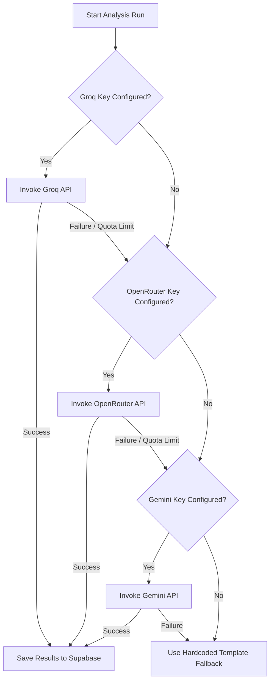

# ⚡ KLAROS AI Integration & LLM Configuration Guide

This guide describes how to configure and manage the AI providers powering KLAROS. The Multi-Criteria Decision Analysis (MCDA) features in KLAROS use a multi-provider fallback engine to ensure high availability and responsiveness.

---

## 🚀 Quick Start Setup

To enable AI analysis, get an API key from one or more of the supported providers below and add it to your `.env.local` file at the root of the project.

> [!TIP]
> Setting up all three providers is recommended. KLAROS will automatically fall back to another provider if one hits rate limits or goes down.

### Option 1: Groq (Recommended - Fastest Inference)
1. Get an API key from the [Groq Console](https://console.groq.com/keys).
2. Add the key to `.env.local`:
   ```env
   VITE_GROQ_API_KEY=gsk_xxxxxxxxxxxxxxxxxxxx
   ```

### Option 2: OpenRouter (Maximum Model Variety)
1. Create an API key in your [OpenRouter Settings](https://openrouter.ai/settings/keys).
2. Add the key to `.env.local`:
   ```env
   VITE_OPENROUTER_API_KEY=sk-or-xxxxxxxxxxxxxxxxxxxx
   ```

### Option 3: Google Gemini (Native API Access)
1. Get an API key from [Google AI Studio](https://aistudio.google.com/apikey).
2. Add the key to `.env.local`:
   ```env
   VITE_GEMINI_API_KEY=AIzaSyDxxxxxxxxxxxxxxxxxxxx
   ```

---

## 🔄 Multi-Provider Fallback Flow

KLAROS automatically resolves API queries through a prioritized stack to minimize quota depletion errors:



---

## 📊 Comparison of Providers

| Feature | Groq | OpenRouter | Google Gemini |
| :--- | :--- | :--- | :--- |
| **Speed** | ⚡⚡⚡ Extremely Fast | ⚡ Fast | ⚡ Fast |
| **Free Models** | ~8 models | 25+ models | 4–7 models |
| **Typical Daily Quota** | ~3,000–5,000 requests | Very High (varies) | 1,500–10,000 requests |
| **Data Types** | Text Only | Text Only | ✅ Multimodal (Text + Images) |
| **Setup Time** | < 1 minute | ~2 minutes | < 1 minute |

---

## 🛠️ Troubleshooting

> [!WARNING]
> Always restart the Vite development server (`npm run dev`) after adding or changing keys in `.env.local` to load the new environment variables.

### "No LLM API key configured"
Verify that `.env.local` is present in the project root and contains the environment variables exactly as shown above. Check for typos or extra spaces.

### "All providers failed"
This occurs if all configured providers are returning error codes, have expired API keys, or have run out of free-tier quotas. 
- Open the browser developer console (**F12**) to inspect raw error messages.
- Double-check API keys on their respective provider dashboards.
- Wait for the provider rate limits to reset (usually on a rolling hourly or daily window).

---

## 🔒 Security & Privacy

- **Local-Only Storage**: All API keys are loaded via client-side environment variables or setting overrides. They are never transmitted to any database or backend server other than the direct AI provider.
- **Git Safety**: The `.env.local` file is listed in `.gitignore` and is never committed to version control.
