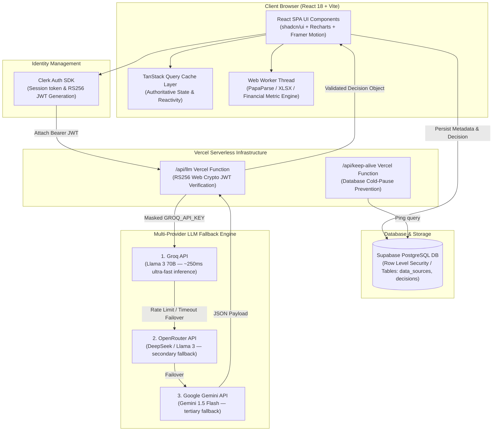
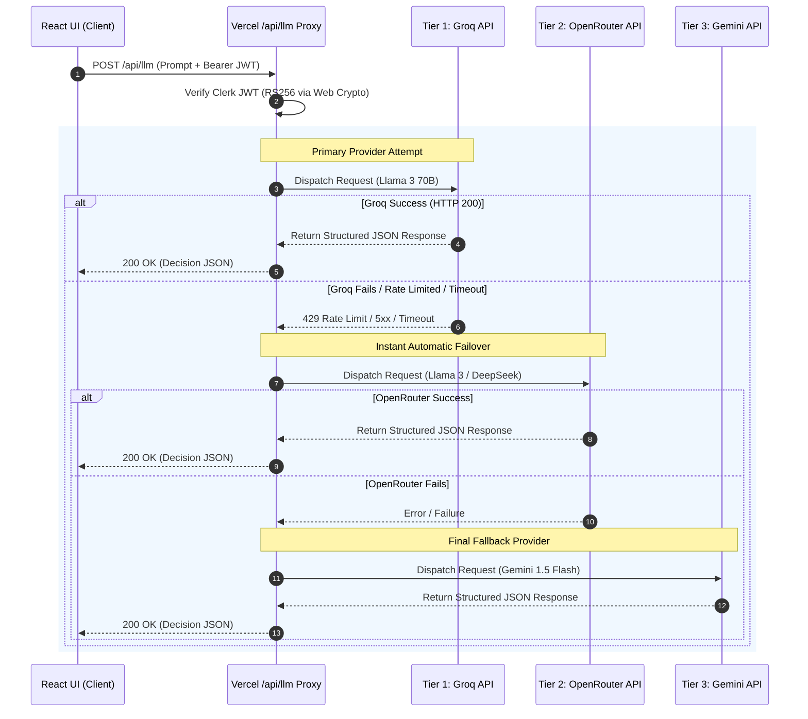
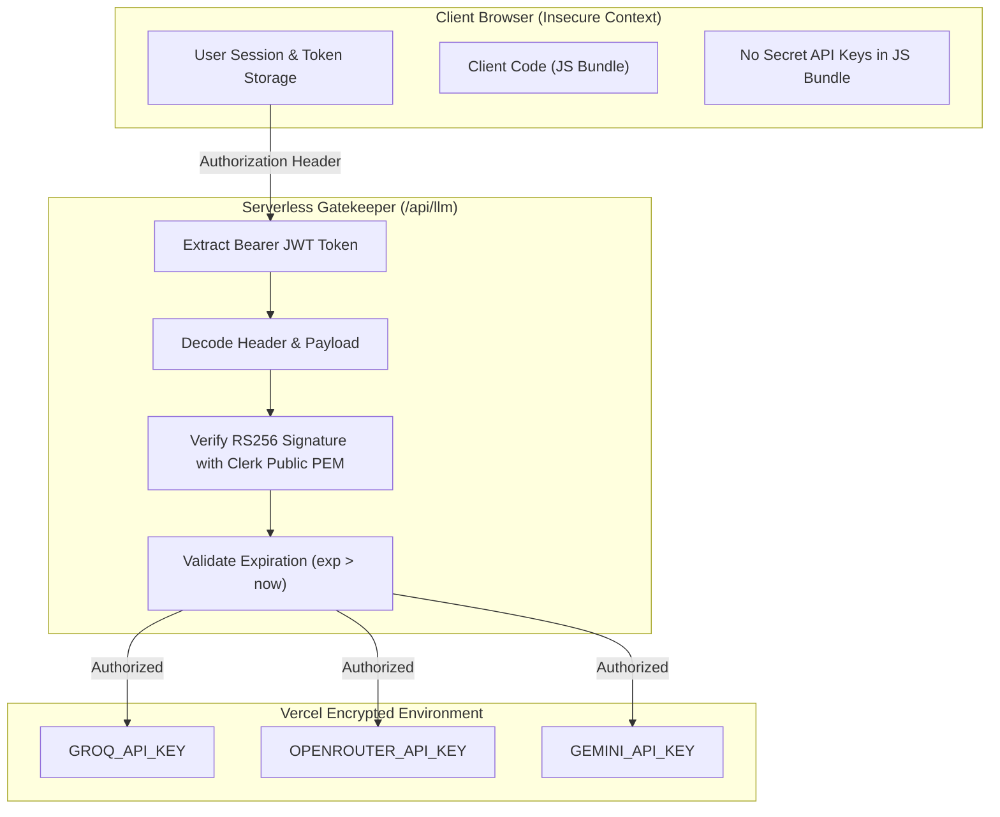

# 02 — Architecture Diagrams & System Overview

> **Serverless Function Entrypoint**: [`api/llm.ts`](file:///e:/KLAROS/api/llm.ts)  
> **LLM Dispatcher Service**: [`src/services/llm/llm-service.ts`](file:///e:/KLAROS/src/services/llm/llm-service.ts)  
> **Web Worker KPI Engine**: [`src/features/market/utils/market-metrics.worker.ts`](file:///e:/KLAROS/src/features/market/utils/market-metrics.worker.ts)  
> **Database Sync Layer**: [`src/features/market/api/bi-api.ts`](file:///e:/KLAROS/src/features/market/api/bi-api.ts)

---

## High-Level System Architecture

KLAROS follows a **Client-Heavy Serverless Architecture**. The React 18 single-page application (SPA) handles data parsing, UI rendering, chart generation, and financial metric aggregation. Heavy dataset calculations run on a dedicated **Web Worker thread**, keeping the main UI thread running at 60 FPS. API keys and external AI communications are securely proxied via a **Vercel Serverless Function** (`/api/llm`).

---

## Detailed Component Architecture Breakdown

### 1. Client Layer (Frontend & Web Worker)
- **Vite 5 + React 18 + TypeScript 5**: Type-safe single-page application.
- **Web Worker KPI Engine**: Parses CSV and Excel files up to 50 MB off the main thread. Performs financial metric aggregation, low-stock calculation, category grouping, and Schwartzian sorting.
- **TanStack Query v5**: Handles client state caching, background refetching, and optimistic updates.

### 2. Authentication & Authorization Layer
- **Clerk SDK**: Manages user authentication, sign-ups, login state, and issues short-lived RS256 JWTs.
- **JWT Verification**: The Vercel proxy verifies JWT signatures natively using Node 20's `crypto.subtle` API, enforcing authentication before proxying AI requests.

### 3. Serverless API Layer
- **`/api/llm` Proxy Endpoint**: Enforces JWT verification, extracts request parameters, attaches secret environment variables (`GROQ_API_KEY`, `OPENROUTER_API_KEY`, `GEMINI_API_KEY`), and manages request timeout and backoff logic.
- **`/api/keep-alive` Endpoint**: Periodically pings the Supabase database to prevent instance pauses on free-tier hosting.

### 4. Database & Storage Layer
- **Supabase (PostgreSQL)**: Stores user data sources and historical decisions.
- **Row Level Security (RLS)**: Restricts database access so users can only read, write, and delete their own records based on `clerk_user_id`.

---

## Multi-Provider LLM Fallback Engine

High availability is guaranteed through an **automatic three-tier provider fallback hierarchy**:

---

## Data Pipeline Architecture

```mermaid
flowchart LR
    A[Raw Retail CSV / XLSX] -->|PapaParse / XLSX| B[Web Worker Thread]
    B -->|Calculate Metrics| C[Local Financial Engine]
    C -->|Aggregate JSON| D[Clerk Authenticated Request]
    D -->|Post to /api/llm| E[Vercel Serverless Function]
    E -->|MCDA Prompting| F[Multi-Provider LLM Engine]
    F -->|Return Raw Text| G[JSON Extractor & Schema Validator]
    G -->|Sanitise Pairwise Matrix| H[AHP Math Engine]
    H -->|Calculate Priority Vector & CR| I[Save Decision Record to Supabase]
    I -->|Render| J[Interactive Dashboard]
```

---

## Security Architecture

- **Zero Client Leakage**: Neither `GROQ_API_KEY`, `OPENROUTER_API_KEY`, nor `GEMINI_API_KEY` are exposed to the client.
- **Cryptographic Authorization**: Every API call is verified against Clerk's public key using RS256 signature verification.
- **Isolated User State**: Database operations are protected using Supabase PostgreSQL RLS policies tied to the user's Clerk ID.
