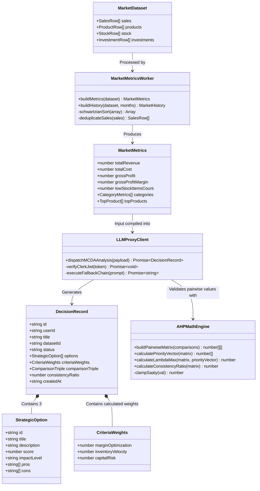
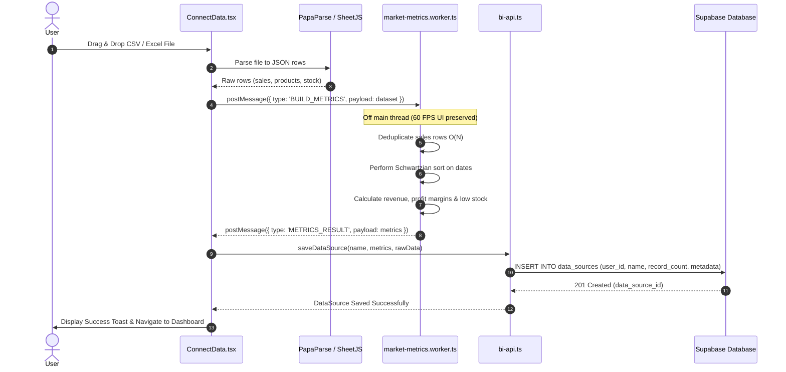
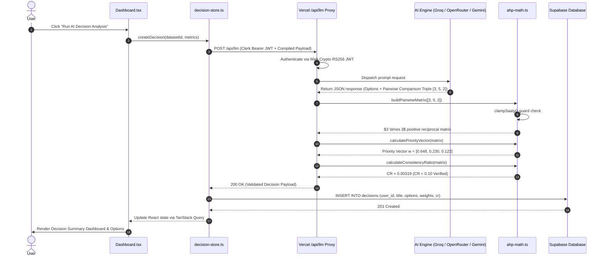
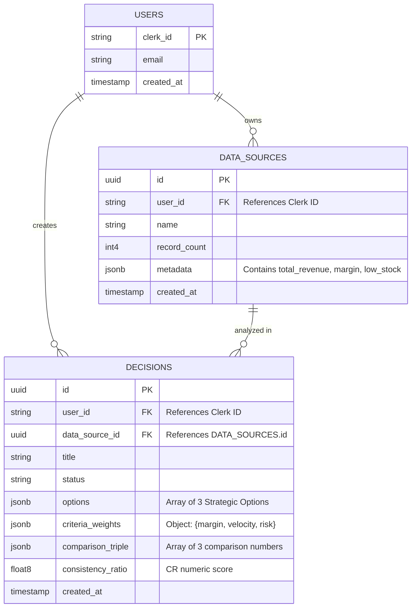
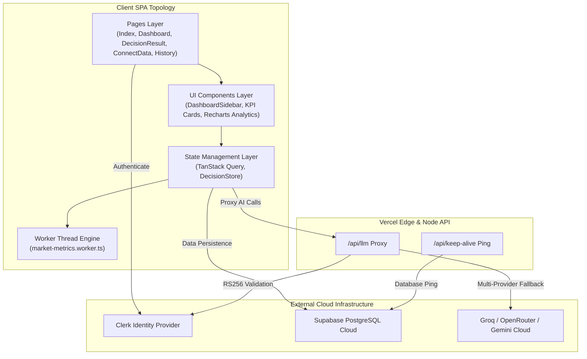

# 03 — UML Diagrams & Domain Specifications

> **Domain Types**: [`src/features/decisions/types/decision.ts`](file:///e:/KLAROS/src/features/decisions/types/decision.ts)  
> **Market Metrics Core**: [`src/features/market/utils/market-metrics-core.ts`](file:///e:/KLAROS/src/features/market/utils/market-metrics-core.ts)  
> **Zod Schemas**: [`src/features/decisions/core/analysis-schema.ts`](file:///e:/KLAROS/src/features/decisions/core/analysis-schema.ts)

---

## 1. Domain & Class UML Diagram

The diagram below outlines the core domain entities, data structures, and utility modules powering KLAROS:



---

## 2. Sequence Diagram: Data Ingestion & Web Worker Processing

This sequence diagram illustrates how a user uploads CSV/XLSX files, processes raw data in a background Web Worker, computes financial KPIs, and caches the result:



---

## 3. Sequence Diagram: AI Decision Execution & AHP Math Validation

This sequence diagram details the execution of an MCDA analysis request from the user interface down through the serverless proxy, AI fallback, AHP matrix validation, and database storage:



---

## 4. Entity-Relationship (ER) Diagram (Supabase Schema)



---

## 5. Use Case Diagram

```mermaid
usecaseDiagram
    actor RetailUser as "Retail Executive / Manager"
    actor AIProvider as "LLM Provider (Groq/Gemini)"
    actor AuthProvider as "Clerk Auth"

    package KLAROS_Platform {
        usecase UC1 as "Upload & Process Retail Dataset"
        usecase UC2 as "Calculate Financial KPIs & Low-Stock Alerts"
        usecase UC3 as "Run AHP-MCDA Strategic Decision Analysis"
        usecase UC4 as "View AI 3-Month Revenue Forecast"
        usecase UC5 as "Compare Historical Decision Reports"
        usecase UC6 as "Delete Data Sources & Decisions"
    }

    RetailUser --> UC1
    RetailUser --> UC2
    RetailUser --> UC3
    RetailUser --> UC4
    RetailUser --> UC5
    RetailUser --> UC6

    UC1 ..> AuthProvider : <<requires auth>>
    UC3 ..> AIProvider : <<dispatches prompt>>
    UC3 ..> AuthProvider : <<verifies JWT>>
```

---

## 6. Component Topology Diagram


