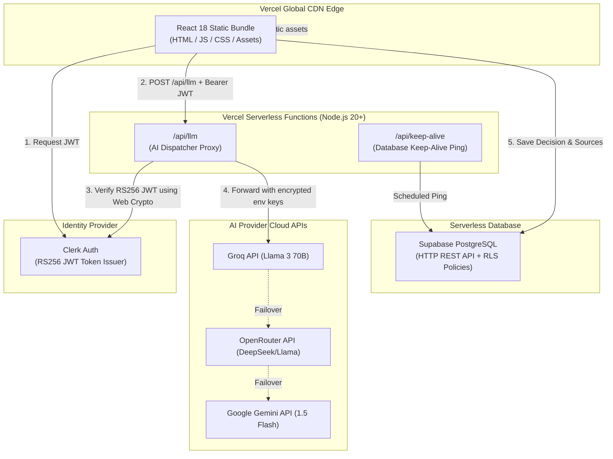

# 05 — Serverless Architecture & Infrastructure Deep Dive

> **Vercel Proxy Function**: [`api/llm.ts`](file:///e:/KLAROS/api/llm.ts)  
> **Keep-Alive Function**: [`api/keep-alive.ts`](file:///e:/KLAROS/api/keep-alive.ts)  
> **Vercel Config**: [`vercel.json`](file:///e:/KLAROS/vercel.json)

---

## 1. Why Serverless Architecture for KLAROS?

Traditional retail analytics applications rely on monolithic backends (Express/Django/Spring) running 24/7 on dedicated virtual machines. For a SaaS platform like KLAROS, this approach introduces significant challenges:
- High baseline infrastructure cost ($30–$100/month per server instance even when idle).
- Security vulnerability caused by embedding LLM API keys directly into front-end client bundles.
- Maintenance overhead for server patching, SSL certificates, load balancer management, and scaling policies.

**KLAROS adopts a 100% Serverless Architecture**:
1. **Frontend**: Static React assets hosted on Vercel's global Content Delivery Network (CDN).
2. **Compute**: On-demand Vercel Serverless Functions (`/api/llm` & `/api/keep-alive`).
3. **Identity**: Serverless authentication managed by Clerk.
4. **Database**: Serverless PostgreSQL provided by Supabase.

---

## 2. Serverless Architecture Diagram



---

## 3. Serverless API Security Architecture

### The Client Key Leakage Problem

In naive AI applications, API keys are stored in client environment variables (`VITE_GROQ_API_KEY`) and compiled directly into JavaScript bundles:

```
❌ INSECURE (Traditional Client Setup):
Browser JS Bundle ──► Contains VITE_GROQ_API_KEY ──► Direct Groq API Call
                      (Extractable via DevTools in seconds!)
```

### The KLAROS Serverless Solution

KLAROS routes all AI requests through the `/api/llm` serverless proxy function. Keys exist solely inside Vercel's encrypted environment variables:

```
✅ SECURE (KLAROS Serverless Architecture):
Browser Client ──► Bearer Clerk JWT ──► /api/llm Vercel Function ──► Groq/OpenRouter/Gemini
                                          (Verifies RS256 JWT)        (Env Key attached server-side)
```

---

## 4. Zero-Dependency RS256 Web Crypto JWT Verification

To maintain fast execution in serverless environments, functions must start rapidly. Traditional JWT verification packages (`jsonwebtoken`, `jose`) add megabytes of bundle size and introduce hundreds of milliseconds of cold-start latency.

KLAROS implements **Zero-Dependency JWT Verification** using Node 20's native **Web Crypto API** (`crypto.subtle`):

### Verification Steps in [`api/llm.ts`](file:///e:/KLAROS/api/llm.ts)

```typescript
// 1. Extract Bearer Token from Authorization Header
const token = authHeader.slice(7);
const [headerB64, payloadB64, sigB64] = token.split('.');

// 2. Decode Payload & Check Expiration
const payload = JSON.parse(Buffer.from(payloadB64, 'base64url').toString());
const now = Math.floor(Date.now() / 1000);
if (payload.exp && payload.exp < now) {
  throw new Error('JWT has expired');
}

// 3. Import Clerk RSA Public Key (PEM) using Web Crypto API
const pemBody = CLERK_JWT_KEY
  .replace(/-----BEGIN PUBLIC KEY-----/, '')
  .replace(/-----END PUBLIC KEY-----/, '')
  .replace(/\s/g, '');
const keyBuffer = Buffer.from(pemBody, 'base64');

const cryptoKey = await crypto.subtle.importKey(
  'spki',
  keyBuffer,
  { name: 'RSASSA-PKCS1-v1_5', hash: 'SHA-256' },
  false,
  ['verify']
);

// 4. Cryptographically Verify Signature
const signingInput = `${headerB64}.${payloadB64}`;
const signatureBuffer = Buffer.from(sigB64, 'base64url');
const isValid = await crypto.subtle.verify(
  'RSASSA-PKCS1-v1_5',
  cryptoKey,
  signatureBuffer,
  Buffer.from(signingInput)
);

if (!isValid) throw new Error('Invalid JWT signature');
```

---

## 5. Supabase Serverless Database & Keep-Alive Daemon

### Database Serverless Connection
- **Protocol**: HTTP/REST interface provided by Supabase PostgREST serverless API layer.
- **Connection Overhead**: Zero connection pooling needed in front-end or serverless function code.
- **Row Level Security (RLS)**: Enforces access control at the database layer using PostgreSQL policies:
  ```sql
  CREATE POLICY "Users can only access their own data sources"
  ON data_sources FOR ALL
  USING (auth.uid() = user_id);
  ```

### Database Keep-Alive Daemon ([`api/keep-alive.ts`](file:///e:/KLAROS/api/keep-alive.ts))
Free-tier Supabase database instances pause after 7 days of inactivity. To ensure high availability for retail users, KLAROS provides a serverless keep-alive function:

```typescript
export default async function handler(req, res) {
  const supabase = createClient(process.env.VITE_SUPABASE_URL, process.env.VITE_SUPABASE_ANON_KEY);
  const { error } = await supabase.from('data_sources').select('id').limit(1);
  
  if (error) {
    return res.status(500).json({ message: 'Supabase ping failed', error: error.message });
  }
  return res.status(200).json({ message: 'Supabase is alive!' });
}
```

This endpoint can be pinged periodically via **Vercel Cron** or external monitoring services (e.g., UptimeRobot) to keep the PostgreSQL database warmed up.

---

## 6. Vercel Configuration Specifications

The project's serverless configuration is governed by [`vercel.json`](file:///e:/KLAROS/vercel.json):

```json
{
  "buildCommand": "npm run build",
  "outputDirectory": "dist",
  "framework": "vite",
  "rewrites": [
    {
      "source": "/api/(.*)",
      "destination": "/api/$1"
    },
    {
      "source": "/(.*)",
      "destination": "/index.html"
    }
  ]
}
```

### Route Handling
- `/api/*` routes are handled by Vercel Serverless Node functions located in the `api/` directory.
- All non-API routes are rewritten to `/index.html` to support HTML5 pushState client routing via React Router DOM.
