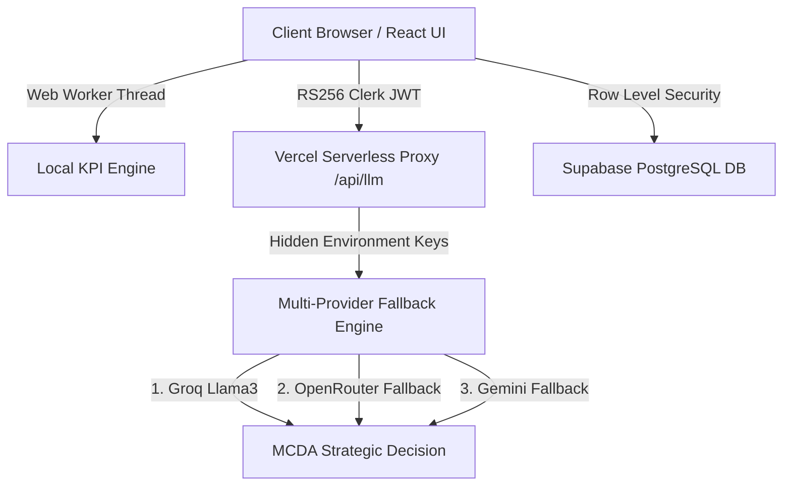

# KLAROS Technical Documentation Hub

Welcome to the comprehensive technical documentation for **KLAROS** — the AI-powered Retail Analytics & Decision Intelligence Platform.

This documentation directory contains in-depth reference manuals covering the core mathematical algorithms, system architecture, UML modeling, functional capabilities, and serverless infrastructure powering KLAROS.

---

## Documentation Index

| File | Document Title | Description |
|---|---|---|
| 📄 [01_ALGORITHM_AND_DECISION_ENGINE.md](file:///e:/KLAROS/project_docs/01_ALGORITHM_AND_DECISION_ENGINE.md) | **Algorithm & Decision Engine** | Mathematical formulation of Analytic Hierarchy Process (AHP) & Multi-Criteria Decision Analysis (MCDA), Saaty matrix calculations, priority vectors, consistency ratio guards ($CR < 0.10$), benchmarks, and step-by-step numerical examples. |
| 📄 [02_ARCHITECTURE_DIAGRAMS.md](file:///e:/KLAROS/project_docs/02_ARCHITECTURE_DIAGRAMS.md) | **System Architecture & Data Flows** | Visual and detailed architectural breakdown including multi-provider LLM fallback hierarchy (Groq → OpenRouter → Gemini), client-side Web Worker pipeline, and serverless API routing. |
| 📄 [03_UML_DIAGRAMS.md](file:///e:/KLAROS/project_docs/03_UML_DIAGRAMS.md) | **UML Modeling Specifications** | Class/domain diagrams, end-to-end Sequence diagrams for ingestion & AI execution, Entity-Relationship (ER) schema for Supabase, Use Case diagrams, and Component topology. |
| 📄 [04_SYSTEM_FUNCTIONALITY_GUIDE.md](file:///e:/KLAROS/project_docs/04_SYSTEM_FUNCTIONALITY_GUIDE.md) | **System Functionality & Features** | Comprehensive feature guide detailing financial & inventory KPI computations, dataset management, interactive decision dashboards, AI revenue forecasting, and comparative analysis tools. |
| 📄 [05_SERVERLESS_ARCHITECTURE.md](file:///e:/KLAROS/project_docs/05_SERVERLESS_ARCHITECTURE.md) | **Serverless Infrastructure & Security** | In-depth breakdown of serverless deployment on Vercel, native Web Crypto RS256 JWT validation for Clerk auth, key masking, Supabase PostgreSQL RLS integration, and automated database keep-alive mechanisms. |

---

## Overview of System Architecture

For questions or developer onboarding, start by reviewing the [Algorithm Guide](file:///e:/KLAROS/project_docs/01_ALGORITHM_AND_DECISION_ENGINE.md) and [System Architecture](file:///e:/KLAROS/project_docs/02_ARCHITECTURE_DIAGRAMS.md).
